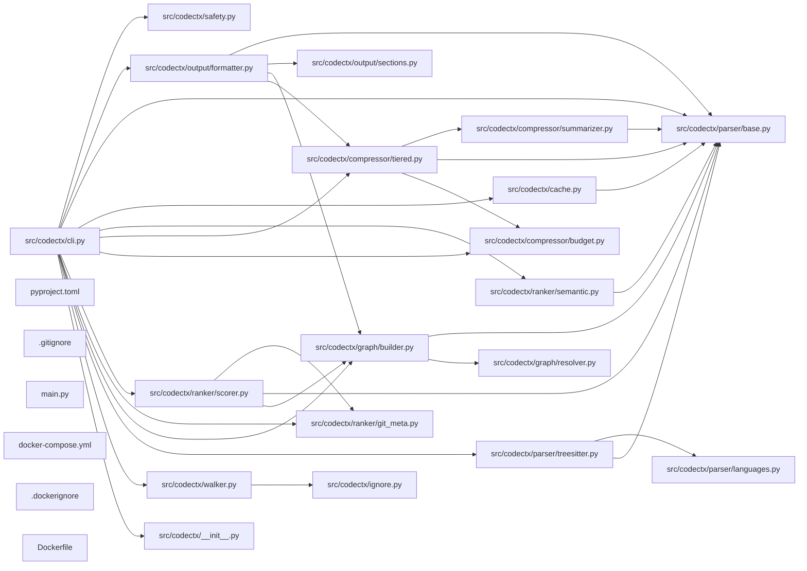

## ARCHITECTURE

codectx processes repositories through a structured analysis pipeline that ranks code by importance, compresses it intelligently, and emits a structured markdown document optimized for AI systems.

(Architecture truncated. See ARCHITECTURE.md for details.)

## ENTRY_POINTS

### `src/codectx/cli.py`

```python
"""codectx CLI — typer entrypoint wiring the full pipeline."""

from __future__ import annotations

import logging
import sys
import time
from dataclasses import dataclass
from pathlib import Path

import typer
from rich.console import Console
from rich.panel import Panel
from rich.progress import Progress, SpinnerColumn, TextColumn

from codectx import __version__
from codectx.config.defaults import CACHE_DIR_NAME

app = typer.Typer(
    name="codectx",
    help="Codebase context compiler for AI agents.",
    no_args_is_help=True,
    add_completion=False,
)
console = Console(stderr=True)


@app.command()
def analyze(
    root: Path = typer.Argument(  # noqa: B008
        ".",
        help="Repository root directory to analyze.",
        exists=True,
        file_okay=False,
        resolve_path=True,
    ),
    tokens: int = typer.Option(  # noqa: B008
        None,
        "--tokens",
        "-t",
        help="Token budget (default: 120000).",
    ),
    output: Path = typer.Option(  # noqa: B008
        None,
        "--output",
        "-o",
        help="Output file path (default: CONTEXT.md).",
    ),
    since: str | None = typer.Option(  # noqa: B008
        None,
        "--since",
        help="Include recent changes since this date (e.g. '7 days ago').",
    ),
    verbose: bool = typer.Option(  # noqa: B008
        False,
        "--verbose",
        "-v",
        help="Enable verbose logging.",
    ),
    no_git: bool = typer.Option(  # noqa: B008
        False,
        "--no-git",
        help="Skip git metadata collection.",
    ),
    query: str | None = typer.Option(  # noqa: B008
        None,
        "--query",
        "-q",
        help="Semantic query to rank files by relevance (requires codectx[semantic]).",
    ),
    task: str = typer.Option(  # noqa: B008
        "default",
        "--task",
        help="Task profile for context generation (debug, feature, architecture, default).",
    ),
    layers: bool = typer.Option(  # noqa: B008
        False,
        "--layers",
        help="Generate layered context output.",
    ),
    extra_roots: list[Path] | None = typer.Option(  # noqa: B008
        None,
        "--extra-root",
        help="Additional root directories for multi-root analysis.",
    ),
) -> None:
    """Analyze a codebase and generate CONTEXT.md."""
    _setup_logging(verbose)
    start_time = time.perf_counter()

    from codectx.config.loader import load_config

    # Build roots list: primary root + any extra roots
    roots_list: list[Path] | None = None
    if extra_roots:
        roots_list = [root] + list(extra_roots)

    config = load_config(
        root,
        token_budget=tokens,
        output_file=str(output) if output else None,
        since=since,
        verbose=verbose,
        no_git=no_git,
        query=query or "",
        task=task,
        layers=layers,
        roots=roots_list,
    )

    metrics = _run_pipeline(config)
    elapsed = time.perf_counter() - start_time

    ratio = metrics.original_tokens / metrics.context_tokens if metrics.context_tokens > 0 else 0

    console.print(
        Panel(
            f"[bold green]✓[/] Context written to [bold]{metrics.output_path}[/]\n\n"
            f"[bold]Files scanned:[/] {metrics.files_scanned:,}\n"
            f"[bold]Source tokens (excl. tests/docs):[/] {metrics.original_tokens:,}\n"
            f"[bold]Context tokens:[/] {metrics.context_tokens:,}\n"
            f"[bold]Compression ratio:[/] {ratio:.1f}x\n"
            f"[bold]Analysis time:[/] {elapsed:.1f}s",
            title="codectx",
            border_style="green",
        )
    )


@app.command()
def benchmark(
    root: Path = typer.Argument(  # noqa: B008
        ".",
        help="Repository root directory.",
        exists=True,
        file_okay=False,
        resolve_path=True,
    ),
    tokens: int = typer.Option(None, "--tokens", "-t"),  # noqa: B008
    verbose: bool = typer.Option(False, "--verbose", "-v"),  # noqa: B008
    no_git: bool = typer.Option(False, "--no-git"),  # noqa: B008
) -> None:
    """Run analysis with detailed timing and stats."""
    _setup_logging(verbose)

    from codectx.config.loader import load_config

    config = load_config(
        root,
        token_budget=tokens,
        verbose=verbose,
        no_git=no_git,
    )

    console.print("[bold]Running benchmark...[/]\n")

    timings: dict[str, float] = {}

    # Walk
    t0 = time.perf_counter()
    from codectx.walker import walk

    files = walk(config.root, config.extra_ignore)
    timings["walk"] = time.perf_counter() - t0

    # Parse
    t0 = time.perf_counter()
    from codectx.parser.treesitter import parse_files

    parse_results = parse_files(files)
    timings["parse"] = time.perf_counter() - t0

    # Graph
    t0 = time.perf_counter()
    from codectx.graph.builder import build_dependency_graph

    dep_graph = build_dependency_graph(parse_results, config.root)
    timings["graph"] = time.perf_counter() - t0

    # Rank
    t0 = time.perf_counter()
    from codectx.ranker.git_meta import collect_git_metadata
    from codectx.ranker.scorer import score_files

    git_meta = collect_git_metadata(files, config.root, config.no_git)
    scores = score_files(files, dep_graph, git_meta)
    timings["rank"] = time.perf_counter() - t0

    # Compress
    t0 = time.perf_counter()
    from codectx.compressor.budget import TokenBudget
    from codectx.compressor.tiered import compress_files

    budget = TokenBudget(config.token_budget)
    compressed = compress_files(parse_results, scores, budget, config.root)
    timings["compress"] = time.perf_counter() - t0

    total = sum(timings.values())

    console.print(
        Panel(
            "\n".join(
                [
                    f"[bold]Files discovered:[/] {len(files)}",
                    f"[bold]Files parsed:[/] {len(parse_results)}",
                    f"[bold]Graph nodes:[/] {dep_graph.node_count}",
                    f"[bold]Graph edges:[/] {dep_graph.edge_count}",
                    f"[bold]Compressed files:[/] {len(compressed)}",
                    f"[bold]Tokens used:[/] {budget.used:,} / {budget.total:,}",
                    "",
                    *[f"  {k:>10}: {v:.3f}s" for k, v in timings.items()],
                    f"  {'total':>10}: {total:.3f}s",
                ]
            ),
            title="Benchmark Results",
            border_style="cyan",
        )
    )


@app.command()
def watch(
    root: Path = typer.Argument(  # noqa: B008
        ".",
        help="Repository root directory.",
        exists=True,
        file_okay=False,
        resolve_path=True,
    ),
    tokens: int = typer.Option(None, "--tokens", "-t"),  # noqa: B008
    output: Path = typer.Option(None, "--output", "-o"),  # noqa: B008
    verbose: bool = typer.Option(False, "--verbose", "-v"),  # noqa: B008
    no_git: bool = typer.Option(False, "--no-git"),  # noqa: B008
) -> None:
    """Watch for file changes and regenerate CONTEXT.md."""
    _setup_logging(verbose)

    from codectx.config.loader import load_config

    config = load_config(
        root,
        token_budget=tokens,
        output_file=str(output) if output else None,
        verbose=verbose,
        no_git=no_git,
        watch=True,
    )

    console.print(f"[bold]Watching[/] {config.root} for changes...")
    console.print("Press Ctrl+C to stop.\n")

    # Initial run
    _run_pipeline(config)
    console.print("[green]Initial context generated.[/]\n")

    try:
        from watchfiles import watch as watchfiles_watch

        for changes in watchfiles_watch(str(config.root)):
            changed_paths = [Path(c[1]) for c in changes]
            console.print(f"[yellow]Changes detected:[/] {len(changed_paths)} file(s)")
            try:
                _run_pipeline(config)
                console.print("[green]Context regenerated.[/]\n")
            except Exception as exc:
                console.print(f"[red]Error during regeneration: {exc}[/]\n")
    except KeyboardInterrupt:
        console.print("\n[bold]Watch stopped.[/]")


@app.command()
def search(
    query: str = typer.Argument(  # noqa: B008
        ...,
        help="Semantic search query.",
    ),
    root: Path = typer.Option(  # noqa: B008
        ".",
        "--root",
        "-r",
        help="Repository root directory.",
        exists=True,
        file_okay=False,
        resolve_path=True,
    ),
    limit: int = typer.Option(  # noqa: B008
        10,
        "--limit",
        "-l",
        help="Number of results to return.",
    ),
    verbose: bool = typer.Option(  # noqa: B008
        False,
        "--verbose",
        "-v",
        help="Enable verbose logging.",
    ),
) -> None:
    """Search the codebase semantically."""
    _setup_logging(verbose)

... (truncated: entry point exceeds 300 lines)
```

## SYMBOL_INDEX

**`src/codectx/cli.py`**
- `analyze()`
- `benchmark()`
- `watch()`
- `search()`
- `cache_export()`
- `cache_import()`
- `main()`
- class `PipelineMetrics`
- `_run_pipeline()`
- `_setup_logging()`

**`src/codectx/parser/base.py`**
- class `Symbol`
- class `ParseResult`
- `make_plaintext_result()`

**`src/codectx/graph/builder.py`**
- class `DepGraph`
  - `add_file()`
  - `add_edge()`
  - `fan_in()`
  - `fan_out()`
  - `entry_points()`
  - `graph_distance()`
  - `entry_distances()`
  - `detect_call_paths()`
- `build_dependency_graph()`

**`src/codectx/output/formatter.py`**
- `_root_label()`
- `format_context()`
- `write_context_file()`
- `write_layer_files()`
- `_section_header()`
- `_auto_architecture()`
- `_render_mermaid_graph()`

**`src/codectx/ranker/scorer.py`**
- `score_files()`
- `_min_max_normalize()`

**`src/codectx/compressor/tiered.py`**
- class `CompressedFile`
- `_is_non_source()`
- `assign_tiers()`
- `compress_files()`
- `_tier1_content()`
- `_extract_internal_imports()`
- `_structured_summary_content()`
- `_tier2_content()`
- `_tier3_content()`
- `_one_line_summary()`

**`src/codectx/parser/treesitter.py`**
- `_parse_scm_patterns()`
- class `QuerySpec`
- `_load_query_spec()`
- `_get_query_spec()`
- `parse_files()`
- `parse_file()`
- `_parse_single_worker()`
- `_log_parse_health()`
- `_extract()`
- `_fallback_parse()`
- `_regex_imports()`
- `_regex_docstrings()`
- `_extract_imports()`
- `_extract_symbols()`
- `_extract_module_docstrings()`
- `_python_func_symbol()`
- `_python_class_symbol()`
- `_js_func_symbol()`
- `_js_class_symbol()`
- `_maybe_js_arrow()`
- `_go_func_symbol()`
- `_generic_symbol()`
- `_walk_tree()`
- `_node_text()`
- `_find_child()`
- `_extract_first_docstring()`
- `_read_source()`

**`src/codectx/walker.py`**
- `walk()`
- `_collect()`
- `_is_binary()`
- `walk_multi()`
- `find_root()`

**`src/codectx/ranker/git_meta.py`**
- class `GitFileInfo`
- `collect_git_metadata()`
- `_collect_from_git()`
- `_filesystem_fallback()`
- `collect_recent_changes()`
- `_parse_since()`
- `_load_pygit2()`

**`src/codectx/ranker/semantic.py`**
- `is_available()`
- `semantic_score()`

**`src/codectx/config/loader.py`**
- class `Config`
- `load_config()`
- `_resolve()`
- `_resolve_bool()`
- `_resolve_str()`
- `_resolve_optional_str()`
- `_resolve_int()`

**`src/codectx/cache.py`**
- class `Cache`
  - `__init__()`
  - `_load()`
  - `save()`
  - `get_parse_result()`
  - `put_parse_result()`
  - `get_token_count()`
  - `put_token_count()`
  - `invalidate()`
  - `export_cache()`
- `file_hash()`
- `_decode_children()`
- `_coerce_int()`

**`src/codectx/graph/resolver.py`**
- `resolve_import()`
- `resolve_import_multi_root()`
- `_resolve_python()`
- `_resolve_js_ts()`
- `_resolve_go()`
- `_resolve_rust()`
- `_resolve_java()`
- `_resolve_c_cpp()`
- `_resolve_ruby()`

**`src/codectx/output/sections.py`**
- class `Section`

**`src/codectx/parser/languages.py`**
- class `LanguageEntry`
- class `TreeSitterLanguageLoadError`
- `get_language()`
- `get_language_for_path()`
- `get_ts_language_object()`
- `_coerce_language()`
- `load_typescript_language()`
- `supported_extensions()`

**`src/codectx/compressor/budget.py`**
- `_get_encoder()`
- `count_tokens()`
- class `TokenBudget`
  - `__init__()`
  - `consume()`
  - `consume_partial()`

**`src/codectx/compressor/summarizer.py`**
- `is_available()`
- `summarize_file()`
- `summarize_files_batch()`
- `_summarize_openai()`
- `_summarize_anthropic()`

**`main.py`**
- `main()`

**`src/codectx/ignore.py`**
- `build_ignore_spec()`
- `should_ignore()`
- `_read_pattern_file()`

## IMPORTANT_CALL_PATHS

main.main()
## CORE_MODULES

### `src/codectx/config/defaults.py`

**Purpose:** Default configuration values and constants for codectx.

### `src/codectx/parser/base.py`

**Purpose:** Core data structures for the parser module.

**Types:**
- `ParseResult` - Result of parsing a single source file.
- `Symbol` - A top-level symbol extracted from a source file.

**Functions:**
- `def make_plaintext_result(path: Path, source: str) -> ParseResult`
  - Create a minimal ParseResult for unsupported language files.

### `src/codectx/graph/builder.py`

**Purpose:** Dependency graph construction using rustworkx.
**Depends on:** `config.defaults`, `graph.resolver`, `parser.base`

**Types:**
- `DepGraph` - Dependency graph with file-level nodes and import edges. methods: `add_edge`, `add_file`, `detect_call_paths`, `entry_distances`, `entry_points`, `fan_in` (+2 more)

**Functions:**
- `def build_dependency_graph(     parse_results: dict[Path, ParseResult],     root: Path, ) -> DepGraph`
  - Build a dependency graph from parse results.

### `src/codectx/output/formatter.py`

**Purpose:** Structured markdown formatter — emits CONTEXT.md.
**Depends on:** `compressor.tiered`, `config.defaults`, `graph.builder`, `output.sections`, +1 more

**Functions:**
- `def _auto_architecture(compressed: list[CompressedFile], root: Path) -> str`
- `def _render_mermaid_graph(     dep_graph: DepGraph,     root: Path,     compressed: list[CompressedFile], ) -> str`
- `def _root_label(file_path: Path, roots: list[Path] | None) -> str`
- `def _section_header(title: str) -> str`

### `src/codectx/ranker/scorer.py`

**Purpose:** Composite file scoring — ranks files by importance.
**Depends on:** `config.defaults`, `graph.builder`, `parser.base`, `ranker.git_meta`

**Functions:**
- `def _min_max_normalize(values: dict[Path, float]) -> dict[Path, float]`
  - Min-max normalize values to [0, 1]. Returns 0 for all if constant.
- `def score_files(files: list[Path], dep_graph: DepGraph, git_meta: dict[Path, GitFileInfo], ...) -> dict[Path, float]`
  - Score each file 0.0–1.0 using a weighted composite.

### `src/codectx/compressor/tiered.py`

**Purpose:** Tiered compression — assigns tiers and enforces token budget.
**Depends on:** `compressor.budget`, `compressor.summarizer`, `config.defaults`, `parser.base`

**Types:**
- `CompressedFile` - A file compressed to its assigned tier.

**Functions:**
- `def _extract_internal_imports(imports: tuple[str, ...], root: Path, source_path: Path) -> list[str]`
- `def _is_non_source(path: Path, root: Path) -> bool`
- `def _one_line_summary(pr: ParseResult) -> str`
- `def _structured_summary_content(pr: ParseResult, path: Path, root: Path) -> str`

### `src/codectx/parser/treesitter.py`

**Purpose:** Tree-sitter AST extraction — parallel parsing of source files.
**Depends on:** `config.defaults`, `parser.base`, `parser.languages`

**Types:**
- `QuerySpec` - Parsed query specification from a .scm file.

**Functions:**
- `def _extract(path: Path, source: str, entry: LanguageEntry) -> ParseResult`
- `def _extract_first_docstring(body_node: Any, source: str) -> str`
- `def _extract_imports(node: Any, language: str, source: str) -> list[str]`
- `def _extract_module_docstrings(node: Any, language: str, source: str) -> list[str]`

### `src/codectx/walker.py`

**Purpose:** File-system walker — discovers files, applies ignore specs, filters binaries.
**Depends on:** `config.defaults`, `ignore`

**Functions:**
- `def _collect(     current: Path,     root: Path,     spec: pathspec.PathSpec,     out: list[Path], ) -> None`
- `def _is_binary(path: Path) -> bool`
- `def find_root(file_path: Path, roots: list[Path]) -> Path | None`
- `def walk(     root: Path,     extra_ignore: tuple[str, ...] = (),     output_file: Path | None = None, ) -> list[Path]`
- `def walk_multi(roots: list[Path], ...),     output_file: Path | None = None, ) -> dict[Path, list[Path]]`

### `src/codectx/ranker/git_meta.py`

**Purpose:** Git metadata extraction via pygit2.

**Types:**
- `GitFileInfo` - Git metadata for a single file.

**Functions:**
- `def _collect_from_git(repo: Any, pygit2_mod: Any, files: list[Path], root: Path, ...) -> dict[Path, GitFileInfo]`
- `def _filesystem_fallback(files: list[Path]) -> dict[Path, GitFileInfo]`
- `def _load_pygit2() -> Any | None`
- `def _parse_since(since: str) -> float | None`
- `def collect_git_metadata(files: list[Path], root: Path, no_git: bool = False, ...) -> dict[Path, GitFileInfo]`
- `def collect_recent_changes(root: Path, since: str | None, no_git: bool = False) -> str`

### `src/codectx/ranker/semantic.py`

**Purpose:** Semantic search ranking using lancedb and sentence-transformers.
**Depends on:** `parser.base`

**Functions:**
- `def is_available() -> bool`
  - Check if semantic search dependencies are available.
- `def semantic_score(query: str, files: list[Path], parse_results: dict[Path, ParseResult], ...) -> dict[Path, float]`
  - Return semantic relevance score 0.0–1.0 per file for the given query.

### `pyproject.toml`

**Purpose:** Implements pyproject.

### `src/codectx/config/loader.py`

**Purpose:** Configuration loader — reads .codectx.toml or pyproject.toml [tool.codectx].
**Depends on:** `config.defaults`

**Types:**
- `Config` - Resolved configuration for a codectx run.

**Functions:**
- `def _resolve(key: str, cli: dict[str, object], file_cfg: dict[str, object], default: object) -> object`
- `def _resolve_bool(key: str, cli: dict[str, object], file_cfg: dict[str, object], default: bool) -> bool`
- `def _resolve_int(     key: str,     cli: dict[str, object],     file_cfg: dict[str, object],     default: int, ) -> int`
- `def _resolve_optional_str(key: str, cli: dict[str, object], file_cfg: dict[str, object], ...) -> str | None`

### `src/codectx/cache.py`

**Purpose:** File-level caching for parse results, token counts, and git metadata.
**Depends on:** `config.defaults`, `parser.base`

**Types:**
- `Cache` - JSON-based file cache in .codectx_cache/. methods: `__init__`, `export_cache`, `get_parse_result`, `get_token_count`, `invalidate`, `put_parse_result` (+2 more)

**Functions:**
- `def _coerce_int(value: object) -> int | None`
- `def _decode_children(children: list[Any] | tuple[Any, ...]) -> tuple[Symbol, ...]`
- `def file_hash(path: Path) -> str`
  - Compute a fast hash of file contents.

## SUPPORTING_MODULES

### `src/codectx/graph/resolver.py`

> Per-language import string → file path resolution.

```python
def resolve_import(
    import_text: str,
    language: str,
    source_file: Path,
    root: Path,
    all_files: frozenset[str],
) -> list[Path]
    """Resolve an import statement to file paths within the repository.

    Args:
        import_text: Raw import string from the AST.
        language: Language name (e.g. "python").
        source_file: Absolute path of the file containing the import.
        root: Repository root.
        all_files: Set of all known file paths (POSIX, relative to root).

    Returns:
        List of resolved file paths (may be empty if unresolvable)."""

def resolve_import_multi_root(
    import_text: str,
    language: str,
    source_file: Path,
    roots: list[Path],
    all_files_by_root: dict[Path, frozenset[str]],
) -> list[Path]
    """Resolve an import trying the source file's root first, then others.

    Args:
        import_text: Raw import string from the AST.
        language: Language name.
        source_file: Absolute path of the file containing the import.
        roots: All root directories.
        all_files_by_root: Map of root → set of relative file paths.

    Returns:
        List of resolved file paths."""

def _resolve_python(
    import_text: str,
    source_file: Path,
    root: Path,
    all_files: frozenset[str],
) -> list[Path]

def _resolve_js_ts(
    import_text: str,
    source_file: Path,
    root: Path,
    all_files: frozenset[str],
) -> list[Path]

def _resolve_go(import_text: str, root: Path, all_files: frozenset[str]) -> list[Path]

def _resolve_rust(
    import_text: str,
    source_file: Path,
    root: Path,
    all_files: frozenset[str],
) -> list[Path]

def _resolve_java(import_text: str, root: Path, all_files: frozenset[str]) -> list[Path]

def _resolve_c_cpp(
    import_text: str,
    source_file: Path,
    root: Path,
    all_files: frozenset[str],
) -> list[Path]

def _resolve_ruby(
    import_text: str,
    source_file: Path,
    root: Path,
    all_files: frozenset[str],
) -> list[Path]

```

### `src/codectx/output/sections.py`

> Section constants for CONTEXT.md output.

```python
class Section
    """A named section in the output file."""

```

### `src/codectx/parser/languages.py`

> Extension → language mapping for tree-sitter parsers.

```python
class LanguageEntry
    """A supported language with its tree-sitter module reference."""

class TreeSitterLanguageLoadError(RuntimeError)
    """Raised when a tree-sitter language cannot be resolved safely."""

def get_language(ext: str) -> LanguageEntry | None
    """Return the LanguageEntry for a file extension, or None if unsupported."""

def get_language_for_path(path: Any) -> LanguageEntry | None
    """Return the LanguageEntry for a file path (uses suffix)."""

def get_ts_language_object(entry: LanguageEntry) -> Any
    """Dynamically import and return the tree-sitter Language object.

    Uses the modern per-package tree-sitter bindings (tree-sitter-python, etc.)."""

def _coerce_language(value: Any) -> tree_sitter.Language
    """Normalize any supported language payload into a Language object."""

def load_typescript_language(language_fn: str = "language_typescript") -> tree_sitter.Language
    """Load TypeScript grammar across tree_sitter_typescript API variants.

    Supported exports across known package versions include:
    - callable factories: language(), get_language(), language_typescript(), language_tsx()
    - constants: LANGUAGE, LANGUAGE_TYPESCRIPT, LANGUAGE_TSX
    - manual binding fallback via tree_sitter.Language(<shared-library>, <name>)"""

def supported_extensions() -> frozenset[str]
    """Return all file extensions supported for tree-sitter parsing."""

```

### `README.md`

*215 lines, 0 imports*

### `src/codectx/compressor/budget.py`

> Token counting and budget tracking via tiktoken.

```python
def _get_encoder() -> tiktoken.Encoding

def count_tokens(text: str) -> int
    """Count the number of tokens in *text*."""

class TokenBudget
    """Tracks remaining token budget during context assembly."""

```

### `src/codectx/__init__.py`

> codectx — Codebase context compiler for AI agents.

*9 lines, 1 imports*

### `.gitignore`

*44 lines, 0 imports*

### `src/codectx/compressor/summarizer.py`

> LLM-based file summarization for Tier 3 compression.

This module is an optional dependency — all LLM imports are guarded.
Install with: pip install codectx[llm]


```python
def is_available() -> bool
    """Check if any LLM provider is available."""

def summarize_file(result: ParseResult, provider: str = "openai", model: str = "") -> str
    """Return one-sentence summary of the file's purpose.

    Args:
        result: ParseResult for the file.
        provider: LLM provider ('openai' or 'anthropic').
        model: Model name (defaults to provider-specific default).

    Returns:
        One-sentence summary string.

    Raises:
        ImportError: If the required provider is not installed.
        RuntimeError: If the summarization call fails."""

def summarize_files_batch(
    results: list[ParseResult],
    provider: str = "openai",
    model: str = "",
    max_workers: int = 4,
) -> dict[Path, str]
    """Summarize multiple files concurrently.

    Args:
        results: List of ParseResult objects to summarize.
        provider: LLM provider name.
        model: Model name.
        max_workers: Max concurrent summarization threads.

    Returns:
        Dict mapping file path to summary string."""

def _summarize_openai(prompt: str, model: str) -> str
    """Call OpenAI API for summarization."""

def _summarize_anthropic(prompt: str, model: str) -> str
    """Call Anthropic API for summarization."""

```

### `main.py`

```python
def main()

```

### `src/codectx/ignore.py`

> Ignore-spec handling — layers ALWAYS_IGNORE, .gitignore, .ctxignore.

```python
def build_ignore_spec(root: Path, extra_patterns: tuple[str, ...] = ()) -> pathspec.PathSpec
    """Build a composite ignore spec from all sources.

    Layering order (all additive):
      1. ALWAYS_IGNORE (hardcoded)
      2. .gitignore (if present)
      3. .ctxignore (if present)
      4. extra_patterns from config"""

def should_ignore(spec: pathspec.PathSpec, path: Path, root: Path) -> bool
    """Check whether a path should be ignored.

    Args:
        spec: The compiled ignore spec.
        path: Absolute path to check.
        root: Repository root (for computing relative path).

    Returns:
        True if the path matches any ignore pattern."""

def _read_pattern_file(path: Path) -> list[str]
    """Read a gitignore-style pattern file, stripping comments and blanks."""

```

### `PLAN.md`

*145 lines, 0 imports*

## DEPENDENCY_GRAPH



## RANKED_FILES

| File | Score | Tier | Tokens |
|------|-------|------|--------|
| `src/codectx/cli.py` | 0.631 | full source | 2189 |
| `src/codectx/config/defaults.py` | 0.607 | structured summary | 25 |
| `src/codectx/parser/base.py` | 0.584 | structured summary | 91 |
| `src/codectx/graph/builder.py` | 0.557 | structured summary | 134 |
| `src/codectx/output/formatter.py` | 0.557 | structured summary | 150 |
| `src/codectx/ranker/scorer.py` | 0.482 | structured summary | 150 |
| `src/codectx/compressor/tiered.py` | 0.450 | structured summary | 164 |
| `src/codectx/parser/treesitter.py` | 0.434 | structured summary | 161 |
| `src/codectx/walker.py` | 0.407 | structured summary | 186 |
| `src/codectx/ranker/git_meta.py` | 0.406 | structured summary | 194 |
| `src/codectx/ranker/semantic.py` | 0.355 | structured summary | 115 |
| `pyproject.toml` | 0.337 | structured summary | 14 |
| `src/codectx/config/loader.py` | 0.300 | structured summary | 200 |
| `src/codectx/cache.py` | 0.284 | structured summary | 160 |
| `src/codectx/graph/resolver.py` | 0.234 | signatures | 537 |
| `src/codectx/output/sections.py` | 0.234 | signatures | 38 |
| `src/codectx/parser/languages.py` | 0.220 | signatures | 320 |
| `README.md` | 0.209 | signatures | 13 |
| `tests/test_integration.py` | 0.209 | one-liner | 20 |
| `tests/unit/test_semantic.py` | 0.207 | one-liner | 17 |
| `src/codectx/compressor/budget.py` | 0.200 | signatures | 74 |
| `tests/unit/test_cache_export.py` | 0.175 | one-liner | 17 |
| `tests/unit/test_treesitter.py` | 0.167 | one-liner | 18 |
| `tests/unit/test_formatter_coverage.py` | 0.159 | one-liner | 15 |
| `tests/unit/test_formatter_sections.py` | 0.159 | one-liner | 19 |
| `src/codectx/__init__.py` | 0.157 | signatures | 33 |
| `.gitignore` | 0.150 | signatures | 13 |
| `tests/test_scorer.py` | 0.140 | one-liner | 17 |
| `tests/test_walker.py` | 0.140 | one-liner | 15 |
| `tests/unit/test_git_meta.py` | 0.140 | one-liner | 16 |
| `tests/test_compressor.py` | 0.134 | one-liner | 18 |
| `tests/unit/test_summarizer.py` | 0.134 | one-liner | 19 |
| `src/codectx/compressor/summarizer.py` | 0.134 | signatures | 348 |
| `tests/unit/test_version.py` | 0.133 | one-liner | 15 |
| `tests/unit/test_resolver.py` | 0.125 | one-liner | 14 |
| `tests/unit/test_multi_root.py` | 0.125 | one-liner | 16 |
| `main.py` | 0.125 | signatures | 13 |
| `tests/test_parser.py` | 0.117 | one-liner | 15 |
| `tests/unit/test_cycles.py` | 0.109 | one-liner | 15 |
| `src/codectx/ignore.py` | 0.108 | signatures | 219 |

## PERIPHERY

- `tests/test_integration.py` — Integration test — runs codectx pipeline end-to-end.
- `tests/unit/test_semantic.py` — Tests for semantic search ranking module.
- `tests/unit/test_cache_export.py` — Tests for CI cache export/import.
- `tests/unit/test_treesitter.py` — Tests for multi-language treesitter parsing.
- `tests/unit/test_formatter_coverage.py` — Tests for output formatting.
- `tests/unit/test_formatter_sections.py` — Tests for deterministic formatter section ordering and presence.
- `tests/test_scorer.py` — Tests for the composite file scorer.
- `tests/test_walker.py` — Tests for the file walker.
- `tests/unit/test_git_meta.py` — Tests for git metadata collection.
- `tests/test_compressor.py` — Tests for tiered compression and token budget.
- `tests/unit/test_summarizer.py` — Tests for LLM summarizer module.
- `tests/unit/test_version.py` — Tests for package version exposure.
- `tests/unit/test_resolver.py` — Tests for import resolution.
- `tests/unit/test_multi_root.py` — Tests for multi-root support.
- `tests/test_parser.py` — Tests for tree-sitter parsing.
- `tests/unit/test_cycles.py` — Tests for cyclic dependency detection.
- `tests/unit/test_cli.py` — Tests for CLI commands.
- `tests/unit/test_cache_wiring.py` — Tests for cache wiring into the analyze pipeline.
- `src/codectx/safety.py` — Sensitive-file detection and user confirmation.
- `tests/unit/test_call_paths.py` — Tests for call path detection and formatting.
- `tests/unit/test_safety.py` — Tests for safety checks in pipeline flow.
- `docs/astro.config.mjs` — 2 imports, 75 lines
- `tests/unit/test_queries.py` — Tests for .scm query file loading and data-driven extraction.
- `tests/unit/test_semantic_mock.py` — Mock tests for semantic logic.
- `ARCHITECTURE.md` — 252 lines
- `DECISIONS.md` — 262 lines
- `tests/test_ignore.py` — Tests for ignore-spec handling.
- `docker-compose.yml` — 14 lines
- `docs/src/content/docs/advanced/dependency-graph.md` — 23 lines
- `docs/src/content/docs/advanced/ranking-system.md` — 41 lines
- `docs/src/content/docs/advanced/token-compression.md` — 27 lines
- `docs/src/content/docs/comparison.md` — 31 lines
- `docs/src/content/docs/getting-started/basic-usage.md` — 63 lines
- `docs/src/content/docs/getting-started/installation.md` — 62 lines
- `docs/src/content/docs/getting-started/quick-start.mdx` — 44 lines
- `docs/src/content/docs/guides/configuration.md` — 53 lines
- `docs/src/content/docs/introduction/what-is-codectx.md` — 22 lines
- `docs/src/content/docs/reference/architecture-overview.md` — 33 lines
- `docs/src/content/docs/reference/cli-reference.md` — 116 lines
- `docs/package.json` — 26 lines
- `.dockerignore` — 27 lines
- `Dockerfile` — 48 lines
- `docs/src/content/docs/guides/docker.md` — 74 lines
- `docs/src/content.config.ts` — 3 imports, 7 lines
- `docs/build_output.txt` — 382 lines
- `docs/src/content/docs/community/contributing.md` — 52 lines
- `docs/src/content/docs/community/faq.md` — 23 lines
- `docs/src/content/docs/guides/best-practices.md` — 34 lines
- `docs/src/content/docs/guides/using-context-effectively.md` — 34 lines
- `docs/src/content/docs/index.mdx` — 32 lines
- `docs/src/content/docs/introduction/why-it-exists.md` — 20 lines
- `docs/src/env.d.ts` — 3 lines
- `docs/src/styles/custom.css` — 19 lines
- `docs/tsconfig.json` — 10 lines
- `src/codectx/parser/queries/go.scm` — 7 lines
- `src/codectx/parser/queries/java.scm` — 5 lines
- `src/codectx/parser/queries/javascript.scm` — 8 lines
- `src/codectx/parser/queries/python.scm` — 7 lines
- `src/codectx/parser/queries/rust.scm` — 8 lines
- `src/codectx/parser/queries/typescript.scm` — 8 lines
- `tests/unit/__init__.py` — 0 lines
- `src/codectx/compressor/__init__.py` — 0 lines
- `src/codectx/config/__init__.py` — 0 lines
- `src/codectx/graph/__init__.py` — 0 lines
- `src/codectx/output/__init__.py` — 0 lines
- `src/codectx/parser/__init__.py` — 0 lines
- `src/codectx/ranker/__init__.py` — 0 lines
- `tests/__init__.py` — 0 lines
- `.python-version` — 2 lines

