## ARCHITECTURE

# Architecture

## Problem
AI agents receive poor codebase context because existing tools (repomix, etc.) are file
concatenators. They dump files in filesystem order with no ranking, no compression, and no
semantic structure. Agent output quality is bounded by signal-to-noise ratio in the context window.

## Solution
Treat context generation as compilation. Parse the codebase into a dependency graph, rank files
by importance signals, compress to a token budget, and emit structured output that orients an
agent immediately.

## Pipeline

```
Codebase
  │
  ▼
Walker
  - Recursive file discovery from root
  - Applies ALWAYS_IGNORE, .gitignore, .ctxignore in order
  - Warns and confirms on sensitive file detection
  - Returns: List[Path]
  │
  ▼
Parser (parallel, ProcessPoolExecutor)
  - Detects language from file extension
  - Extracts via tree-sitter AST:
      - Import statements → List[str]
      - Top-level symbols (functions, classes) → List[Symbol]
      - Docstrings per symbol
  - Returns: Dict[Path, ParseResult]
  │
  ▼
Graph Builder
  - Resolves import strings → file paths (per-language resolver)
  - Constructs rustworkx DiGraph: nodes=files, edges=imports
  - Computes fan-in (in-degree) per node
  - Returns: DepGraph
  │
  ▼
Ranker
  - Scores each file 0.0–1.0 using weighted composite:
      git_frequency  : 0.35  (commit count touching file)
      fan_in         : 0.35  (how many files import this)
      recency        : 0.20  (days since last modification)
      entry_proximity: 0.10  (graph distance from entry points)
  - Returns: Dict[Path, float]
  │
  ▼
Compressor
  - Enforces token budget (from config or CLI flag)
  - Assigns tier per file by score:
      Tier 1 (score > 0.7): full source
      Tier 2 (score 0.3–0.7): signatures + docstrings
      Tier 3 (score < 0.3): one-line summary
  - If over budget: drop Tier 3 → truncate Tier 2 → truncate Tier 1
  - Returns: Dict[Path, CompressedFile]
  │
  ▼
Formatter
  - Emits structured markdown with fixed section order
  - Sections: ARCHITECTURE, DEPENDENCY_GRAPH, ENTRY_POINTS,
              CORE_MODULES, PERIPHERY, RECENT_CHANGES
  - Returns: str
  │
  ▼
Output file (default: context.md)
```

## Parallelism model
- File parsing: ProcessPoolExecutor (CPU-bound, tree-sitter C extension)
- File I/O: ThreadPoolExecutor (I/O-bound, reading source files)
- Graph construction: single-threaded (fast, rustworkx handles it)
- Ranking: single-threaded (fast after git metadata collected)

## Caching
- Cache key: (file_path, file_hash, git_commit_sha)
- Cache location: .codectx_cache/ at project root (gitignored)
- Cached: ParseResult per file, git metadata per file
- Invalidated: on file content change or new commit

## Incremental mode (--watch)
- watchfiles monitors project root
- On change: reparse affected files only
- Rebuild graph for changed nodes and their dependents
- Re-rank affected subgraph
- Re-emit output

## Token budget enforcement
Hard cap. Not a suggestion. Budget is consumed in this order:
1. ARCHITECTURE section (fixed, small)
2. DEPENDENCY_GRAPH section (fixed, small)
3. Tier 1 files by rank score descending
4. Tier 2 files by rank score descending
5. Tier 3 files by rank score descending

Files that don't fit are omitted with a note in the output.

## Language support
Pluggable resolver interface. Initial support:
- Python (.py)
- TypeScript (.ts, .tsx)
- JavaScript (.js, .jsx)
- Go (.go)
- Rust (.rs)
- Java (.java)

Adding a language requires: tree-sitter grammar (via tree-sitter-languages) + import resolver.

## Config precedence
CLI flags > .contextcraft.toml > defaults


## DEPENDENCY_GRAPH

```mermaid
graph LR
    f0["src/codectx/cli.py"]
    f1["main.py"]
    f2["tests/unit/__init__.py"]
    f3["tests/unit/test_cache_wiring.py"]
    f4[".gitignore"]
    f5["src/codectx/walker.py"]
    f6["src/codectx/safety.py"]
    f7["src/codectx/ignore.py"]
    f8["src/codectx/parser/languages.py"]
    f9["tests/__init__.py"]
    f10["tests/test_integration.py"]
    f11["tests/test_compressor.py"]
    f12["tests/test_scorer.py"]
    f13["tests/test_parser.py"]
    f14["tests/test_walker.py"]
    f15["tests/test_ignore.py"]
    f16["src/codectx/cache.py"]
    f17["src/codectx/output/formatter.py"]
    f18["src/codectx/output/sections.py"]
    f19["src/codectx/compressor/tiered.py"]
    f20["src/codectx/compressor/budget.py"]
    f21["src/codectx/ranker/scorer.py"]
    f22["src/codectx/ranker/git_meta.py"]
    f23["src/codectx/graph/builder.py"]
    f24["src/codectx/graph/resolver.py"]
    f25["src/codectx/parser/treesitter.py"]
    f26["src/codectx/parser/base.py"]
    f27["src/codectx/config/loader.py"]
    f28["src/codectx/config/defaults.py"]
    f29["src/codectx/output/__init__.py"]
    f30["src/codectx/compressor/__init__.py"]
    f31["src/codectx/ranker/__init__.py"]
    f32["src/codectx/graph/__init__.py"]
    f33["src/codectx/parser/__init__.py"]
    f34["src/codectx/config/__init__.py"]
    f35["src/codectx/__init__.py"]
    f36["pyproject.toml"]
    f37[".python-version"]
    f38["README.md"]
    f39["ARCHITECTURE.md"]
    f40["CLAUDE.md"]
    f41["DECISIONS.md"]
    f42["PLAN.md"]
```



## PERIPHERY

- `src/codectx/cli.py` — codectx CLI — typer entrypoint wiring the full pipeline."""
- `main.py` — 1 function, 7 lines
- `tests/unit/__init__.py` — 0 lines
- `tests/unit/test_cache_wiring.py` — Tests for cache wiring into the analyze pipeline.
- `.gitignore` — 18 lines
- `src/codectx/walker.py` — File-system walker — discovers files, applies ignore specs, filters binaries."""
- `src/codectx/safety.py` — Sensitive-file detection and user confirmation.
- `src/codectx/ignore.py` — Ignore-spec handling — layers ALWAYS_IGNORE, .gitignore, .ctxignore."""
- `src/codectx/parser/languages.py` — Extension → language mapping for tree-sitter parsers."""
- `tests/__init__.py` — 0 lines
- `tests/test_integration.py` — Integration test — runs codectx pipeline end-to-end."""
- `tests/test_compressor.py` — Tests for tiered compression and token budget.
- `tests/test_scorer.py` — Tests for the composite file scorer.
- `tests/test_parser.py` — Tests for tree-sitter parsing.
- `tests/test_walker.py` — Tests for the file walker.
- `tests/test_ignore.py` — Tests for ignore-spec handling.
- `src/codectx/cache.py` — File-level caching for parse results, token counts, and git metadata.
- `src/codectx/output/formatter.py` — Structured markdown formatter — emits CONTEXT.md."""
- `src/codectx/output/sections.py` — Section constants for CONTEXT.md output.
- `src/codectx/compressor/tiered.py` — Tiered compression — assigns tiers and enforces token budget."""
- `src/codectx/compressor/budget.py` — Token counting and budget tracking via tiktoken.
- `src/codectx/ranker/scorer.py` — Composite file scoring — ranks files by importance."""
- `src/codectx/ranker/git_meta.py` — Git metadata extraction via pygit2.
- `src/codectx/graph/builder.py` — Dependency graph construction using rustworkx.
- `src/codectx/graph/resolver.py` — Per-language import string → file path resolution."""
- `src/codectx/parser/treesitter.py` — Tree-sitter AST extraction — parallel parsing of source files."""
- `src/codectx/parser/base.py` — Core data structures for the parser module.
- `src/codectx/config/loader.py` — Configuration loader — reads .codectx.toml or pyproject.toml [tool.codectx]."""
- `src/codectx/config/defaults.py` — Default configuration values and constants for codectx.
- `src/codectx/output/__init__.py` — 0 lines
- `src/codectx/compressor/__init__.py` — 0 lines
- `src/codectx/ranker/__init__.py` — 0 lines
- `src/codectx/graph/__init__.py` — 0 lines
- `src/codectx/parser/__init__.py` — 0 lines
- `src/codectx/config/__init__.py` — 0 lines
- `src/codectx/__init__.py` — codectx — Codebase context compiler for AI agents."""
- `pyproject.toml` — 86 lines
- `.python-version` — 2 lines
- `README.md` — 0 lines
- `ARCHITECTURE.md` — 113 lines
- `CLAUDE.md` — 91 lines
- `DECISIONS.md` — 82 lines
- `PLAN.md` — 54 lines

