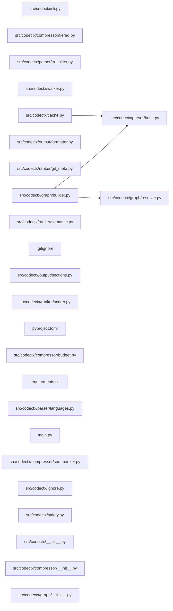

## ARCHITECTURE

AI agents receive poor codebase context because existing tools (repomix, etc.) are file concatenators. They dump files in filesystem order with no ranking, no compression, and no semantic structure. A

(Architecture truncated. See ARCHITECTURE.md for details.)

## DEPENDENCY_GRAPH



## ENTRY_POINTS

### `src/codectx/cli.py`

```python
"""codectx CLI — typer entrypoint wiring the full pipeline."""

from __future__ import annotations

import logging
import sys
import time
from pathlib import Path
from typing import Optional

import typer
from rich.console import Console
from rich.panel import Panel
from rich.progress import Progress, SpinnerColumn, TextColumn

from codectx.config.defaults import CACHE_DIR_NAME

from codectx import __version__

app = typer.Typer(
    name="codectx",
    help="Codebase context compiler for AI agents.",
    no_args_is_help=True,
    add_completion=False,
)
console = Console(stderr=True)


@app.command()
def analyze(
    root: Path = typer.Argument(
        ".",
        help="Repository root directory to analyze.",
        exists=True,
        file_okay=False,
        resolve_path=True,
    ),
    tokens: int = typer.Option(
        None,
        "--tokens",
        "-t",
        help="Token budget (default: 120000).",
    ),
    output: Path = typer.Option(
        None,
        "--output",
        "-o",
        help="Output file path (default: CONTEXT.md).",
    ),
    since: Optional[str] = typer.Option(
        None,
        "--since",
        help="Include recent changes since this date (e.g. '7 days ago').",
    ),
    verbose: bool = typer.Option(
        False,
        "--verbose",
        "-v",
        help="Enable verbose logging.",
    ),
    no_git: bool = typer.Option(
        False,
        "--no-git",
        help="Skip git metadata collection.",
    ),
    query: Optional[str] = typer.Option(
        None,
        "--query",
        "-q",
        help="Semantic query to rank files by relevance (requires codectx[semantic]).",
    ),
    extra_roots: Optional[list[Path]] = typer.Option(
        None,
        "--extra-root",
        help="Additional root directories for multi-root analysis.",
    ),
) -> None:
    """Analyze a codebase and generate CONTEXT.md."""
    _setup_logging(verbose)
    start_time = time.perf_counter()

    from codectx.config.loader import load_config

    # Build roots list: primary root + any extra roots
    roots_list: list[Path] | None = None
    if extra_roots:
        roots_list = [root] + list(extra_roots)

    config = load_config(
        root,
        token_budget=tokens,
        output_file=str(output) if output else None,
        since=since,
        verbose=verbose,
        no_git=no_git,
        query=query or "",
        roots=roots_list,
    )

    result_path = _run_pipeline(config)
    elapsed = time.perf_counter() - start_time

    console.print(
        Panel(
            f"[bold green]✓[/] Context written to [bold]{result_path}[/]\n  Time: {elapsed:.2f}s",
            title="codectx",
            border_style="green",
        )
    )


@app.command()
def benchmark(
    root: Path = typer.Argument(
        ".",
        help="Repository root directory.",
        exists=True,
        file_okay=False,
        resolve_path=True,
    ),
    tokens: int = typer.Option(None, "--tokens", "-t"),
    verbose: bool = typer.Option(False, "--verbose", "-v"),
    no_git: bool = typer.Option(False, "--no-git"),
) -> None:
    """Run analysis with detailed timing and stats."""
    _setup_logging(verbose)

    from codectx.config.loader import load_config

    config = load_config(
        root,
        token_budget=tokens,
        verbose=verbose,
        no_git=no_git,
    )

    console.print("[bold]Running benchmark...[/]\n")

    timings: dict[str, float] = {}

    # Walk
    t0 = time.perf_counter()
    from codectx.walker import walk

    files = walk(config.root, config.extra_ignore)
    timings["walk"] = time.perf_counter() - t0

    # Parse
    t0 = time.perf_counter()
    from codectx.parser.treesitter import parse_files

    parse_results = parse_files(files)
    timings["parse"] = time.perf_counter() - t0

    # Graph
    t0 = time.perf_counter()
    from codectx.graph.builder import build_dependency_graph

    dep_graph = build_dependency_graph(parse_results, config.root)
    timings["graph"] = time.perf_counter() - t0

    # Rank
    t0 = time.perf_counter()
    from codectx.ranker.git_meta import collect_git_metadata, collect_recent_changes
    from codectx.ranker.scorer import score_files

    git_meta = collect_git_metadata(files, config.root, config.no_git)
    scores = score_files(files, dep_graph, git_meta)
    timings["rank"] = time.perf_counter() - t0

    # Compress
    t0 = time.perf_counter()
    from codectx.compressor.budget import TokenBudget
    from codectx.compressor.tiered import compress_files

    budget = TokenBudget(config.token_budget)
    compressed = compress_files(parse_results, scores, budget, config.root)
    timings["compress"] = time.perf_counter() - t0

    total = sum(timings.values())

    console.print(
        Panel(
            "\n".join(
                [
                    f"[bold]Files discovered:[/] {len(files)}",
                    f"[bold]Files parsed:[/] {len(parse_results)}",
                    f"[bold]Graph nodes:[/] {dep_graph.node_count}",
                    f"[bold]Graph edges:[/] {dep_graph.edge_count}",
                    f"[bold]Compressed files:[/] {len(compressed)}",
                    f"[bold]Tokens used:[/] {budget.used:,} / {budget.total:,}",
                    "",
                    *[f"  {k:>10}: {v:.3f}s" for k, v in timings.items()],
                    f"  {'total':>10}: {total:.3f}s",
                ]
            ),
            title="Benchmark Results",
            border_style="cyan",
        )
    )


@app.command()
def watch(
    root: Path = typer.Argument(
        ".",
        help="Repository root directory.",
        exists=True,
        file_okay=False,
        resolve_path=True,
    ),
    tokens: int = typer.Option(None, "--tokens", "-t"),
    output: Path = typer.Option(None, "--output", "-o"),
    verbose: bool = typer.Option(False, "--verbose", "-v"),
    no_git: bool = typer.Option(False, "--no-git"),
) -> None:
    """Watch for file changes and regenerate CONTEXT.md."""
    _setup_logging(verbose)

    from codectx.config.loader import load_config

    config = load_config(
        root,
        token_budget=tokens,
        output_file=str(output) if output else None,
        verbose=verbose,
        no_git=no_git,
        watch=True,
    )

    console.print(f"[bold]Watching[/] {config.root} for changes...")
    console.print("Press Ctrl+C to stop.\n")

    # Initial run
    _run_pipeline(config)
    console.print("[green]Initial context generated.[/]\n")

    try:
        from watchfiles import watch as watchfiles_watch

        for changes in watchfiles_watch(str(config.root)):
            changed_paths = [Path(c[1]) for c in changes]
            console.print(f"[yellow]Changes detected:[/] {len(changed_paths)} file(s)")
            try:
                _run_pipeline(config)
                console.print("[green]Context regenerated.[/]\n")
            except Exception as exc:
                console.print(f"[red]Error during regeneration: {exc}[/]\n")
    except KeyboardInterrupt:
        console.print("\n[bold]Watch stopped.[/]")


# ---------------------------------------------------------------------------
# Cache commands
# ---------------------------------------------------------------------------

cache_app = typer.Typer(help="Manage the codectx cache.")
app.add_typer(cache_app, name="cache")


@cache_app.command("export")
def cache_export(
    root: Path = typer.Argument(
        ".",
        help="Repository root directory.",
        exists=True,
        file_okay=False,
        resolve_path=True,
    ),
    output: Path = typer.Option(
        ".codectx_cache.tar.gz",
        "--output",
        "-o",
        help="Output archive path.",
    ),
) -> None:
    """Export the cache as a tar.gz archive for CI sharing."""
    from codectx.cache import Cache

    cache = Cache(root)
    try:
        cache.export_cache(output)
        console.print(f"[bold green]✓[/] Cache exported to [bold]{output}[/]")
    except FileNotFoundError as exc:
        console.print(f"[red]Error:[/] {exc}")
        raise typer.Exit(1)


@cache_app.command("import")
def cache_import(
    root: Path = typer.Argument(
        ".",
        help="Repository root directory.",
        exists=True,
        file_okay=False,
        resolve_path=True,
    ),
    archive: Path = typer.Option(
        ".codectx_cache.tar.gz",
        "--input",

... (truncated: entry point exceeds 300 lines)
```

## CORE_MODULES

*No core modules selected within budget.*

## SUPPORTING_MODULES

### `src/codectx/config/defaults.py`

> Default configuration values and constants for codectx.

*144 lines, 1 imports*

### `src/codectx/parser/base.py`

> Core data structures for the parser module.

```python
class Symbol
    """A top-level symbol extracted from a source file."""

class ParseResult
    """Result of parsing a single source file."""

def make_plaintext_result(path: Path, source: str) -> ParseResult
    """Create a minimal ParseResult for unsupported language files."""

```

### `src/codectx/compressor/tiered.py`

> Tiered compression — assigns tiers and enforces token budget."""


```python
class mpressedFile:

    """"A file compressed to its assigned tier.""""""

def sign_tiers(
(    scores: dict[Path, float],
) -) -> ct[Path, int]:

    """"Assign tier to each file based on its score.

    Tier 1 (score > 0.7): full source
    Tier 2 (0.3–0.7): signatures + docstrings
    Tier 3 (< 0.3): one-line summary
    """"""

def ress_files(
  (  parse_results: dict[Path, ParseResult],
    scores: dict[Path, float],
    budget: TokenBudget,
    root: Path,
    llm_enabled: bool = False,
    llm_provider: str = "openai",
    llm_model: str = "",
) -> ) -> [CompressedFile]:
  
    """ompress files into tiered content within the token budget.

    Budget consumption order:
      1. Tier 1 files (full source), by score descending
      2. Tier 2 files (signatures + docstrings), by score descending
      3. Tier 3 files (one-line summary), by score descending

    Overflow policy: drop Tier 3 → truncate Tier 2 → truncate Tier 1.
    """
    tie"""

def arseResult, pa(th: Path, root: Path) -> str:
    """Tier) -> ful
    """ce with metadata header."""
    rel = path.rela"""

def arseResult, pa(th: Path, root: Path) -> str:
    """Tier) -> fun
    """class signatures + docstrings."""
    rel = path.rela"""

def arseResult, pa(th: Path, root: Path) -> str:
    """Tier) -> one
    """summary."""
    rel = path.rela"""

def ParseResult) -> s(tr:
    """Genera) ->  on
    """summary from parse result."""
    parts: list[str]"""

```

### `src/codectx/parser/treesitter.py`

> Tree-sitter AST extraction — parallel parsing of source files."""


```python
def arse_scm_patterns(t(ext: str) -) -> st[tuple[str, str]]:

    """"Parse S-expression (.scm) text into (node_type, capture_name) pairs.

    Handles nested parentheses like:
        (function_definition name: (identifier) @name) @function
    Returns the *outermost* node_type with its trailing @capture.
    """"""

class erySpec:

    """"Parsed query specification from a .scm file.""""""

def oad_query_spec(l(anguage: str) -) -> erySpec | None:

    """"Load and parse a .scm query file for the given language.""""""

def et_query_spec(l(anguage: str) -) -> erySpec | None:

    """"Get cached QuerySpec for a language.""""""

def rse_files(f(iles: list[Path]) -) -> ct[Path, ParseResult]:

    """"Parse multiple files in parallel using ProcessPoolExecutor.

    Files with unsupported languages get a plain-text ParseResult.
    """"""

def rse_file(p(ath: Path) -) -> rseResult:

    """"Parse a single file (synchronous, for caching or single-file use).""""""

def arse_single_worker(a(rgs: tuple[str, str, str]) -) -> rseResult:

    """"Worker function for ProcessPoolExecutor. Receives serializable args.""""""

def xtract(p(ath: Path, source: str, entry: LanguageEntry) -) -> rseResult:

    """"Extract imports, symbols, and docstrings from source via tree-sitter.""""""

def allback_parse(p(ath: Path, source: str, language: str) -) -> rseResult:

    """"Best-effort fallback extraction when tree-sitter parsing fails.""""""

def egex_imports(s(ource: str, language: str) -) -> st[str]:

    """"Extract import-like lines via lightweight regex patterns.""""""

def egex_docstrings(s(ource: str, language: str) -) -> st[str]:

    """"Extract a module-level docstring/comment for fallback parsing.""""""

def xtract_imports(n(ode: Any, language: str, source: str) -) -> st[str]:

    """"Extract import strings from the AST.

    Uses .scm query spec (data-driven) if available, otherwise falls back
    to manual per-language logic for c, cpp, ruby.
    """"""

def xtract_symbols(n(ode: Any, language: str, source: str) -) -> st[Symbol]:

    """"Extract top-level functions and classes.""""""

def xtract_module_docstrings(n(ode: Any, language: str, source: str) -) -> st[str]:

    """"Extract module-level docstrings.""""""

def ython_func_symbol(n(ode: Any, source: str, kind: str) -) -> mbol:


def ython_class_symbol(n(ode: Any, source: str) -) -> mbol:


def s_func_symbol(n(ode: Any, source: str) -) -> mbol:


def s_class_symbol(n(ode: Any, source: str) -) -> mbol:


def aybe_js_arrow(n(ode: Any, source: str, symbols: list[Symbol]) -) -> ne:

    """"Handle `const foo = () => {}` pattern.""""""

def o_func_symbol(n(ode: Any, source: str, kind: str = "function") -) -> mbol:


def eneric_symbol(n(ode: Any, source: str, kind: str) -) -> mbol:

    """"Generic symbol extractor — takes first identifier as name.""""""

def k_tree(nod(e: Any) -> ) -> [Any]:
  
    """terate over all nodes in the tree (BFS).""""""

def e_text(nod(e: Any, source: str) -> ) -> 
  
    """et the source text for a tree-sitter node.""""""

def d_child(nod(e: Any, child_type: str) -> ) -> | None:
  
    """ind first child of a given type.""""""

def ract_first_docstring(bod(y_node: Any, source: str) -> ) -> 
  
    """xtract docstring from the first expression_statement in a body block.""""""

def d_source(pat(h: Path) -> ) -> 
  
    """ead a source file as UTF-8 text.""""""

```

### `src/codectx/walker.py`

> File-system walker — discovers files, applies ignore specs, filters binaries."""


```python
def lk(
(    root: Path,
    extra_ignore: tuple[str, ...] = (),
    output_file: Path | None = None,
) -) -> st[Path]:

    """"Recursively discover non-ignored, non-binary files under *root*.

    Args:
        root: Repository root directory.
        extra_ignore: Additional ignore patterns from config.
        output_file: Output file to exclude from results (prevents self-inclusion).

    Returns:
        Sorted list of absolute file paths.
    """"""

def ollect(
(    current: Path,
    root: Path,
    spec: "object",  # pathspec.PathSpec
    out: list[Path],
) -) -> ne:

    """"Recursively collect files, pruning ignored directories.""""""

def s_binary(p(ath: Path) -) -> ol:

    """"Detect binary files by probing UTF-8 decoding on the initial byte chunk.""""""

def lk_multi(
(    roots: list[Path],
    extra_ignore: tuple[str, ...] = (),
    output_file: Path | None = None,
) -) -> ct[Path, list[Path]]:

    """"Walk multiple roots independently, returning files grouped by root.

    Args:
        roots: List of repository root directories.
        extra_ignore: Additional ignore patterns from config.
        output_file: Output file to exclude from results.

    Returns:
        Dict mapping each root to sorted list of absolute file paths.
    """"""

def nd_root(f(ile_path: Path, roots: list[Path]) -) -> th | None:

    """"Determine which root a file belongs to.

    Args:
        file_path: Absolute path to a file.
        roots: List of root directories.

    Returns:
        The root the file belongs to, or None if not under any root.
    """"""

```

### `src/codectx/cache.py`

> File-level caching for parse results, token counts, and git metadata.

```python
class Cache
    """JSON-based file cache in .codectx_cache/."""

def file_hash(path: Path) -> str
    """Compute a fast hash of file contents."""

```

### `src/codectx/graph/resolver.py`

> Per-language import string → file path resolution."""


```python
def solve_import(
(    import_text: str,
    language: str,
    source_file: Path,
    root: Path,
    all_files: frozenset[str],
) -) -> st[Path]:

    """"Resolve an import statement to file paths within the repository.

    Args:
        import_text: Raw import string from the AST.
        language: Language name (e.g. "python").
        source_file: Absolute path of the file containing the import.
        root: Repository root.
        all_files: Set of all known file paths (POSIX, relative to root).

    Returns:
        List of resolved file paths (may be empty if unresolvable).
    """"""

def solve_import_multi_root(
(    import_text: str,
    language: str,
    source_file: Path,
    roots: list[Path],
    all_files_by_root: dict[Path, frozenset[str]],
) -) -> st[Path]:

    """"Resolve an import trying the source file's root first, then others.

    Args:
        import_text: Raw import string from the AST.
        language: Language name.
        source_file: Absolute path of the file containing the import.
        roots: All root directories.
        all_files_by_root: Map of root → set of relative file paths.

    Returns:
        List of resolved file paths.
    """"""

def olve_python(
  (  import_text: str,
    source_file: Path,
    root: Path,
    all_files: frozenset[str],
) -> ) -> [Path]:
  

def olve_js_ts(
  (  import_text: str,
    source_file: Path,
    root: Path,
    all_files: frozenset[str],
) -> ) -> [Path]:
  

def olve_go(imp(ort_text: str, root: Path, all_files: frozenset[str]) -> ) -> [Path]:
  

def olve_rust(
  (  import_text: str,
    source_file: Path,
    root: Path,
    all_files: frozenset[str],
) -> ) -> [Path]:
  

def ve_java(impor(t_text: str, root: Path, all_files: frozenset[str]) -> li) -> ath]:
    

def ve_c_cpp(
    (import_text: str,
    source_file: Path,
    root: Path,
    all_files: frozenset[str],
) -> li) -> ath]:
    

def ve_ruby(
    (import_text: str,
    source_file: Path,
    root: Path,
    all_files: frozenset[str],
) -> li) -> ath]:
    

```

### `src/codectx/output/formatter.py`

> Structured markdown formatter — emits CONTEXT.md."""


```python
def oot_label(f(ile_path: Path, roots: list[Path] | None) -) -> r:

    """"Return a root label prefix if multi-root, else empty string.""""""

def rmat_context(
(    compressed: list[CompressedFile],
    dep_graph: DepGraph,
    root: Path,
    budget: TokenBudget,
    architecture_text: str = "",
    roots: list[Path] | None = None,
) -) -> r:

    """"Assemble the full CONTEXT.md content.

    Sections are emitted in the canonical order and consume the token budget.
    """"""

def ite_context_file(c(ontent: str, output_path: Path) -) -> ne:

    """"Write the assembled context to disk.""""""

def ection_header(t(itle: str) -) -> r:


def uto_architecture(c(ompressed: list[CompressedFile], root: Path) -) -> r:

    """"Generate a simple, compressed architecture summary from the file list.""""""

def ender_mermaid_graph(
(    dep_graph: DepGraph,
    root: Path,
    compressed: list[CompressedFile],
) -) -> r:

    """"Render the dependency graph as a Mermaid diagram.

    Limited to top N ranked modules to keep the diagram readable.
    """"""

```

### `src/codectx/ranker/git_meta.py`

> Git metadata extraction via pygit2.

```python
class GitFileInfo
    """Git metadata for a single file."""

def collect_git_metadata(
    files: list[Path],
    root: Path,
    no_git: bool = False,
    max_commits: int = 5000,
) -> dict[Path, GitFileInfo]
    """Collect git metadata for all files.

    Args:
        files: List of absolute file paths.
        root: Repository root.
        no_git: If True, use filesystem metadata only.
        max_commits: Max number of commits to walk (default: 5000).

    Returns:
        Mapping of file path to GitFileInfo."""

def _collect_from_git(
    repo: object,  # pygit2.Repository
    files: list[Path],
    root: Path,
    max_commits: int,
) -> dict[Path, GitFileInfo]
    """Walk git log to collect per-file commit counts and last-modified times."""

def ilesystem_fallback(f(iles: list[Path]) -) -> ct[Path, GitFileInfo]:

    """"Fallback using filesystem metadata when git is unavailable.""""""

def llect_recent_changes(r(oot: Path, since: str | None, no_git: bool = False) -) -> r:

    """"Collect a deterministic markdown summary of recent git changes.""""""

def arse_since(s(ince: str) -) -> oat | None:

    """"Parse --since values like '7 days ago' or ISO date strings.""""""

```

### `src/codectx/config/loader.py`

> Configuration loader — reads .codectx.toml or pyproject.toml [tool.codectx]."""


```python
class nfig:

    """"Resolved configuration for a codectx run.""""""

def ad_config(r(oot: Path, **cli_overrides: object) -) -> nfig:

    """"Load config from .codectx.toml → pyproject.toml [tool.codectx] → defaults.

    CLI overrides take highest precedence.
    """
    f"""

def ve(
    (key: str,
    cli: dict[str, object],
    file_cfg: dict[str, object],
    default: object,
) -> ob) -> :
    
    """olve a config key with precedence: CLI > file > default."""
    c"""

```

### `src/codectx/graph/builder.py`

> Dependency graph construction using rustworkx.

```python
class DepGraph
    """Dependency graph with file-level nodes and import edges."""

def build_dependency_graph(
    parse_results: dict[Path, ParseResult],
    root: Path,
) -> DepGraph
    """Build a dependency graph from parse results.

    Args:
        parse_results: Mapping of file paths to their parse results.
        root: Repository root directory.

    Returns:
        Constructed DepGraph."""

```

### `src/codectx/ranker/semantic.py`

> Semantic search ranking using lancedb and sentence-transformers.

This module is an optional dependency — all imports are guarded.
Install with: pip install codectx[semantic]
"""


```python
def _available()( -) -> ol:

    """"Check if semantic search dependencies are available.""""""

def mantic_score(
(    query: str,
    files: list[Path],
    parse_results: dict[Path, ParseResult],
    cache_dir: Path,
) -) -> ct[Path, float]:

    """"Return semantic relevance score 0.0–1.0 per file for the given query.

    Args:
        query: Natural language query to rank files against.
        files: List of file paths to score.
        parse_results: Parse results for each file.
        cache_dir: Directory to store lancedb tables for caching.

    Returns:
        Dict mapping file path to semantic similarity score (0.0–1.0).

    Raises:
        ImportError: If lancedb or sentence-transformers not installed.
    """
    i"""

```

### `.gitignore`

*18 lines, 0 imports*

## PERIPHERY

- `tests/test_walker.py` — Tests for the file walker.
- `src/codectx/output/sections.py` — Section constants for CONTEXT.md output.
- `tests/test_parser.py` — Tests for tree-sitter parsing.
- `src/codectx/ranker/scorer.py` — Composite file scoring — ranks files by importance."""
- `tests/unit/test_formatter_sections.py` — Tests for deterministic formatter section ordering and presence.
- `pyproject.toml` — 90 lines
- `src/codectx/compressor/budget.py` — Token counting and budget tracking via tiktoken.
- `tests/unit/test_cache_export.py` — Tests for CI cache export/import.
- `tests/unit/test_cache_wiring.py` — Tests for cache wiring into the analyze pipeline.
- `tests/unit/test_semantic.py` — Tests for semantic search ranking module.
- `tests/test_scorer.py` — Tests for the composite file scorer.
- `tests/unit/test_cycles.py` — Tests for cyclic dependency detection.
- `tests/unit/test_summarizer.py` — Tests for LLM summarizer module.
- `requirements.txt` — 113 lines
- `src/codectx/parser/languages.py` — Extension → language mapping for tree-sitter parsers."""
- `tests/test_integration.py` — Integration test — runs codectx pipeline end-to-end."""
- `main.py` — 1 function, 7 lines
- `src/codectx/compressor/summarizer.py` — LLM-based file summarization for Tier 3 compression.
- `src/codectx/ignore.py` — Ignore-spec handling — layers ALWAYS_IGNORE, .gitignore, .ctxignore."""
- `tests/unit/test_multi_root.py` — Tests for multi-root support.
- `tests/test_compressor.py` — Tests for tiered compression and token budget.
- `src/codectx/safety.py` — Sensitive-file detection and user confirmation.
- `src/codectx/parser/queries/go.scm` — 7 lines
- `src/codectx/parser/queries/java.scm` — 5 lines
- `src/codectx/parser/queries/javascript.scm` — 8 lines
- `src/codectx/parser/queries/python.scm` — 7 lines
- `src/codectx/parser/queries/rust.scm` — 8 lines
- `src/codectx/parser/queries/typescript.scm` — 8 lines
- `tests/unit/__init__.py` — 0 lines
- `tests/unit/test_queries.py` — Tests for .scm query file loading and data-driven extraction.
- `src/codectx/__init__.py` — codectx — Codebase context compiler for AI agents."""
- `src/codectx/compressor/__init__.py` — 0 lines
- `src/codectx/config/__init__.py` — 0 lines
- `src/codectx/graph/__init__.py` — 0 lines
- `src/codectx/output/__init__.py` — 0 lines
- `src/codectx/parser/__init__.py` — 0 lines
- `src/codectx/ranker/__init__.py` — 0 lines
- `tests/__init__.py` — 0 lines
- `tests/test_ignore.py` — Tests for ignore-spec handling.
- `.python-version` — 2 lines
- `ARCHITECTURE.md` — 113 lines
- `CLAUDE.md` — 91 lines
- `DECISIONS.md` — 82 lines
- `PLAN.md` — 54 lines
- `README.md` — 104 lines

