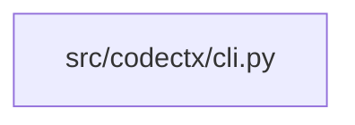

## ARCHITECTURE

codectx processes repositories through a structured analysis pipeline that ranks code by importance, compresses it intelligently, and emits a structured markdown document optimized for AI systems.

(Architecture truncated. See ARCHITECTURE.md for details.)

## ENTRY_POINTS

### `src/codectx/cli.py`

```python
"""codectx CLI — typer entrypoint wiring the full pipeline."""

from __future__ import annotations

import logging
import os
import sys
import threading
import time
from collections.abc import Callable
from dataclasses import dataclass
from fnmatch import fnmatch
from pathlib import Path
from typing import TYPE_CHECKING, Any

import typer
from rich.console import Console
from rich.panel import Panel
from rich.progress import Progress, SpinnerColumn, TextColumn

from codectx import __version__
from codectx.config.defaults import CACHE_DIR_NAME

if TYPE_CHECKING:
    from codectx.output.formatter import CompressionResult

try:
    from codectx.llm import llm_dependencies_available

    _LLM_AVAILABLE = llm_dependencies_available()
except Exception:
    _LLM_AVAILABLE = False


_WATCH_SOURCE_EXTENSIONS: frozenset[str] = frozenset(
    {
        ".py",
        ".ts",
        ".tsx",
        ".js",
        ".go",
        ".rs",
        ".java",
        ".cpp",
        ".c",
        ".h",
        ".rb",
        ".php",
    }
)
_WATCH_IGNORED_DIRS: frozenset[str] = frozenset(
    {"__pycache__", ".git", "node_modules", "dist", "build"}
)
_WATCH_IGNORED_NAMES: frozenset[str] = frozenset({"package-lock.json", "yarn.lock", "uv.lock"})
_WATCH_IGNORED_GLOBS: tuple[str, ...] = ("*.pyc", "*.pyo", "*.lock")


def _watch_path_is_relevant(path: Path) -> bool:
    parts = set(path.parts)
    if parts.intersection(_WATCH_IGNORED_DIRS):
        return False
    if path.name in _WATCH_IGNORED_NAMES:
        return False
    if any(fnmatch(path.name, pattern) for pattern in _WATCH_IGNORED_GLOBS):
        return False
    return path.suffix.lower() in _WATCH_SOURCE_EXTENSIONS


class DebouncedHandler:
    def __init__(self, delay: float, callback: Callable[[set[str]], None]) -> None:
        self._delay = delay
        self._callback = callback
        self._timer: threading.Timer | None = None
        self._pending: set[str] = set()
        self._lock = threading.Lock()

    def on_any_event(self, event: Any) -> None:
        if bool(getattr(event, "is_directory", False)):
            return
        src_path = str(getattr(event, "src_path", ""))
        if not src_path:
            return
        with self._lock:
            self._pending.add(src_path)
            if self._timer:
                self._timer.cancel()
            self._timer = threading.Timer(self._delay, self._fire)
            self._timer.start()

    def _fire(self) -> None:
        with self._lock:
            paths = self._pending.copy()
            self._pending.clear()
        callback = self._callback
        if callable(callback):
            callback(paths)


app = typer.Typer(
    name="codectx",
    help="Compile codebase context for AI agents using AST-driven analysis.",
    epilog="Docs: https://codectx.granth.tech | Source: https://github.com/hey-granth/codectx",
    no_args_is_help=True,
    add_completion=False,
)
console = Console(stderr=True)


@app.command(
    short_help="Analyze a repository and generate compressed context.",
    help="Analyze a repository and generate compressed context for AI consumption.",
)
def analyze(
    root: Path = typer.Argument(  # noqa: B008
        ".",
        help="Path to the repository root (default: current directory).",
        exists=True,
        file_okay=False,
        resolve_path=True,
    ),
    tokens: int = typer.Option(  # noqa: B008
        None,
        "--budget",
        "--tokens",
        "-t",
        help="Token budget for context output (default: 120000).",
    ),
    output: Path = typer.Option(  # noqa: B008
        None,
        "--output",
        "-o",
        help="Output file path (default: CONTEXT.md).",
    ),
    exclude: list[str] | None = typer.Option(  # noqa: B008
        None,
        "--exclude",
        help="Glob patterns to exclude (repeatable).",
    ),
    since: str | None = typer.Option(  # noqa: B008
        None,
        "--since",
        help="Include recent changes since this date (e.g. '7 days ago').",
    ),
    verbose: bool = typer.Option(
... [truncated to fit token budget]
## SYMBOL_INDEX

**`src/codectx/cli.py`**
- `_watch_path_is_relevant()`
- class `DebouncedHandler`
  - `__init__()`
  - `on_any_event()`
  - `_fire()`
- `analyze()`
- `benchmark()`
- `watch()`
- `search()`
- `cache_export()`
- `cache_import()`
- `cache_clear()`
- `cache_info()`
- `main()`
- class `PipelineMetrics`
- `_run_pipeline()`
- `_setup_logging()`

## IMPORTANT_CALL_PATHS

main.main()
## CORE_MODULES

*No core modules selected within budget.*

## SUPPORTING_MODULES

*No supporting modules selected within budget.*

## DEPENDENCY_GRAPH



### Cyclic Dependencies

> [!WARNING]
> The following circular import chains were detected:

1. `src/codectx/ranker/scorer.py` -> `tests/test_scorer.py`

## RANKED_FILES

| File | Score | Tier | Tokens |
|------|-------|------|--------|
| `src/codectx/cli.py` | 0.996 | full source | 1009 |

## PERIPHERY

*No periphery files selected within budget.*

