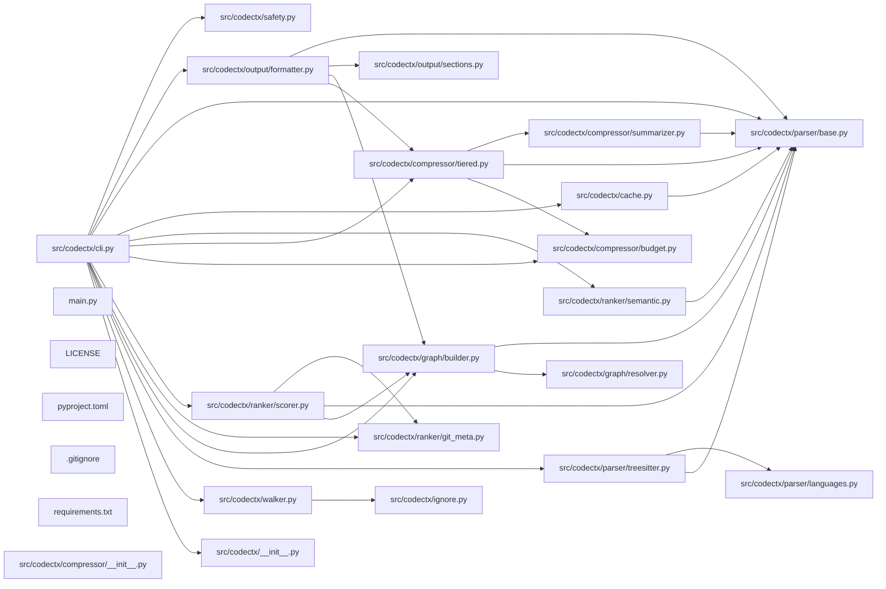

## ARCHITECTURE

codectx processes repositories through a structured analysis pipeline that ranks code by importance, compresses it intelligently, and emits a structured markdown document optimized for AI systems.

(Architecture truncated. See ARCHITECTURE.md for details.)

## ENTRY_POINTS

### `src/codectx/cli.py`

```python
"""codectx CLI — typer entrypoint wiring the full pipeline."""

from __future__ import annotations

import logging
import sys
import time
from pathlib import Path

import typer
from rich.console import Console
from rich.panel import Panel
from rich.progress import Progress, SpinnerColumn, TextColumn

from codectx import __version__
from codectx.config.defaults import CACHE_DIR_NAME

app = typer.Typer(
    name="codectx",
    help="Codebase context compiler for AI agents.",
    no_args_is_help=True,
    add_completion=False,
)
console = Console(stderr=True)


@app.command()
def analyze(
    root: Path = typer.Argument(
        ".",
        help="Repository root directory to analyze.",
        exists=True,
        file_okay=False,
        resolve_path=True,
    ),
    tokens: int = typer.Option(
        None,
        "--tokens",
        "-t",
        help="Token budget (default: 120000).",
    ),
    output: Path = typer.Option(
        None,
        "--output",
        "-o",
        help="Output file path (default: CONTEXT.md).",
    ),
    since: str | None = typer.Option(
        None,
        "--since",
        help="Include recent changes since this date (e.g. '7 days ago').",
    ),
    verbose: bool = typer.Option(
        False,
        "--verbose",
        "-v",
        help="Enable verbose logging.",
    ),
    no_git: bool = typer.Option(
        False,
        "--no-git",
        help="Skip git metadata collection.",
    ),
    query: str | None = typer.Option(
        None,
        "--query",
        "-q",
        help="Semantic query to rank files by relevance (requires codectx[semantic]).",
    ),
    task: str = typer.Option(
        "default",
        "--task",
        help="Task profile for context generation (debug, feature, architecture, default).",
    ),
    layers: bool = typer.Option(
        False,
        "--layers",
        help="Generate layered context output.",
    ),
    extra_roots: list[Path] | None = typer.Option(
        None,
        "--extra-root",
        help="Additional root directories for multi-root analysis.",
    ),
) -> None:
    """Analyze a codebase and generate CONTEXT.md."""
    _setup_logging(verbose)
    start_time = time.perf_counter()

    from codectx.config.loader import load_config

    # Build roots list: primary root + any extra roots
    roots_list: list[Path] | None = None
    if extra_roots:
        roots_list = [root] + list(extra_roots)

    config = load_config(
        root,
        token_budget=tokens,
        output_file=str(output) if output else None,
        since=since,
        verbose=verbose,
        no_git=no_git,
        query=query or "",
        task=task,
        layers=layers,
        roots=roots_list,
    )

    metrics = _run_pipeline(config)
    elapsed = time.perf_counter() - start_time

    ratio = metrics.original_tokens / metrics.context_tokens if metrics.context_tokens > 0 else 0

    console.print(
        Panel(
            f"[bold green]✓[/] Context written to [bold]{metrics.output_path}[/]\n\n"
            f"[bold]Files scanned:[/] {metrics.files_scanned:,}\n"
            f"[bold]Source tokens (excl. tests/docs):[/] {metrics.original_tokens:,}\n"
            f"[bold]Context tokens:[/] {metrics.context_tokens:,}\n"
            f"[bold]Compression ratio:[/] {ratio:.1f}x\n"
            f"[bold]Analysis time:[/] {elapsed:.1f}s",
            title="codectx",
            border_style="green",
        )
    )


@app.command()
def benchmark(
    root: Path = typer.Argument(
        ".",
        help="Repository root directory.",
        exists=True,
        file_okay=False,
        resolve_path=True,
    ),
    tokens: int = typer.Option(None, "--tokens", "-t"),
    verbose: bool = typer.Option(False, "--verbose", "-v"),
    no_git: bool = typer.Option(False, "--no-git"),
) -> None:
    """Run analysis with detailed timing and stats."""
    _setup_logging(verbose)

    from codectx.config.loader import load_config

    config = load_config(
        root,
        token_budget=tokens,
        verbose=verbose,
        no_git=no_git,
    )

    console.print("[bold]Running benchmark...[/]\n")

    timings: dict[str, float] = {}

    # Walk
    t0 = time.perf_counter()
    from codectx.walker import walk

    files = walk(config.root, config.extra_ignore)
    timings["walk"] = time.perf_counter() - t0

    # Parse
    t0 = time.perf_counter()
    from codectx.parser.treesitter import parse_files

    parse_results = parse_files(files)
    timings["parse"] = time.perf_counter() - t0

    # Graph
    t0 = time.perf_counter()
    from codectx.graph.builder import build_dependency_graph

    dep_graph = build_dependency_graph(parse_results, config.root)
    timings["graph"] = time.perf_counter() - t0

    # Rank
    t0 = time.perf_counter()
    from codectx.ranker.git_meta import collect_git_metadata
    from codectx.ranker.scorer import score_files

    git_meta = collect_git_metadata(files, config.root, config.no_git)
    scores = score_files(files, dep_graph, git_meta)
    timings["rank"] = time.perf_counter() - t0

    # Compress
    t0 = time.perf_counter()
    from codectx.compressor.budget import TokenBudget
    from codectx.compressor.tiered import compress_files

    budget = TokenBudget(config.token_budget)
    compressed = compress_files(parse_results, scores, budget, config.root)
    timings["compress"] = time.perf_counter() - t0

    total = sum(timings.values())

    console.print(
        Panel(
            "\n".join(
                [
                    f"[bold]Files discovered:[/] {len(files)}",
                    f"[bold]Files parsed:[/] {len(parse_results)}",
                    f"[bold]Graph nodes:[/] {dep_graph.node_count}",
                    f"[bold]Graph edges:[/] {dep_graph.edge_count}",
                    f"[bold]Compressed files:[/] {len(compressed)}",
                    f"[bold]Tokens used:[/] {budget.used:,} / {budget.total:,}",
                    "",
                    *[f"  {k:>10}: {v:.3f}s" for k, v in timings.items()],
                    f"  {'total':>10}: {total:.3f}s",
                ]
            ),
            title="Benchmark Results",
            border_style="cyan",
        )
    )


@app.command()
def watch(
    root: Path = typer.Argument(
        ".",
        help="Repository root directory.",
        exists=True,
        file_okay=False,
        resolve_path=True,
    ),
    tokens: int = typer.Option(None, "--tokens", "-t"),
    output: Path = typer.Option(None, "--output", "-o"),
    verbose: bool = typer.Option(False, "--verbose", "-v"),
    no_git: bool = typer.Option(False, "--no-git"),
) -> None:
    """Watch for file changes and regenerate CONTEXT.md."""
    _setup_logging(verbose)

    from codectx.config.loader import load_config

    config = load_config(
        root,
        token_budget=tokens,
        output_file=str(output) if output else None,
        verbose=verbose,
        no_git=no_git,
        watch=True,
    )

    console.print(f"[bold]Watching[/] {config.root} for changes...")
    console.print("Press Ctrl+C to stop.\n")

    # Initial run
    _run_pipeline(config)
    console.print("[green]Initial context generated.[/]\n")

    try:
        from watchfiles import watch as watchfiles_watch

        for changes in watchfiles_watch(str(config.root)):
            changed_paths = [Path(c[1]) for c in changes]
            console.print(f"[yellow]Changes detected:[/] {len(changed_paths)} file(s)")
            try:
                _run_pipeline(config)
                console.print("[green]Context regenerated.[/]\n")
            except Exception as exc:
                console.print(f"[red]Error during regeneration: {exc}[/]\n")
    except KeyboardInterrupt:
        console.print("\n[bold]Watch stopped.[/]")


@app.command()
def search(
    query: str = typer.Argument(
        ...,
        help="Semantic search query.",
    ),
    root: Path = typer.Option(
        ".",
        "--root",
        "-r",
        help="Repository root directory.",
        exists=True,
        file_okay=False,
        resolve_path=True,
    ),
    limit: int = typer.Option(
        10,
        "--limit",
        "-l",
        help="Number of results to return.",
    ),
    verbose: bool = typer.Option(
        False,
        "--verbose",
        "-v",
        help="Enable verbose logging.",
    ),
) -> None:
    """Search the codebase semantically."""
    _setup_logging(verbose)


... (truncated: entry point exceeds 300 lines)
```

## SYMBOL_INDEX

**`src/codectx/parser/base.py`**
- class `Symbol`
- class `ParseResult`
- `make_plaintext_result()`

**`src/codectx/compressor/tiered.py`**
- class `CompressedFile`
- `_is_non_source()`
- `assign_tiers()`
- `compress_files()`
- `_tier1_content()`
- `_tier2_content()`
- `_tier3_content()`
- `_one_line_summary()`

**`src/codectx/graph/builder.py`**
- class `DepGraph`
  - `add_file()`
  - `add_edge()`
  - `fan_in()`
  - `fan_out()`
  - `entry_points()`
  - `graph_distance()`
  - `entry_distances()`
  - `detect_call_paths()`
- `build_dependency_graph()`

**`src/codectx/parser/treesitter.py`**
- `_parse_scm_patterns()`
- class `QuerySpec`
- `_load_query_spec()`
- `_get_query_spec()`
- `parse_files()`
- `parse_file()`
- `_parse_single_worker()`
- `_extract()`
- `_fallback_parse()`
- `_regex_imports()`
- `_regex_docstrings()`
- `_extract_imports()`
- `_extract_symbols()`
- `_extract_module_docstrings()`
- `_python_func_symbol()`
- `_python_class_symbol()`
- `_js_func_symbol()`
- `_js_class_symbol()`
- `_maybe_js_arrow()`
- `_go_func_symbol()`
- `_generic_symbol()`
- `_walk_tree()`
- `_node_text()`
- `_find_child()`
- `_extract_first_docstring()`
- `_read_source()`

**`src/codectx/cli.py`**
- `analyze()`
- `benchmark()`
- `watch()`
- `search()`
- `cache_export()`
- `cache_import()`
- `main()`
- class `PipelineMetrics`
- `_run_pipeline()`
- `_setup_logging()`

**`src/codectx/output/formatter.py`**
- `_root_label()`
- `format_context()`
- `write_context_file()`
- `write_layer_files()`
- `_section_header()`
- `_auto_architecture()`
- `_render_mermaid_graph()`

**`src/codectx/ranker/git_meta.py`**
- class `GitFileInfo`
- `collect_git_metadata()`
- `_collect_from_git()`
- `_filesystem_fallback()`
- `collect_recent_changes()`
- `_parse_since()`
- `_load_pygit2()`

**`src/codectx/ranker/scorer.py`**
- `score_files()`
- `_min_max_normalize()`

**`src/codectx/config/loader.py`**
- class `Config`
- `load_config()`
- `_resolve()`
- `_resolve_bool()`
- `_resolve_str()`
- `_resolve_optional_str()`
- `_resolve_int()`

**`src/codectx/compressor/budget.py`**
- `_get_encoder()`
- `count_tokens()`
- class `TokenBudget`
  - `__init__()`
  - `consume()`
  - `consume_partial()`

**`src/codectx/walker.py`**
- `walk()`
- `_collect()`
- `_is_binary()`
- `walk_multi()`
- `find_root()`

**`src/codectx/ranker/semantic.py`**
- `is_available()`
- `semantic_score()`

**`src/codectx/output/sections.py`**
- class `Section`

**`src/codectx/cache.py`**
- class `Cache`
  - `__init__()`
  - `_load()`
  - `save()`
  - `get_parse_result()`
  - `put_parse_result()`
  - `get_token_count()`
  - `put_token_count()`
  - `invalidate()`
  - `export_cache()`
- `file_hash()`
- `_decode_children()`
- `_coerce_int()`

**`src/codectx/compressor/summarizer.py`**
- `is_available()`
- `summarize_file()`
- `summarize_files_batch()`
- `_summarize_openai()`
- `_summarize_anthropic()`

**`src/codectx/graph/resolver.py`**
- `resolve_import()`
- `resolve_import_multi_root()`
- `_resolve_python()`
- `_resolve_js_ts()`
- `_resolve_go()`
- `_resolve_rust()`
- `_resolve_java()`
- `_resolve_c_cpp()`
- `_resolve_ruby()`

**`main.py`**
- `main()`

**`src/codectx/ignore.py`**
- `build_ignore_spec()`
- `should_ignore()`
- `_read_pattern_file()`

**`src/codectx/safety.py`**
- `build_sensitive_spec()`
- `find_sensitive_files()`
- `confirm_sensitive_files()`

**`src/codectx/parser/languages.py`**
- class `LanguageEntry`
- `get_language()`
- `get_language_for_path()`
- `get_ts_language_object()`
- `supported_extensions()`

## IMPORTANT_CALL_PATHS

main.main()

cli.analyze()
  → base.Symbol()
## CORE_MODULES

### `src/codectx/config/defaults.py`

```python
"""Default configuration values and constants for codectx."""

from __future__ import annotations

from pathlib import Path

# ---------------------------------------------------------------------------
# Always-ignored patterns (applied before .gitignore and .ctxignore)
# ---------------------------------------------------------------------------

ALWAYS_IGNORE: tuple[str, ...] = (
    ".git",
    ".github",
    ".idea",
    ".vscode",
    "__pycache__",
    "*.pyc",
    "*.log",
    "*.lock",
    "*.sqlite",
    "*.db",
    "*.cache",
    ".codectx_cache",
    ".mypy_cache",
    ".pytest_cache",
    "node_modules",
    "dist",
    "build",
    "coverage",
)

# ---------------------------------------------------------------------------
# Token budget
# ---------------------------------------------------------------------------

DEFAULT_TOKEN_BUDGET: int = 120_000
TIKTOKEN_ENCODING: str = "cl100k_base"

# ---------------------------------------------------------------------------
# Scoring weights (must sum to 1.0)
# ---------------------------------------------------------------------------

WEIGHT_GIT_FREQUENCY: float = 0.40
WEIGHT_FAN_IN: float = 0.40
WEIGHT_RECENCY: float = 0.10
WEIGHT_ENTRY_PROXIMITY: float = 0.10
CYCLE_PENALTY: float = 0.10

# ---------------------------------------------------------------------------
# Entry-point filename patterns (basename matching)
# ---------------------------------------------------------------------------

ENTRYPOINT_FILENAMES: frozenset[str] = frozenset(
    {
        # Python
        "main.py",
        "__main__.py",
        "app.py",
        "cli.py",
        "manage.py",
        # JavaScript / TypeScript
        "index.ts",
        "index.js",
        "index.tsx",
        "index.jsx",
        "server.ts",
        "server.js",
        # Go
        "main.go",
        # Rust
        "main.rs",
        "lib.rs",
        # Java
        "Main.java",
        "Application.java",
        # Ruby
        "Rakefile",
        "config.ru",
    }
)

# ---------------------------------------------------------------------------
# Sensitive-file patterns (for safety.py warnings)
# ---------------------------------------------------------------------------

SENSITIVE_PATTERNS: tuple[str, ...] = (
    ".env",
    ".env.*",
    "*.pem",
    "*.key",
    "*.crt",
    "*.p12",
    "*.pfx",
    "id_rsa",
    "id_ed25519",
    "credentials.json",
    "service-account*.json",
    "*.secret",
    "secrets.yaml",
    "secrets.yml",
)

# ---------------------------------------------------------------------------
# Output defaults
# ---------------------------------------------------------------------------

DEFAULT_OUTPUT_FILE: Path = Path("CONTEXT.md")
CONFIG_FILENAME: str = ".codectx.toml"
CACHE_DIR_NAME: str = ".codectx_cache"

# ---------------------------------------------------------------------------
# Mermaid graph limits
# ---------------------------------------------------------------------------

MAX_MERMAID_NODES: int = 25

# ---------------------------------------------------------------------------
# Strict section limits
# ---------------------------------------------------------------------------

MAX_ENTRYPOINT_LINES: int = 300

# ---------------------------------------------------------------------------
# Binary detection
# ---------------------------------------------------------------------------

BINARY_CHECK_BYTES: int = 8192

# ---------------------------------------------------------------------------
# Parallelism
# ---------------------------------------------------------------------------

MAX_PARSER_WORKERS: int | None = None  # defaults to cpu_count
MAX_IO_WORKERS: int = 16

```

### `src/codectx/parser/base.py`

```python
"""Core data structures for the parser module."""

from __future__ import annotations

from dataclasses import dataclass
from pathlib import Path


@dataclass(frozen=True)
class Symbol:
    """A top-level symbol extracted from a source file."""

    name: str
    kind: str  # "function", "class", "method"
    signature: str  # e.g. "def foo(x: int, y: str) -> bool"
    docstring: str  # empty string if none
    start_line: int
    end_line: int
    children: tuple[Symbol, ...] = ()


@dataclass(frozen=True)
class ParseResult:
    """Result of parsing a single source file."""

    path: Path
    language: str  # e.g. "python", "typescript", or "unknown"
    imports: tuple[str, ...]  # raw import strings
    symbols: tuple[Symbol, ...]
    docstrings: tuple[str, ...]  # module-level docstrings
    raw_source: str
    line_count: int
    partial_parse: bool = False

    @property
    def is_empty(self) -> bool:
        return not self.imports and not self.symbols


def make_plaintext_result(path: Path, source: str) -> ParseResult:
    """Create a minimal ParseResult for unsupported language files."""
    return ParseResult(
        path=path,
        language="unknown",
        imports=(),
        symbols=(),
        docstrings=(),
        raw_source=source,
        line_count=source.count("\n") + 1 if source else 0,
        partial_parse=False,
    )

```

### `src/codectx/compressor/tiered.py`

```python
"""Tiered compression — assigns tiers and enforces token budget."""

from __future__ import annotations

from dataclasses import dataclass
from pathlib import Path

from codectx.compressor.budget import TokenBudget, count_tokens
from codectx.config.defaults import (
    ENTRYPOINT_FILENAMES,
    MAX_ENTRYPOINT_LINES,
)
from codectx.parser.base import ParseResult


@dataclass(frozen=True)
class CompressedFile:
    """A file compressed to its assigned tier."""

    path: Path
    tier: int  # 1, 2, or 3
    score: float
    content: str
    token_count: int
    language: str


_NON_SOURCE_DIRS: frozenset[str] = frozenset(
    {
        "tests",
        "test",
        "docs",
        "doc",
        "examples",
        "example",
        "benchmarks",
        "benchmark",
        "scripts",
        "script",
    }
)


def _is_non_source(path: Path, root: Path) -> bool:
    """Return True if the file lives under a non-source directory."""
    try:
        parts = set(path.relative_to(root).parts)
    except ValueError:
        return False
    return bool(parts.intersection(_NON_SOURCE_DIRS))


def assign_tiers(
    scores: dict[Path, float],
) -> dict[Path, int]:
    """Assign tiers by score percentile.

    Top 15% -> Tier 1, next 30% -> Tier 2, rest -> Tier 3.
    Ties at the threshold are promoted into the higher tier.
    """
    if not scores:
        return {}

    sorted_scores = sorted(scores.values(), reverse=True)
    n = len(sorted_scores)

    tier1_cutoff_idx = max(1, int(n * 0.15))
    tier2_cutoff_idx = max(2, int(n * 0.45))

    tier1_threshold = sorted_scores[tier1_cutoff_idx - 1]
    tier2_threshold = sorted_scores[min(tier2_cutoff_idx - 1, n - 1)]

    tiers: dict[Path, int] = {}
    for path, score in scores.items():
        if score >= tier1_threshold:
            tiers[path] = 1
        elif score >= tier2_threshold:
            tiers[path] = 2
        else:
            tiers[path] = 3
    return tiers


def compress_files(
    parse_results: dict[Path, ParseResult],
    scores: dict[Path, float],
    budget: TokenBudget,
    root: Path,
    llm_enabled: bool = False,
    llm_provider: str = "openai",
    llm_model: str = "",
) -> list[CompressedFile]:
    """Compress files into tiered content within the token budget.

    Budget consumption order:
      1. Tier 1 files (full source), by score descending
      2. Tier 2 files (signatures + docstrings), by score descending
      3. Tier 3 files (one-line summary), by score descending

    Overflow policy: drop Tier 3 → truncate Tier 2 → truncate Tier 1.
    """
    tiers = assign_tiers(scores)

    # Force non-source files to Tier 3 regardless of score
    for path in list(tiers.keys()):
        if _is_non_source(path, root):
            tiers[path] = 3

    # Group and sort files by score, then path
    def sort_key(p: Path) -> tuple[float, str]:
        return (-scores.get(p, 0.0), p.as_posix())

    sorted_paths = sorted(parse_results.keys(), key=sort_key)

    tier1: list[Path] = []
    tier2: list[Path] = []
    tier3: list[Path] = []

    for path in sorted_paths:
        tier = tiers.get(path, 3)
        if tier == 1:
            tier1.append(path)
        elif tier == 2:
            tier2.append(path)
        else:
            tier3.append(path)

    result: list[CompressedFile] = []

    # Process Tier 1 — full source
    for path in tier1:
        pr = parse_results[path]
        content = _tier1_content(pr, path, root)
        tokens = count_tokens(content)

        if budget.remaining >= tokens:
            budget.consume(tokens)
            result.append(
                CompressedFile(
                    path=path,
                    tier=1,
                    score=scores.get(path, 0.0),
                    content=content,
                    token_count=tokens,
                    language=pr.language,
                )
            )
        else:
            # Truncate Tier 1 to fit
            truncated = budget.consume_partial(content)
            if truncated:
                result.append(
                    CompressedFile(
                        path=path,
                        tier=1,
                        score=scores.get(path, 0.0),
                        content=truncated,
                        token_count=count_tokens(truncated),
                        language=pr.language,
                    )
                )

    # Process Tier 2 — signatures + docstrings
    for path in tier2:
        if budget.is_exhausted:
            break
        pr = parse_results[path]
        content = _tier2_content(pr, path, root)
        tokens = count_tokens(content)

        if budget.remaining >= tokens:
            budget.consume(tokens)
            result.append(
                CompressedFile(
                    path=path,
                    tier=2,
                    score=scores.get(path, 0.0),
                    content=content,
                    token_count=tokens,
                    language=pr.language,
                )
            )
        else:
            truncated = budget.consume_partial(content)
            if truncated:
                result.append(
                    CompressedFile(
                        path=path,
                        tier=2,
                        score=scores.get(path, 0.0),
                        content=truncated,
                        token_count=count_tokens(truncated),
                        language=pr.language,
                    )
                )

    # Process Tier 3 — one-line summaries (dropped first on overflow)
    # Pre-compute LLM summaries if enabled
    llm_summaries: dict[Path, str] = {}
    if llm_enabled and tier3:
        try:
            from codectx.compressor.summarizer import is_available, summarize_files_batch

            if is_available():
                tier3_results = [parse_results[p] for p in tier3]
                llm_summaries = summarize_files_batch(tier3_results, llm_provider, llm_model)
        except Exception as exc:
            import logging

            logging.getLogger(__name__).debug("LLM summarization failed, using heuristic: %s", exc)

    for path in tier3:
        if budget.is_exhausted:
            break
        pr = parse_results[path]

        # Use LLM summary if available, otherwise heuristic
        if path in llm_summaries and llm_summaries[path]:
            rel = path.relative_to(root).as_posix()
            content = f"- `{rel}` — {llm_summaries[path]}\n"
        else:
            content = _tier3_content(pr, path, root)

        tokens = count_tokens(content)

        if budget.remaining >= tokens:
            budget.consume(tokens)
            result.append(
                CompressedFile(
                    path=path,
                    tier=3,
                    score=scores.get(path, 0.0),
                    content=content,
                    token_count=tokens,
                    language=pr.language,
                )
            )
        # Tier 3 files are simply dropped if they don't fit

    # Sort result for deterministic output: tier → score desc → path
    result.sort(key=lambda cf: (cf.tier, -cf.score, cf.path.as_posix()))

    return result


# ---------------------------------------------------------------------------
# Content generators per tier
# ---------------------------------------------------------------------------


def _tier1_content(pr: ParseResult, path: Path, root: Path) -> str:
    """Tier 1: full source with metadata header."""
    rel = path.relative_to(root).as_posix()
    lang = pr.language if pr.language != "unknown" else ""
    header = f"### `{rel}`\n"

    source = pr.raw_source
    if path.name in ENTRYPOINT_FILENAMES:
        lines = source.split("\n")
        if len(lines) > MAX_ENTRYPOINT_LINES:
            source = "\n".join(lines[:MAX_ENTRYPOINT_LINES])
            source += f"\n\n... (truncated: entry point exceeds {MAX_ENTRYPOINT_LINES} lines)"

    return f"{header}\n```{lang}\n{source}\n```\n"


def _tier2_content(pr: ParseResult, path: Path, root: Path) -> str:
    """Tier 2: function/class signatures + docstrings."""
    rel = path.relative_to(root).as_posix()
    lines: list[str] = [f"### `{rel}`\n"]

    if pr.docstrings:
        lines.append(f"> {pr.docstrings[0]}\n")

    if pr.symbols:
        lang = pr.language if pr.language != "unknown" else ""
        lines.append(f"```{lang}")
        for sym in pr.symbols:
            lines.append(sym.signature)
            if sym.docstring:
                lines.append(f'    """{sym.docstring}"""')
            lines.append("")
        lines.append("```\n")
    else:
        lines.append(f"*{pr.line_count} lines, {len(pr.imports)} imports*\n")

    return "\n".join(lines)


def _tier3_content(pr: ParseResult, path: Path, root: Path) -> str:
    """Tier 3: one-line summary."""
    rel = path.relative_to(root).as_posix()
    summary = _one_line_summary(pr)
    return f"- `{rel}` — {summary}\n"


def _one_line_summary(pr: ParseResult) -> str:
    """Generate a one-line summary from parse result."""
    parts: list[str] = []

    if pr.docstrings:
        # Use first docstring, truncated
        doc = pr.docstrings[0].split("\n")[0][:80]
        return doc

    if pr.symbols:
        sym_names = [s.name for s in pr.symbols[:5]]
        kind_counts: dict[str, int] = {}
        for s in pr.symbols:
            kind_counts[s.kind] = kind_counts.get(s.kind, 0) + 1
        for kind, count in sorted(kind_counts.items()):
            parts.append(f"{count} {kind}{'s' if count > 1 else ''}")

    if pr.imports:
        parts.append(f"{len(pr.imports)} imports")

    parts.append(f"{pr.line_count} lines")

    return ", ".join(parts)

```

### `src/codectx/graph/builder.py`

```python
"""Dependency graph construction using rustworkx."""

from __future__ import annotations

import logging
from collections import deque
from dataclasses import dataclass, field
from pathlib import Path

import rustworkx

from codectx.config.defaults import ENTRYPOINT_FILENAMES
from codectx.graph.resolver import resolve_import
from codectx.parser.base import ParseResult

logger = logging.getLogger(__name__)


@dataclass
class DepGraph:
    """Dependency graph with file-level nodes and import edges."""

    graph: rustworkx.PyDiGraph = field(default_factory=rustworkx.PyDiGraph)
    path_to_idx: dict[Path, int] = field(default_factory=dict)
    idx_to_path: dict[int, Path] = field(default_factory=dict)
    cycles: list[list[Path]] = field(default_factory=list)

    def add_file(self, path: Path) -> int:
        """Add a file node, returning its index."""
        if path in self.path_to_idx:
            return self.path_to_idx[path]
        idx = self.graph.add_node(path)
        self.path_to_idx[path] = idx
        self.idx_to_path[idx] = path
        return idx

    def add_edge(self, from_path: Path, to_path: Path) -> None:
        """Add a directed edge (from imports to)."""
        src = self.add_file(from_path)
        dst = self.add_file(to_path)
        # Avoid duplicate edges
        if not self.graph.has_edge(src, dst):
            self.graph.add_edge(src, dst, None)

    def fan_in(self, path: Path) -> int:
        """Number of files that import this file (in-degree)."""
        idx = self.path_to_idx.get(path)
        if idx is None:
            return 0
        return self.graph.in_degree(idx)

    def fan_out(self, path: Path) -> int:
        """Number of files this file imports (out-degree)."""
        idx = self.path_to_idx.get(path)
        if idx is None:
            return 0
        return self.graph.out_degree(idx)

    def entry_points(self) -> list[Path]:
        """Detect entry points by filename pattern + fallback to low in-degree."""
        detected: list[Path] = []
        for path in self.path_to_idx:
            if path.name in ENTRYPOINT_FILENAMES:
                detected.append(path)

        if detected:
            return sorted(detected, key=lambda p: p.as_posix())

        # Fallback: files with lowest in-degree
        if not self.path_to_idx:
            return []

        min_in = min(self.fan_in(p) for p in self.path_to_idx)
        fallback = [p for p in self.path_to_idx if self.fan_in(p) == min_in]
        return sorted(fallback, key=lambda p: p.as_posix())

    def graph_distance(self, source: Path, target: Path) -> int | None:
        """BFS shortest distance from source to target. None if unreachable."""
        src_idx = self.path_to_idx.get(source)
        tgt_idx = self.path_to_idx.get(target)
        if src_idx is None or tgt_idx is None:
            return None

        # BFS
        visited: set[int] = {src_idx}
        queue: deque[tuple[int, int]] = deque([(src_idx, 0)])

        while queue:
            current, dist = queue.popleft()
            if current == tgt_idx:
                return dist
            for neighbor in self.graph.successor_indices(current):
                if neighbor not in visited:
                    visited.add(neighbor)
                    queue.append((neighbor, dist + 1))

        return None

    def entry_distances(self) -> dict[Path, int]:
        """BFS distance from nearest entry point for each file."""
        entries = self.entry_points()
        distances: dict[Path, int] = {}

        for entry in entries:
            entry_idx = self.path_to_idx.get(entry)
            if entry_idx is None:
                continue

            # BFS from this entry point (follow both directions for proximity)
            visited: set[int] = {entry_idx}
            queue: deque[tuple[int, int]] = deque([(entry_idx, 0)])

            while queue:
                current, dist = queue.popleft()
                current_path = self.idx_to_path[current]

                if current_path not in distances or dist < distances[current_path]:
                    distances[current_path] = dist

                # Follow successors (imports)
                for neighbor in self.graph.successor_indices(current):
                    if neighbor not in visited:
                        visited.add(neighbor)
                        queue.append((neighbor, dist + 1))

                # Also follow predecessors (imported by)
                for neighbor in self.graph.predecessor_indices(current):
                    if neighbor not in visited:
                        visited.add(neighbor)
                        queue.append((neighbor, dist + 1))

        return distances

    @property
    def cyclic_files(self) -> set[Path]:
        """Return set of all files participating in at least one cycle."""
        result: set[Path] = set()
        for cycle in self.cycles:
            result.update(cycle)
        return result

    def detect_call_paths(self, max_depth: int = 5) -> list[list[Path]]:
        """Detect important call paths starting from entrypoints.

        Algorithm:
        - start from entrypoints
        - follow dependency graph edges
        - limit depth to max_depth
        - prioritize high fan-in nodes
        """
        paths: list[list[Path]] = []
        entries = self.entry_points()

        for entry in entries:
            current = entry
            path = [current]

            idx = self.path_to_idx.get(current)
            if idx is None:
                continue

            visited = {idx}

            for _ in range(max_depth - 1):
                curr_idx = self.path_to_idx[current]
                successors = list(self.graph.successor_indices(curr_idx))
                if not successors:
                    break

                # Sort by fan-in (in-degree) descending
                successors.sort(key=lambda s: self.graph.in_degree(s), reverse=True)

                next_node = None
                for s in successors:
                    if s not in visited:
                        next_node = s
                        break

                if next_node is None:
                    break

                visited.add(next_node)
                current = self.idx_to_path[next_node]
                path.append(current)

            paths.append(path)

        return paths

    @property
    def node_count(self) -> int:
        return len(self.path_to_idx)

    @property
    def edge_count(self) -> int:
        return self.graph.num_edges()


def build_dependency_graph(
    parse_results: dict[Path, ParseResult],
    root: Path,
) -> DepGraph:
    """Build a dependency graph from parse results.

    Args:
        parse_results: Mapping of file paths to their parse results.
        root: Repository root directory.

    Returns:
        Constructed DepGraph.
    """
    graph = DepGraph()

    # Build set of all known files (POSIX paths relative to root)
    all_files: frozenset[str] = frozenset(p.relative_to(root).as_posix() for p in parse_results)

    # Add all files as nodes first
    for path in parse_results:
        graph.add_file(path)

    # Resolve imports and add edges
    for path, result in parse_results.items():
        for import_text in result.imports:
            resolved = resolve_import(
                import_text=import_text,
                language=result.language,
                source_file=path,
                root=root,
                all_files=all_files,
            )
            for target in resolved:
                if target != path:  # no self-edges
                    graph.add_edge(path, target)

    # Detect cycles
    try:
        cycle_edges = rustworkx.digraph_find_cycle(graph.graph)
        if cycle_edges:
            # cycle_edges is a list of (source_idx, target_idx) tuples
            # Group them into a single cycle path
            cycle_nodes: list[Path] = []
            seen: set[int] = set()
            for src_idx, _tgt_idx in cycle_edges:
                if src_idx not in seen:
                    seen.add(src_idx)
                    p = graph.idx_to_path.get(src_idx)
                    if p is not None:
                        cycle_nodes.append(p)
            if cycle_nodes:
                graph.cycles.append(cycle_nodes)
    except Exception as exc:
        logger.debug("Cycle detection failed: %s", exc)

    logger.info(
        "Dependency graph: %d nodes, %d edges, %d cycles",
        graph.node_count,
        graph.edge_count,
        len(graph.cycles),
    )
    return graph

```

### `src/codectx/parser/treesitter.py`

```python
"""Tree-sitter AST extraction — parallel parsing of source files."""

from __future__ import annotations

import logging
import multiprocessing
import re
from concurrent.futures import ProcessPoolExecutor
from dataclasses import dataclass
from pathlib import Path
from typing import Any

import tree_sitter

from codectx.config.defaults import MAX_PARSER_WORKERS
from codectx.parser.base import ParseResult, Symbol, make_plaintext_result
from codectx.parser.languages import (
    LanguageEntry,
    get_language_for_path,
    get_ts_language_object,
)

logger = logging.getLogger(__name__)

# ---------------------------------------------------------------------------
# Query file loading
# ---------------------------------------------------------------------------

QUERIES_DIR = Path(__file__).parent / "queries"


def _parse_scm_patterns(text: str) -> list[tuple[str, str]]:
    """Parse S-expression (.scm) text into (node_type, capture_name) pairs.

    Handles nested parentheses like:
        (function_definition name: (identifier) @name) @function
    Returns the *outermost* node_type with its trailing @capture.
    """
    results: list[tuple[str, str]] = []
    i = 0
    while i < len(text):
        if text[i] == "(":
            # Find the node_type (first word after opening paren)
            j = i + 1
            while j < len(text) and text[j] == " ":
                j += 1
            k = j
            while k < len(text) and text[k] not in (" ", ")", "\n"):
                k += 1
            node_type = text[j:k]

            # Find matching closing paren (handle nesting)
            depth = 1
            m = i + 1
            while m < len(text) and depth > 0:
                if text[m] == "(":
                    depth += 1
                elif text[m] == ")":
                    depth -= 1
                m += 1

            # After closing paren, look for @capture
            while m < len(text) and text[m] in (" ", "\t"):
                m += 1
            if m < len(text) and text[m] == "@":
                cap_start = m + 1
                cap_end = cap_start
                while (
                    cap_end < len(text)
                    and text[cap_end].isalnum()
                    or (cap_end < len(text) and text[cap_end] == "_")
                ):
                    cap_end += 1
                capture = text[cap_start:cap_end]
                if node_type and capture:
                    results.append((node_type, capture))
                i = cap_end
            else:
                i = m
        else:
            i += 1
    return results


@dataclass(frozen=True)
class QuerySpec:
    """Parsed query specification from a .scm file."""

    import_types: frozenset[str]
    function_types: frozenset[str]
    class_types: frozenset[str]


def _load_query_spec(language: str) -> QuerySpec | None:
    """Load and parse a .scm query file for the given language."""
    scm_path = QUERIES_DIR / f"{language}.scm"
    if not scm_path.is_file():
        return None

    text = scm_path.read_text(encoding="utf-8")
    import_types: set[str] = set()
    function_types: set[str] = set()
    class_types: set[str] = set()

    for node_type, capture in _parse_scm_patterns(text):
        if capture in ("import", "from_import"):
            import_types.add(node_type)
        elif capture in ("function", "method"):
            function_types.add(node_type)
        elif capture == "class":
            class_types.add(node_type)

    return QuerySpec(
        import_types=frozenset(import_types),
        function_types=frozenset(function_types),
        class_types=frozenset(class_types),
    )


# Module-level cache of loaded query specs
_query_cache: dict[str, QuerySpec | None] = {}


def _get_query_spec(language: str) -> QuerySpec | None:
    """Get cached QuerySpec for a language."""
    if language not in _query_cache:
        _query_cache[language] = _load_query_spec(language)
    return _query_cache[language]


# ---------------------------------------------------------------------------
# Public API
# ---------------------------------------------------------------------------


def parse_files(files: list[Path]) -> dict[Path, ParseResult]:
    """Parse multiple files in parallel using ProcessPoolExecutor.

    Files with unsupported languages get a plain-text ParseResult.
    """
    results: dict[Path, ParseResult] = {}

    if not files:
        return results

    # Separate into parseable vs plain-text
    parseable: list[tuple[Path, LanguageEntry]] = []
    for f in files:
        entry = get_language_for_path(f)
        if entry is not None:
            parseable.append((f, entry))
        else:
            source = _read_source(f)
            results[f] = make_plaintext_result(f, source)

    # Parse tree-sitter files in parallel
    if parseable:
        # Serialize the language entry for cross-process transfer
        work_items = [(str(p), e.name, e.ts_module_name) for p, e in parseable]

        ctx = multiprocessing.get_context("spawn")
        with ProcessPoolExecutor(max_workers=MAX_PARSER_WORKERS, mp_context=ctx) as pool:
            parsed = list(pool.map(_parse_single_worker, work_items))

        for pr in parsed:
            results[pr.path] = pr

    return results


def parse_file(path: Path) -> ParseResult:
    """Parse a single file (synchronous, for caching or single-file use)."""
    entry = get_language_for_path(path)
    source = _read_source(path)
    if entry is None:
        return make_plaintext_result(path, source)
    return _extract(path, source, entry)


# ---------------------------------------------------------------------------
# Worker function (must be top-level for pickling)
# ---------------------------------------------------------------------------


def _parse_single_worker(args: tuple[str, str, str]) -> ParseResult:
    """Worker function for ProcessPoolExecutor. Receives serializable args."""
    path_str, lang_name, ts_module_name = args
    path = Path(path_str)
    source = _read_source(path)

    entry = LanguageEntry(name=lang_name, ts_module_name=ts_module_name, extensions=())
    return _extract(path, source, entry)


# ---------------------------------------------------------------------------
# Core extraction
# ---------------------------------------------------------------------------


def _extract(path: Path, source: str, entry: LanguageEntry) -> ParseResult:
    """Extract imports, symbols, and docstrings from source via tree-sitter."""
    try:
        ts_lang = get_ts_language_object(entry)
        parser = tree_sitter.Parser(ts_lang)
        tree = parser.parse(source.encode("utf-8"))
    except Exception as exc:
        logger.warning("tree-sitter parse failed for %s: %s", path, exc)
        return _fallback_parse(path, source, entry.name)

    root_node = tree.root_node

    imports = _extract_imports(root_node, entry.name, source)
    symbols = _extract_symbols(root_node, entry.name, source)
    docstrings = _extract_module_docstrings(root_node, entry.name, source)

    return ParseResult(
        path=path,
        language=entry.name,
        imports=tuple(imports),
        symbols=tuple(symbols),
        docstrings=tuple(docstrings),
        raw_source=source,
        line_count=source.count("\n") + 1 if source else 0,
        partial_parse=False,
    )


def _fallback_parse(path: Path, source: str, language: str) -> ParseResult:
    """Best-effort fallback extraction when tree-sitter parsing fails."""
    imports = _regex_imports(source, language)
    docstrings = _regex_docstrings(source, language)
    return ParseResult(
        path=path,
        language=language,
        imports=tuple(imports),
        symbols=(),
        docstrings=tuple(docstrings),
        raw_source=source,
        line_count=source.count("\n") + 1 if source else 0,
        partial_parse=True,
    )


def _regex_imports(source: str, language: str) -> list[str]:
    """Extract import-like lines via lightweight regex patterns."""
    patterns: dict[str, tuple[str, ...]] = {
        "python": (r"^\s*import\s+.+$", r"^\s*from\s+.+\s+import\s+.+$"),
        "javascript": (
            r"^\s*import\s+.+$",
            r"^\s*const\s+.+\s*=\s*require\(.+\).*$",
            r"^\s*require\(.+\).*$",
        ),
        "typescript": (
            r"^\s*import\s+.+$",
            r"^\s*const\s+.+\s*=\s*require\(.+\).*$",
            r"^\s*require\(.+\).*$",
        ),
        "go": (r'^\s*import\s+\("?.+"?\)?\s*$',),
        "rust": (r"^\s*use\s+.+;$",),
        "java": (r"^\s*import\s+.+;$",),
    }
    selected = patterns.get(language)
    if not selected:
        return []

    imports: list[str] = []
    for line in source.splitlines():
        if any(re.match(pat, line) for pat in selected):
            imports.append(line.strip())
    return imports


def _regex_docstrings(source: str, language: str) -> list[str]:
    """Extract a module-level docstring/comment for fallback parsing."""
    if language != "python":
        return []
    triple = re.match(r"^\s*(?:'''|\"\"\")([\s\S]*?)(?:'''|\"\"\")", source)
    if triple:
        return [triple.group(1).strip()]
    return []


# ---------------------------------------------------------------------------
# Import extraction (per-language)
# ---------------------------------------------------------------------------


def _extract_imports(node: Any, language: str, source: str) -> list[str]:
    """Extract import strings from the AST.

    Uses .scm query spec (data-driven) if available, otherwise falls back
    to manual per-language logic for c, cpp, ruby.
    """
    imports: list[str] = []
    spec = _get_query_spec(language)

    if spec is not None and spec.import_types:
        # Data-driven: walk tree and match node types from .scm spec
        for child in _walk_tree(node):
            if child.type in spec.import_types:
                imports.append(_node_text(child, source))
    elif language in ("c", "cpp"):
        for child in _walk_tree(node):
            if child.type == "preproc_include":
                imports.append(_node_text(child, source))
    elif language == "ruby":
        for child in _walk_tree(node):
            if child.type == "call":
                text = _node_text(child, source)
                if text.startswith(("require", "require_relative")):
                    imports.append(text)

    return imports


# ---------------------------------------------------------------------------
# Symbol extraction
# ---------------------------------------------------------------------------


def _extract_symbols(node: Any, language: str, source: str) -> list[Symbol]:
    """Extract top-level functions and classes."""
    symbols: list[Symbol] = []

    if language == "python":
        for child in node.children:
            if child.type == "function_definition":
                symbols.append(_python_func_symbol(child, source, "function"))
            elif child.type == "class_definition":
                symbols.append(_python_class_symbol(child, source))
            elif child.type == "decorated_definition":
                # Handle decorated functions/classes
                for sub in child.children:
                    if sub.type == "function_definition":
                        symbols.append(_python_func_symbol(sub, source, "function"))
                    elif sub.type == "class_definition":
                        symbols.append(_python_class_symbol(sub, source))
    elif language in ("javascript", "typescript"):
        for child in node.children:
            if child.type in ("function_declaration", "function"):
                symbols.append(_js_func_symbol(child, source))
            elif child.type == "class_declaration":
                symbols.append(_js_class_symbol(child, source))
            elif child.type in ("export_statement", "export_default_declaration"):
                for sub in child.children:
                    if sub.type in ("function_declaration", "function"):
                        symbols.append(_js_func_symbol(sub, source))
                    elif sub.type == "class_declaration":
                        symbols.append(_js_class_symbol(sub, source))
            elif child.type == "lexical_declaration":
                # const foo = () => {} or const foo = function() {}
                for decl in child.children:
                    if decl.type == "variable_declarator":
                        _maybe_js_arrow(decl, source, symbols)
    elif language == "go":
        for child in node.children:
            if child.type == "function_declaration":
                symbols.append(_go_func_symbol(child, source))
            elif child.type == "method_declaration":
                symbols.append(_go_func_symbol(child, source, kind="method"))
            elif child.type == "type_declaration":
                for spec in child.children:
                    if spec.type == "type_spec":
                        symbols.append(_generic_symbol(spec, source, "class"))
    elif language == "rust":
        for child in node.children:
            if child.type == "function_item":
                symbols.append(_generic_symbol(child, source, "function"))
            elif child.type in ("struct_item", "enum_item", "impl_item", "trait_item"):
                symbols.append(_generic_symbol(child, source, "class"))
    elif language == "java":
        for child in _walk_tree(node):
            if child.type == "method_declaration":
                symbols.append(_generic_symbol(child, source, "function"))
            elif child.type == "class_declaration":
                symbols.append(_generic_symbol(child, source, "class"))
    elif language in ("c", "cpp"):
        for child in node.children:
            if child.type == "function_definition":
                symbols.append(_generic_symbol(child, source, "function"))
            elif child.type in ("struct_specifier", "class_specifier"):
                symbols.append(_generic_symbol(child, source, "class"))
    elif language == "ruby":
        for child in node.children:
            if child.type == "method":
                symbols.append(_generic_symbol(child, source, "function"))
            elif child.type == "class":
                symbols.append(_generic_symbol(child, source, "class"))

    return symbols


# ---------------------------------------------------------------------------
# Module docstring extraction
# ---------------------------------------------------------------------------


def _extract_module_docstrings(node: Any, language: str, source: str) -> list[str]:
    """Extract module-level docstrings."""
    docstrings: list[str] = []

    if language == "python":
        # First expression_statement with a string child
        for child in node.children:
            if child.type == "expression_statement":
                for sub in child.children:
                    if sub.type == "string":
                        text = _node_text(sub, source).strip("\"'")
                        if text:
                            docstrings.append(text)
                break  # Only first expression
            elif child.type not in ("comment",):
                break

    return docstrings


# ---------------------------------------------------------------------------
# Language-specific symbol helpers
# ---------------------------------------------------------------------------


def _python_func_symbol(node: Any, source: str, kind: str) -> Symbol:
    name = ""
    sig_parts: list[str] = []
    docstring = ""

    for child in node.children:
        if child.type == "identifier":
            name = _node_text(child, source).split()[0].strip()
        elif child.type == "parameters":
            sig_parts.append(_node_text(child, source))
        elif child.type == "type":
            sig_parts.append(f" -> {_node_text(child, source)}")

    # Look for docstring in body
    body = _find_child(node, "block")
    if body:
        docstring = _extract_first_docstring(body, source)

    signature = f"def {name}({', '.join(sig_parts)})" if sig_parts else f"def {name}()"
    # Fix: the parameters node already includes parens
    first_param = sig_parts[0] if sig_parts else "()"
    if first_param.startswith("("):
        signature = f"def {name}{first_param}"
    else:
        signature = f"def {name}({first_param})"

    if len(sig_parts) > 1:
        signature += sig_parts[1]  # return type annotation

    return Symbol(
        name=name,
        kind=kind,
        signature=signature,
        docstring=docstring,
        start_line=node.start_point[0] + 1,
        end_line=node.end_point[0] + 1,
    )


def _python_class_symbol(node: Any, source: str) -> Symbol:
    name = ""
    docstring = ""
    bases = ""

    for child in node.children:
        if child.type == "identifier":
            name = _node_text(child, source).split()[0].strip()
        elif child.type == "argument_list":
            bases = _node_text(child, source)

    children = []
    body = _find_child(node, "body") or _find_child(node, "block")
    if body:
        docstring = _extract_first_docstring(body, source)
        for sub in body.children:
            if sub.type == "function_definition":
                children.append(_python_func_symbol(sub, source, "method"))

    signature = f"class {name}{bases}" if bases else f"class {name}"

    return Symbol(
        name=name,
        kind="class",
        signature=signature,
        docstring=docstring,
        start_line=node.start_point[0] + 1,
        end_line=node.end_point[0] + 1,
        children=tuple(children),
    )


def _js_func_symbol(node: Any, source: str) -> Symbol:
    name = ""
    for child in node.children:
        if child.type == "identifier":
            name = _node_text(child, source)
            break

    first_line = _node_text(node, source).split("\n")[0].rstrip(" {")
    return Symbol(
        name=name or "<anonymous>",
        kind="function",
        signature=first_line,
        docstring="",
        start_line=node.start_point[0] + 1,
        end_line=node.end_point[0] + 1,
    )


def _js_class_symbol(node: Any, source: str) -> Symbol:
    name = ""
    for child in node.children:
        if child.type == "identifier":
            name = _node_text(child, source)
            break

    children = []
    body = _find_child(node, "class_body")
    if body:
        for sub in body.children:
            if sub.type == "method_definition":
                mname = ""
                for mchild in sub.children:
                    if mchild.type == "property_identifier":
                        mname = _node_text(mchild, source)
                        break
                if mname:
                    first_line = _node_text(sub, source).split("\n")[0].rstrip(" {")
                    children.append(
                        Symbol(
                            name=mname,
                            kind="method",
                            signature=first_line,
                            docstring="",
                            start_line=sub.start_point[0] + 1,
                            end_line=sub.end_point[0] + 1,
                        )
                    )

    return Symbol(
        name=name or "<anonymous>",
        kind="class",
        signature=f"class {name}",
        docstring="",
        start_line=node.start_point[0] + 1,
        end_line=node.end_point[0] + 1,
        children=tuple(children),
    )


def _maybe_js_arrow(node: Any, source: str, symbols: list[Symbol]) -> None:
    """Handle `const foo = () => {}` pattern."""
    name = ""
    for child in node.children:
        if child.type == "identifier":
            name = _node_text(child, source)
        elif child.type in ("arrow_function", "function"):
            symbols.append(
                Symbol(
                    name=name or "<anonymous>",
                    kind="function",
                    signature=f"const {name} = ...",
                    docstring="",
                    start_line=node.start_point[0] + 1,
                    end_line=node.end_point[0] + 1,
                )
            )
            return


def _go_func_symbol(node: Any, source: str, kind: str = "function") -> Symbol:
    name = ""
    for child in node.children:
        if child.type in ("identifier", "field_identifier"):
            name = _node_text(child, source).split()[0].strip()
            break

    first_line = _node_text(node, source).split("\n")[0].rstrip(" {")
    return Symbol(
        name=name,
        kind=kind,
        signature=first_line,
        docstring="",
        start_line=node.start_point[0] + 1,
        end_line=node.end_point[0] + 1,
    )


def _generic_symbol(node: Any, source: str, kind: str) -> Symbol:
    """Generic symbol extractor — takes first identifier as name."""
    name = ""
    for child in node.children:
        if child.type in ("identifier", "name", "type_identifier"):
            name = _node_text(child, source).split()[0].strip()
            break

    first_line = _node_text(node, source).split("\n")[0]
    return Symbol(
        name=name or "<unknown>",
        kind=kind,
        signature=first_line.rstrip(" {"),
        docstring="",
        start_line=node.start_point[0] + 1,
        end_line=node.end_point[0] + 1,
    )


# ---------------------------------------------------------------------------
# Tree helpers
# ---------------------------------------------------------------------------


def _walk_tree(node: Any) -> list[Any]:
    """Iterate over all nodes in the tree (BFS)."""
    nodes: list[Any] = []
    stack = [node]
    while stack:
        current = stack.pop()
        nodes.append(current)
        stack.extend(reversed(current.children))
    return nodes


def _node_text(node: Any, source: str) -> str:
    """Get the source text for a tree-sitter node."""
    source_bytes = source.encode("utf-8")
    return source_bytes[node.start_byte : node.end_byte].decode("utf-8", errors="replace")


def _find_child(node: Any, child_type: str) -> Any | None:
    """Find first child of a given type."""
    for child in node.children:
        if child.type == child_type:
            return child
    return None


def _extract_first_docstring(body_node: Any, source: str) -> str:
    """Extract docstring from the first expression_statement in a body block."""
    for child in body_node.children:
        if child.type == "expression_statement":
            for sub in child.children:
                if sub.type == "string":
                    text = _node_text(sub, source)
                    # Strip triple-quotes
                    for q in ('"""', "'''", '"', "'"):
                        if text.startswith(q) and text.endswith(q):
                            text = text[len(q) : -len(q)]
                            break
                    return text.strip()
            break
        elif child.type not in ("comment", "newline"):
            break
    return ""


def _read_source(path: Path) -> str:
    """Read a source file as UTF-8 text."""
    try:
        return path.read_text(encoding="utf-8", errors="replace")
    except OSError as exc:
        logger.warning("Could not read %s: %s", path, exc)
        return ""

```

### `src/codectx/output/formatter.py`

```python
"""Structured markdown formatter — emits CONTEXT.md."""

from __future__ import annotations

from pathlib import Path

from codectx.compressor.tiered import CompressedFile
from codectx.config.defaults import ENTRYPOINT_FILENAMES, MAX_MERMAID_NODES
from codectx.graph.builder import DepGraph
from codectx.output.sections import (
    ARCHITECTURE,
    CORE_MODULES,
    DEPENDENCY_GRAPH,
    ENTRY_POINTS,
    IMPORTANT_CALL_PATHS,
    PERIPHERY,
    RANKED_FILES,
    SUPPORTING_MODULES,
    SYMBOL_INDEX,
)
from codectx.parser.base import ParseResult


def _root_label(file_path: Path, roots: list[Path] | None) -> str:
    """Return a root label prefix if multi-root, else empty string."""
    if not roots or len(roots) <= 1:
        return ""
    for r in roots:
        try:
            file_path.relative_to(r)
            return f"[{r.name}] "
        except ValueError:
            continue
    return ""


def format_context(
    compressed: list[CompressedFile],
    dep_graph: DepGraph,
    root: Path,
    architecture_text: str = "",
    roots: list[Path] | None = None,
    parse_results: dict[Path, ParseResult] | None = None,
) -> dict[str, str]:
    """Assemble the full CONTEXT.md content.

    Sections are emitted in the canonical order.
    """
    sections_out: dict[str, str] = {}

    # --- ARCHITECTURE ---
    arch_section = _section_header(ARCHITECTURE.title)
    if architecture_text:
        # Heavily truncate existing ARCHITECTURE.md or provide short summary to avoid >10 lines violation
        lines = architecture_text.strip().split("\n")
        # Find first paragraph
        first_p: list[str] = []
        for line in lines:
            if line.startswith("#"):
                continue
            if not line.strip() and first_p:
                break
            if line.strip():
                first_p.append(line.strip())

        arch_section += " ".join(first_p)[:200]
        arch_section += "\n\n(Architecture truncated. See ARCHITECTURE.md for details.)\n\n"
    else:
        arch_section += _auto_architecture(compressed, root) + "\n\n"
    sections_out[ARCHITECTURE.key] = arch_section

    # --- DEPENDENCY_GRAPH ---
    graph_section = _section_header(DEPENDENCY_GRAPH.title)
    graph_section += _render_mermaid_graph(dep_graph, root, compressed)

    if dep_graph.cycles:
        graph_section += "### Cyclic Dependencies\n\n"
        graph_section += "> [!WARNING]\n> The following circular import chains were detected:\n\n"
        sorted_cycles = sorted(
            dep_graph.cycles,
            key=lambda cycle: [p.relative_to(root).as_posix() for p in cycle],
        )
        for i, cycle in enumerate(sorted_cycles, 1):
            rel_paths = [p.relative_to(root).as_posix() for p in cycle]
            chain = " -> ".join(f"`{r}`" for r in rel_paths)
            graph_section += f"{i}. {chain}\n"
        graph_section += "\n"
    sections_out[DEPENDENCY_GRAPH.key] = graph_section

    # --- ENTRY_POINTS & CORE_MODULES ---
    entry_files = []
    core_files = []
    for cf in compressed:
        if cf.tier == 1:
            if cf.path.name in ENTRYPOINT_FILENAMES:
                entry_files.append(cf)
            else:
                core_files.append(cf)

    entry_section = _section_header(ENTRY_POINTS.title)
    if entry_files:
        for cf in entry_files:
            entry_section += cf.content + "\n"
    else:
        entry_section += "*No entry points identified within budget.*\n\n"
    sections_out[ENTRY_POINTS.key] = entry_section

    # --- SYMBOL_INDEX ---
    symbol_section = _section_header(SYMBOL_INDEX.title)
    if parse_results:
        sym_lines: list[str] = []
        sym_count = 0
        for cf in compressed:
            if cf.tier not in (1, 2):
                continue
            pr = parse_results.get(cf.path)
            if not pr or not pr.symbols:
                continue
            rel = cf.path.relative_to(root).as_posix()
            sym_lines.append(f"**`{rel}`**")
            for sym in pr.symbols:
                if sym_count >= 150:
                    break
                clean_name = sym.name.strip()
                if not clean_name or "\n" in clean_name or len(clean_name) > 100:
                    continue
                if sym.kind == "class":
                    sym_lines.append(f"- class `{clean_name}`")
                    for child in getattr(sym, "children", ()):
                        child_name = child.name.strip()
                        if child_name and "\n" not in child_name:
                            sym_lines.append(f"  - `{child_name}()`")
                else:
                    sym_lines.append(f"- `{clean_name}()`")
                sym_count += 1
            sym_lines.append("")
            if sym_count >= 150:
                break
        symbol_section += "\n".join(sym_lines) if sym_lines else "*No symbols found within budget.*\n"
    else:
        symbol_section += "*No symbol data available.*\n"
    symbol_section += "\n"
    sections_out[SYMBOL_INDEX.key] = symbol_section

    # --- IMPORTANT_CALL_PATHS ---
    call_paths_section = _section_header(IMPORTANT_CALL_PATHS.title)
    call_paths = dep_graph.detect_call_paths(max_depth=5)

    if call_paths and parse_results:
        import_lines = []
        for path in call_paths:
            for i, node_path in enumerate(path):
                node_pr = parse_results.get(node_path)
                sym_name = node_path.stem
                if node_pr and node_pr.symbols:
                    # just take the first symbol as the main representative
                    sym_name = f"{node_path.stem}.{node_pr.symbols[0].name}()"
                elif node_pr and not node_pr.symbols:
                    sym_name = f"{node_path.stem}()"

                if i == 0:
                    import_lines.append(sym_name)
                else:
                    import_lines.append(f"  → {sym_name}")
            import_lines.append("")

        call_paths_section += "\n".join(import_lines)
    else:
        call_paths_section += "*No call paths detected.*\n\n"

    sections_out[IMPORTANT_CALL_PATHS.key] = call_paths_section

    core_section = _section_header(CORE_MODULES.title)
    if core_files:
        for cf in core_files:
            core_section += cf.content + "\n"
    else:
        core_section += "*No core modules selected within budget.*\n\n"
    sections_out[CORE_MODULES.key] = core_section

    # --- SUPPORTING_MODULES ---
    supporting_files = [cf for cf in compressed if cf.tier == 2]
    supp_section = _section_header(SUPPORTING_MODULES.title)
    if supporting_files:
        for cf in supporting_files:
            supp_section += cf.content + "\n"
    else:
        supp_section += "*No supporting modules selected within budget.*\n\n"
    sections_out[SUPPORTING_MODULES.key] = supp_section

    # --- RANKED_FILES ---
    ranked_section = _section_header(RANKED_FILES.title)
    ranked_section += "| File | Score | Tier | Tokens |\n"
    ranked_section += "|------|-------|------|--------|\n"
    tier_label = {1: "full/capped", 2: "signatures", 3: "summary"}
    for cf in sorted(compressed, key=lambda x: (-x.score, x.path.as_posix()))[:40]:
        rel = cf.path.relative_to(root).as_posix()
        label = tier_label.get(cf.tier, str(cf.tier))
        ranked_section += f"| `{rel}` | {cf.score:.3f} | {label} | {cf.token_count} |\n"
    ranked_section += "\n"
    sections_out[RANKED_FILES.key] = ranked_section

    # --- PERIPHERY ---
    periph_files = [cf for cf in compressed if cf.tier == 3]
    periph_section = _section_header(PERIPHERY.title)
    if periph_files:
        for cf in periph_files:
            periph_section += cf.content
        periph_section += "\n"
    else:
        periph_section += "*No periphery files selected within budget.*\n\n"
    sections_out[PERIPHERY.key] = periph_section

    return sections_out


def write_context_file(content: str | dict[str, str], output_path: Path) -> None:
    """Write the assembled context to disk in canonical section order."""
    if isinstance(content, dict):
        from codectx.output.sections import SECTION_ORDER

        ordered = []
        for section in SECTION_ORDER:
            if section.key in content:
                ordered.append(content[section.key])
        # append any keys not in SECTION_ORDER (future-proofing)
        known_keys = {s.key for s in SECTION_ORDER}
        for key, val in content.items():
            if key not in known_keys:
                ordered.append(val)
        content_str = "".join(ordered)
    else:
        content_str = content
    output_path.write_text(content_str, encoding="utf-8")


def write_layer_files(sections: dict[str, str], root: Path) -> None:
    """Write REPO_MAP.md and CORE_CONTEXT.md according to the sections."""
    repo_map_keys = [
        ARCHITECTURE.key,
        ENTRY_POINTS.key,
        SYMBOL_INDEX.key,
        IMPORTANT_CALL_PATHS.key,
        DEPENDENCY_GRAPH.key,
        "ranked_files",
    ]
    core_context_keys = [
        CORE_MODULES.key,
        SUPPORTING_MODULES.key,
    ]

    repo_map_content = "".join(sections.get(k, "") for k in repo_map_keys)
    core_context_content = "".join(sections.get(k, "") for k in core_context_keys)

    (root / "REPO_MAP.md").write_text(repo_map_content, encoding="utf-8")
    (root / "CORE_CONTEXT.md").write_text(core_context_content, encoding="utf-8")


# ---------------------------------------------------------------------------
# Helpers
# ---------------------------------------------------------------------------


def _section_header(title: str) -> str:
    return f"## {title}\n\n"


def _auto_architecture(compressed: list[CompressedFile], root: Path) -> str:
    """Generate a simple, compressed architecture summary from the file list."""
    # Group files by top-level directory
    dirs: dict[str, int] = {}
    for cf in compressed:
        rel = cf.path.relative_to(root).as_posix()
        parts = rel.split("/")
        top = parts[0] if len(parts) > 1 else "."
        dirs[top] = dirs.get(top, 0) + 1

    lines: list[str] = ["A python-based project composed of the following subsystems:", ""]

    # Sort and take top 5 most populated directories to keep it under 10 lines
    top_dirs = sorted(dirs.items(), key=lambda x: -x[1])[:5]
    for d, count in top_dirs:
        if d != ".":
            lines.append(f"- **{d}/**: Primary subsystem containing {count} files")

    if "." in dirs:
        lines.append("- **Root**: Contains scripts and execution points")

    return "\n".join(lines)


def _render_mermaid_graph(
    dep_graph: DepGraph,
    root: Path,
    compressed: list[CompressedFile],
) -> str:
    """Render the dependency graph as a Mermaid diagram.

    Limited to top N ranked modules to keep the diagram readable.
    """
    # Exclude tests, configs, docs, queries, and build artifacts
    exclude_parts = {
        "tests",
        "test",
        "docs",
        "doc",
        "config",
        "configs",
        "queries",
        "build",
        "dist",
    }

    valid_files = []
    for cf in sorted(compressed, key=lambda cf: (-cf.score, cf.path.as_posix())):
        rel = cf.path.relative_to(root).as_posix()
        parts = set(rel.split("/"))
        if (
            not parts.intersection(exclude_parts)
            and not rel.endswith(".scm")
            and not rel.endswith(".md")
        ):
            valid_files.append(cf)

    # Use the first MAX_MERMAID_NODES files by score
    top_files = valid_files[:MAX_MERMAID_NODES]

    if not top_files:
        return "*No dependency data available.*\n\n"

    top_paths = {cf.path for cf in top_files}

    lines: list[str] = ["```mermaid", "graph LR"]

    # Build safe node IDs
    path_to_id: dict[Path, str] = {}
    for i, cf in enumerate(top_files):
        rel = cf.path.relative_to(root).as_posix()
        node_id = f"f{i}"
        path_to_id[cf.path] = node_id
        # Escape special chars in labels
        label = rel.replace('"', '\\"')
        lines.append(f'    {node_id}["{label}"]')

    # Add edges between top files only
    for cf in top_files:
        src_idx = dep_graph.path_to_idx.get(cf.path)
        if src_idx is None:
            continue
        for neighbor_idx in dep_graph.graph.successor_indices(src_idx):
            neighbor_path = dep_graph.idx_to_path.get(neighbor_idx)
            if neighbor_path and neighbor_path in top_paths:
                src_id = path_to_id[cf.path]
                dst_id = path_to_id[neighbor_path]
                lines.append(f"    {src_id} --> {dst_id}")

    lines.append("```\n\n")
    return "\n".join(lines)

```

### `src/codectx/ranker/git_meta.py`

```python
"""Git metadata extraction via pygit2."""

from __future__ import annotations

import logging
import re
import time
from importlib import import_module
from dataclasses import dataclass
from datetime import datetime, timezone
from pathlib import Path
from typing import Any, Callable

logger = logging.getLogger(__name__)


@dataclass(frozen=True)
class GitFileInfo:
    """Git metadata for a single file."""

    commit_count: int
    last_modified_ts: float  # unix timestamp


def collect_git_metadata(
    files: list[Path],
    root: Path,
    no_git: bool = False,
    max_commits: int = 5000,
) -> dict[Path, GitFileInfo]:
    """Collect git metadata for all files.

    Args:
        files: List of absolute file paths.
        root: Repository root.
        no_git: If True, use filesystem metadata only.
        max_commits: Max number of commits to walk (default: 5000).

    Returns:
        Mapping of file path to GitFileInfo.
    """
    if no_git:
        return _filesystem_fallback(files)

    pygit2_mod = _load_pygit2()
    if pygit2_mod is None:
        logger.warning("pygit2 not available, falling back to filesystem metadata")
        return _filesystem_fallback(files)

    try:
        repo = pygit2_mod.Repository(str(root))
    except Exception as exc:
        logger.warning("Not a git repository or git error: %s", exc)
        return _filesystem_fallback(files)

    return _collect_from_git(repo, pygit2_mod, files, root, max_commits)


def _collect_from_git(
    repo: Any,
    pygit2_mod: Any,
    files: list[Path],
    root: Path,
    max_commits: int,
) -> dict[Path, GitFileInfo]:
    """Walk git log to collect per-file commit counts and last-modified times."""

    commit_counts: dict[str, int] = {}
    last_modified: dict[str, float] = {}

    try:
        head = repo.head
        if head.target is None:
            return _filesystem_fallback(files)
        walker = repo.walk(head.target, pygit2_mod.GIT_SORT_TIME)
    except Exception as exc:
        logger.warning("Could not walk git log: %s", exc)
        return _filesystem_fallback(files)

    # Walk commits and diff to find which files were touched
    count = 0
    for commit in walker:
        if count >= max_commits:
            break
        count += 1

        ts = float(commit.commit_time)

        if commit.parents:
            parent = commit.parents[0]
            try:
                diff = repo.diff(parent, commit)
            except Exception:
                continue
        else:
            # Initial commit — all files are new
            try:
                diff = commit.tree.diff_to_tree()
            except Exception:
                continue

        for delta in diff.deltas:
            fpath = delta.new_file.path
            commit_counts[fpath] = commit_counts.get(fpath, 0) + 1
            if fpath not in last_modified or ts > last_modified[fpath]:
                last_modified[fpath] = ts

    # Map back to absolute paths
    result: dict[Path, GitFileInfo] = {}
    for f in files:
        try:
            rel = f.relative_to(root).as_posix()
        except ValueError:
            continue
        result[f] = GitFileInfo(
            commit_count=commit_counts.get(rel, 0),
            last_modified_ts=last_modified.get(rel, f.stat().st_mtime),
        )

    return result


def _filesystem_fallback(files: list[Path]) -> dict[Path, GitFileInfo]:
    """Fallback using filesystem metadata when git is unavailable."""
    result: dict[Path, GitFileInfo] = {}
    for f in files:
        try:
            mtime = f.stat().st_mtime
        except OSError:
            mtime = time.time()
        result[f] = GitFileInfo(commit_count=0, last_modified_ts=mtime)
    return result


def collect_recent_changes(root: Path, since: str | None, no_git: bool = False) -> str:
    """Collect a deterministic markdown summary of recent git changes."""
    if no_git or not since:
        return ""

    cutoff = _parse_since(since)
    if cutoff is None:
        logger.warning("Could not parse --since value %r; skipping recent changes", since)
        return ""

    pygit2_mod = _load_pygit2()
    if pygit2_mod is None:
        logger.warning("pygit2 not available; skipping recent changes")
        return ""

    try:
        repo = pygit2_mod.Repository(str(root))
        if repo.head.target is None:
            return ""
        walker = repo.walk(repo.head.target, pygit2_mod.GIT_SORT_TIME)
    except Exception as exc:
        logger.warning("Could not read git history for recent changes: %s", exc)
        return ""

    commit_lines: list[str] = []
    touched_files: set[str] = set()

    for commit in walker:
        commit_ts = float(commit.commit_time)
        if commit_ts < cutoff:
            break

        short_oid = str(commit.id)[:8]
        message = (commit.message or "").splitlines()[0].strip()
        when = datetime.fromtimestamp(commit_ts, tz=timezone.utc).strftime("%Y-%m-%d")
        commit_lines.append(f"- `{short_oid}` ({when}) {message}")

        if commit.parents:
            parent = commit.parents[0]
            try:
                diff = repo.diff(parent, commit)
            except Exception:
                continue
        else:
            try:
                diff = commit.tree.diff_to_tree()
            except Exception:
                continue

        for delta in diff.deltas:
            if delta.new_file.path:
                touched_files.add(delta.new_file.path)

    if not commit_lines:
        return ""

    lines = ["### Commits", "", *commit_lines, "", "### Files", ""]
    for path in sorted(touched_files)[:50]:
        lines.append(f"- `{path}`")
    if len(touched_files) > 50:
        lines.append(f"- ... and {len(touched_files) - 50} more")
    lines.append("")
    return "\n".join(lines)


def _parse_since(since: str) -> float | None:
    """Parse --since values like '7 days ago' or ISO date strings."""
    value = since.strip()
    m = re.fullmatch(r"(\d+)\s+days?\s+ago", value)
    if m:
        days = int(m.group(1))
        return time.time() - (days * 86400)

    def _parse_iso(s: str) -> datetime:
        return datetime.fromisoformat(s).replace(tzinfo=timezone.utc)

    def _parse_ymd(s: str) -> datetime:
        return datetime.strptime(s, "%Y-%m-%d").replace(tzinfo=timezone.utc)

    parsers: tuple[Callable[[str], datetime], ...] = (_parse_iso, _parse_ymd)
    for parser in parsers:
        try:
            return parser(value).timestamp()
        except ValueError:
            continue
    return None


def _load_pygit2() -> Any | None:
    """Resolve pygit2 at call-time so tests can monkeypatch sys.modules safely."""
    try:
        return import_module("pygit2")
    except ImportError:
        return None

```

### `src/codectx/ranker/scorer.py`

```python
"""Composite file scoring — ranks files by importance."""

from __future__ import annotations

import logging
import time
from pathlib import Path

from codectx.config.defaults import (
    CYCLE_PENALTY,
    WEIGHT_ENTRY_PROXIMITY,
    WEIGHT_FAN_IN,
    WEIGHT_GIT_FREQUENCY,
    WEIGHT_RECENCY,
)
from codectx.graph.builder import DepGraph
from codectx.parser.base import ParseResult
from codectx.ranker.git_meta import GitFileInfo

_logger = logging.getLogger(__name__)


def score_files(
    files: list[Path],
    dep_graph: DepGraph,
    git_meta: dict[Path, GitFileInfo],
    semantic_scores: dict[Path, float] | None = None,
    task: str = "default",
    parse_results: dict[Path, ParseResult] | None = None,
) -> dict[Path, float]:
    """Score each file 0.0–1.0 using a weighted composite.

    Signals:
        git_frequency  (0.40): normalized commit count
        fan_in         (0.40): normalized in-degree
        recency        (0.10): normalized days since last modification
        entry_proximity(0.10): normalized graph distance from entry points

    If semantic_scores are provided (from --query), a 5th signal is added
    with weight 0.20, and other weights are rescaled proportionally.

    All signals are min-max normalized before weighting.
    Files in cycles receive a penalty of -0.10 (floored at 0.0).
    """
    if not files:
        return {}

    w_freq = WEIGHT_GIT_FREQUENCY
    w_fan = WEIGHT_FAN_IN
    w_rec = WEIGHT_RECENCY
    w_prox = WEIGHT_ENTRY_PROXIMITY
    w_sym = 0.0
    w_dir = 0.0

    if task == "debug":
        # Recent changes matter most for debugging.
        w_freq = 0.20
        w_fan = 0.20
        w_rec = 0.50
        w_prox = 0.10
    elif task == "feature":
        # Fan-in (heavily imported) + symbol density matters.
        w_freq = 0.20
        w_fan = 0.5
        w_rec = 0.10
        w_prox = 0.10
        w_sym = 0.10
    elif task == "architecture":
        # Pure structural: fan-in and entry proximity dominate.
        w_freq = 0.10
        w_fan = 0.6
        w_rec = 0.05
        w_prox = 0.15
        w_dir = 0.10

    # normalize weights
    total_w = w_freq + w_fan + w_rec + w_prox + w_sym + w_dir
    if total_w > 0:
        w_freq /= total_w
        w_fan /= total_w
        w_rec /= total_w
        w_prox /= total_w
        w_sym /= total_w
        w_dir /= total_w

    # Determine weights — if semantic scores provided, rescale
    has_semantic = semantic_scores is not None and len(semantic_scores) > 0
    if has_semantic:
        semantic_weight = 0.20
        scale = 1.0 - semantic_weight
        w_freq *= scale
        w_fan *= scale
        w_rec *= scale
        w_prox *= scale
        w_sym *= scale
        w_dir *= scale
    else:
        semantic_weight = 0.0

    # Collect raw signals
    raw_freq: dict[Path, float] = {}
    raw_fan_in: dict[Path, float] = {}
    raw_recency: dict[Path, float] = {}
    raw_proximity: dict[Path, float] = {}
    raw_sym: dict[Path, float] = {}
    raw_dir: dict[Path, float] = {}

    now = time.time()
    entry_distances = dep_graph.entry_distances()

    for f in files:
        info = git_meta.get(f)
        raw_freq[f] = float(info.commit_count) if info else 0.0
        raw_fan_in[f] = float(dep_graph.fan_in(f))

        if info:
            days_since = max((now - info.last_modified_ts) / 86400.0, 0.0)
        else:
            days_since = 365.0
        raw_recency[f] = 1.0 / (1.0 + days_since)

        dist = entry_distances.get(f)
        if dist is not None:
            raw_proximity[f] = 1.0 / (1.0 + float(dist))
        else:
            raw_proximity[f] = 0.0

        if parse_results and f in parse_results:
            raw_sym[f] = float(len(parse_results[f].symbols))
        else:
            raw_sym[f] = 0.0

        raw_dir[f] = 1.0 / (1.0 + len(f.parts))

    if raw_freq and max(raw_freq.values()) == 0.0:
        _logger.warning(
            "Git frequency signal is flat (all commit counts are zero). "
            "Ranking will rely on dependency graph structure only. "
            "For better results, run on a repo with full git history or use --no-git explicitly."
        )

    # Min-max normalize each signal
    norm_freq = _min_max_normalize(raw_freq)
    norm_fan = _min_max_normalize(raw_fan_in)
    norm_rec = _min_max_normalize(raw_recency)
    norm_prox = _min_max_normalize(raw_proximity)
    norm_sym = _min_max_normalize(raw_sym)
    norm_dir = _min_max_normalize(raw_dir)

    # Weighted composite
    cyclic = dep_graph.cyclic_files
    scores: dict[Path, float] = {}
    for f in files:
        score = (
            w_freq * norm_freq.get(f, 0.0)
            + w_fan * norm_fan.get(f, 0.0)
            + w_rec * norm_rec.get(f, 0.0)
            + w_prox * norm_prox.get(f, 0.0)
            + w_sym * norm_sym.get(f, 0.0)
            + w_dir * norm_dir.get(f, 0.0)
        )
        if has_semantic and semantic_scores is not None:
            score += semantic_weight * semantic_scores.get(f, 0.0)
        # Apply cycle penalty
        if f in cyclic:
            score -= CYCLE_PENALTY
        scores[f] = round(min(max(score, 0.0), 1.0), 6)

    return scores


def _min_max_normalize(values: dict[Path, float]) -> dict[Path, float]:
    """Min-max normalize values to [0, 1]. Returns 0 for all if constant."""
    if not values:
        return {}

    min_val = min(values.values())
    max_val = max(values.values())
    span = max_val - min_val

    if span == 0.0:
        # All values are the same — normalize to 0.5 or 0.0
        return {k: 0.0 for k in values}

    return {k: (v - min_val) / span for k, v in values.items()}

```

### `src/codectx/config/loader.py`

```python
"""Configuration loader — reads .codectx.toml or pyproject.toml [tool.codectx]."""

from __future__ import annotations

from dataclasses import dataclass, field
from pathlib import Path

try:
    import tomllib as tomli
except ModuleNotFoundError:
    import tomli

from codectx.config.defaults import (
    CONFIG_FILENAME,
    DEFAULT_OUTPUT_FILE,
    DEFAULT_TOKEN_BUDGET,
)


@dataclass(frozen=True)
class Config:
    """Resolved configuration for a codectx run."""

    root: Path
    token_budget: int = DEFAULT_TOKEN_BUDGET
    output_file: Path = DEFAULT_OUTPUT_FILE
    since: str | None = None
    verbose: bool = False
    no_git: bool = False
    watch: bool = False
    llm_enabled: bool = False
    llm_provider: str = "openai"
    llm_model: str = ""
    query: str = ""
    task: str = "default"
    layers: bool = False
    roots: list[Path] = field(default_factory=list)
    extra_ignore: tuple[str, ...] = field(default_factory=tuple)

    @property
    def cache_dir(self) -> Path:
        from codectx.config.defaults import CACHE_DIR_NAME

        return self.root / CACHE_DIR_NAME


def load_config(root: Path, **cli_overrides: object) -> Config:
    """Load config from .codectx.toml → pyproject.toml [tool.codectx] → defaults.

    CLI overrides take highest precedence.
    """
    file_config: dict[str, object] = {}

    # Try .codectx.toml first
    toml_path = root / CONFIG_FILENAME
    if toml_path.is_file():
        with open(toml_path, "rb") as fp:
            loaded = tomli.load(fp)
        if isinstance(loaded, dict):
            file_config = loaded
    else:
        # Fallback to pyproject.toml [tool.codectx]
        pyproject_path = root / "pyproject.toml"
        if pyproject_path.is_file():
            with open(pyproject_path, "rb") as fp:
                data = tomli.load(fp)
            if isinstance(data, dict):
                tool_cfg = data.get("tool")
                if isinstance(tool_cfg, dict):
                    codectx_cfg = tool_cfg.get("codectx")
                    if isinstance(codectx_cfg, dict):
                        file_config = codectx_cfg

    token_budget = _resolve_int("token_budget", cli_overrides, file_config, DEFAULT_TOKEN_BUDGET)
    output_file = Path(
        _resolve_str("output_file", cli_overrides, file_config, str(DEFAULT_OUTPUT_FILE))
    )
    since = _resolve_optional_str("since", cli_overrides, file_config, None)
    verbose = _resolve_bool("verbose", cli_overrides, file_config, False)
    no_git = _resolve_bool("no_git", cli_overrides, file_config, False)
    watch = _resolve_bool("watch", cli_overrides, file_config, False)
    llm_enabled = _resolve_bool("llm_enabled", cli_overrides, file_config, False)
    llm_provider = _resolve_str("llm_provider", cli_overrides, file_config, "openai")
    llm_model = _resolve_str("llm_model", cli_overrides, file_config, "")
    query = _resolve_str("query", cli_overrides, file_config, "")
    task = _resolve_str("task", cli_overrides, file_config, "default")
    layers = _resolve_bool("layers", cli_overrides, file_config, False)

    # Roots: from config or CLI overrides, defaults to [root]
    roots_raw = _resolve("roots", cli_overrides, file_config, None)
    resolved_root = root
    roots: list[Path]
    if roots_raw and isinstance(roots_raw, (list, tuple)):
        roots = [Path(r).resolve() for r in roots_raw]
        # For multi-root, use common parent as the effective root
        if len(roots) > 1:
            import os

            resolved_root = Path(os.path.commonpath([str(r) for r in roots]))
    else:
        roots = [root.resolve()]

    extra_ignore_raw = _resolve("extra_ignore", cli_overrides, file_config, ())
    extra_ignore: tuple[str, ...]
    if isinstance(extra_ignore_raw, (list, tuple)):
        extra_ignore = tuple(str(p) for p in extra_ignore_raw)
    else:
        extra_ignore = ()

    return Config(
        root=resolved_root,
        token_budget=token_budget,
        output_file=output_file,
        since=since,
        verbose=verbose,
        no_git=no_git,
        watch=watch,
        llm_enabled=llm_enabled,
        llm_provider=llm_provider,
        llm_model=llm_model,
        query=query,
        task=task,
        layers=layers,
        roots=roots,
        extra_ignore=extra_ignore,
    )


def _resolve(
    key: str,
    cli: dict[str, object],
    file_cfg: dict[str, object],
    default: object,
) -> object:
    """Resolve a config key with precedence: CLI > file > default."""
    cli_val = cli.get(key)
    if cli_val is not None:
        return cli_val
    file_val = file_cfg.get(key)
    if file_val is not None:
        return file_val
    return default


def _resolve_bool(
    key: str,
    cli: dict[str, object],
    file_cfg: dict[str, object],
    default: bool,
) -> bool:
    return bool(_resolve(key, cli, file_cfg, default))


def _resolve_str(
    key: str,
    cli: dict[str, object],
    file_cfg: dict[str, object],
    default: str,
) -> str:
    return str(_resolve(key, cli, file_cfg, default))


def _resolve_optional_str(
    key: str,
    cli: dict[str, object],
    file_cfg: dict[str, object],
    default: str | None,
) -> str | None:
    value = _resolve(key, cli, file_cfg, default)
    return None if value is None else str(value)


def _resolve_int(
    key: str,
    cli: dict[str, object],
    file_cfg: dict[str, object],
    default: int,
) -> int:
    value = _resolve(key, cli, file_cfg, default)
    if isinstance(value, bool):
        return int(value)
    if isinstance(value, int):
        return value
    if isinstance(value, float):
        return int(value)
    if isinstance(value, str):
        return int(value)
    raise TypeError(f"Config value for {key!r} must be numeric, got {type(value).__name__}")

```

### `src/codectx/compressor/budget.py`

```python
"""Token counting and budget tracking via tiktoken."""

from __future__ import annotations

import tiktoken

from codectx.config.defaults import DEFAULT_TOKEN_BUDGET, TIKTOKEN_ENCODING

# Lazily initialized encoder
_encoder: tiktoken.Encoding | None = None


def _get_encoder() -> tiktoken.Encoding:
    global _encoder
    if _encoder is None:
        _encoder = tiktoken.get_encoding(TIKTOKEN_ENCODING)
    return _encoder


def count_tokens(text: str) -> int:
    """Count the number of tokens in *text*."""
    return len(_get_encoder().encode(text, disallowed_special=()))


class TokenBudget:
    """Tracks remaining token budget during context assembly."""

    def __init__(self, total: int = DEFAULT_TOKEN_BUDGET) -> None:
        self.total = total
        self.used = 0

    @property
    def remaining(self) -> int:
        return max(self.total - self.used, 0)

    @property
    def is_exhausted(self) -> bool:
        return self.remaining <= 0

    def consume(self, tokens: int) -> bool:
        """Consume tokens from the budget. Returns True if successful."""
        if tokens <= self.remaining:
            self.used += tokens
            return True
        return False

    def consume_partial(self, text: str, max_tokens: int | None = None) -> str:
        """Consume as much of *text* as fits within the budget.

        Returns the (possibly truncated) text that was consumed.
        """
        limit = min(max_tokens, self.remaining) if max_tokens else self.remaining

        if limit <= 0:
            return ""

        enc = _get_encoder()
        tokens = enc.encode(text, disallowed_special=())

        if len(tokens) <= limit:
            self.used += len(tokens)
            return text

        # Truncate to fit
        truncated_tokens = tokens[:limit]
        self.used += len(truncated_tokens)
        truncated = enc.decode(truncated_tokens)
        return truncated + "\n... [truncated to fit token budget]"

```

### `src/codectx/walker.py`

```python
"""File-system walker — discovers files, applies ignore specs, filters binaries."""

from __future__ import annotations

from concurrent.futures import ThreadPoolExecutor
from pathlib import Path

import pathspec

from codectx.config.defaults import BINARY_CHECK_BYTES, MAX_IO_WORKERS
from codectx.ignore import build_ignore_spec, should_ignore


def walk(
    root: Path,
    extra_ignore: tuple[str, ...] = (),
    output_file: Path | None = None,
) -> list[Path]:
    """Recursively discover non-ignored, non-binary files under *root*.

    Args:
        root: Repository root directory.
        extra_ignore: Additional ignore patterns from config.
        output_file: Output file to exclude from results (prevents self-inclusion).

    Returns:
        Sorted list of absolute file paths.
    """
    root = root.resolve()
    spec = build_ignore_spec(root, extra_ignore)

    # Resolve output file path for exclusion
    excluded: Path | None = None
    if output_file is not None:
        excluded = (
            (root / output_file).resolve()
            if not output_file.is_absolute()
            else output_file.resolve()
        )

    # Collect candidates (avoids descending into ignored directories)
    candidates: list[Path] = []
    _collect(root, root, spec, candidates)

    # Filter binaries in parallel
    with ThreadPoolExecutor(max_workers=MAX_IO_WORKERS) as pool:
        results = list(pool.map(lambda p: (p, _is_binary(p)), candidates))

    files = sorted(
        (p for p, is_bin in results if not is_bin and p != excluded),
        key=lambda p: p.relative_to(root).as_posix(),
    )
    return files


def _collect(
    current: Path,
    root: Path,
    spec: pathspec.PathSpec,
    out: list[Path],
) -> None:
    """Recursively collect files, pruning ignored directories."""
    try:
        entries = sorted(current.iterdir(), key=lambda e: e.name)
    except PermissionError:
        return

    for entry in entries:
        if should_ignore(spec, entry, root):
            continue
        if entry.is_dir():
            _collect(entry, root, spec, out)
        elif entry.is_file():
            out.append(entry)


def _is_binary(path: Path) -> bool:
    """Detect binary files by probing UTF-8 decoding on the initial byte chunk."""
    try:
        with open(path, "rb") as f:
            chunk = f.read(BINARY_CHECK_BYTES)
        if b"\x00" in chunk:
            return True
        chunk.decode("utf-8")
        return False
    except UnicodeDecodeError:
        return True
    except OSError:
        return True  # treat unreadable files as binary


# ---------------------------------------------------------------------------
# Multi-root support
# ---------------------------------------------------------------------------


def walk_multi(
    roots: list[Path],
    extra_ignore: tuple[str, ...] = (),
    output_file: Path | None = None,
) -> dict[Path, list[Path]]:
    """Walk multiple roots independently, returning files grouped by root.

    Args:
        roots: List of repository root directories.
        extra_ignore: Additional ignore patterns from config.
        output_file: Output file to exclude from results.

    Returns:
        Dict mapping each root to sorted list of absolute file paths.
    """
    result: dict[Path, list[Path]] = {}
    for root in roots:
        root = root.resolve()
        files = walk(root, extra_ignore, output_file)
        result[root] = files
    return result


def find_root(file_path: Path, roots: list[Path]) -> Path | None:
    """Determine which root a file belongs to.

    Args:
        file_path: Absolute path to a file.
        roots: List of root directories.

    Returns:
        The root the file belongs to, or None if not under any root.
    """
    for root in sorted(roots, key=lambda r: len(str(r)), reverse=True):
        try:
            file_path.relative_to(root)
            return root
        except ValueError:
            continue
    return None

```

### `src/codectx/ranker/semantic.py`

```python
"""Semantic search ranking using lancedb and sentence-transformers.

This module is an optional dependency — all imports are guarded.
Install with: pip install codectx[semantic]
"""

from __future__ import annotations

import logging
from pathlib import Path
from typing import TYPE_CHECKING, Any

from codectx.parser.base import ParseResult

if TYPE_CHECKING:
    import lancedb as lancedb_module
    from sentence_transformers import SentenceTransformer as SentenceTransformerType

logger = logging.getLogger(__name__)

_HAS_LANCEDB = False
_HAS_SENTENCE_TRANSFORMERS = False
lancedb: Any | None = None
SentenceTransformer: Any | None = None

try:
    import lancedb as lancedb_module

    lancedb = lancedb_module
    _HAS_LANCEDB = True
except ImportError:
    pass

try:
    from sentence_transformers import SentenceTransformer as SentenceTransformerType

    SentenceTransformer = SentenceTransformerType
    _HAS_SENTENCE_TRANSFORMERS = True
except ImportError:
    pass

_DEFAULT_MODEL = "all-MiniLM-L6-v2"


def is_available() -> bool:
    """Check if semantic search dependencies are available."""
    return _HAS_LANCEDB and _HAS_SENTENCE_TRANSFORMERS


def semantic_score(
    query: str,
    files: list[Path],
    parse_results: dict[Path, ParseResult],
    cache_dir: Path,
) -> dict[Path, float]:
    """Return semantic relevance score 0.0–1.0 per file for the given query.

    Args:
        query: Natural language query to rank files against.
        files: List of file paths to score.
        parse_results: Parse results for each file.
        cache_dir: Directory to store lancedb tables for caching.

    Returns:
        Dict mapping file path to semantic similarity score (0.0–1.0).

    Raises:
        ImportError: If lancedb or sentence-transformers not installed.
    """
    if not _HAS_LANCEDB:
        raise ImportError("lancedb is not installed. Install with: pip install codectx[semantic]")
    if not _HAS_SENTENCE_TRANSFORMERS:
        raise ImportError(
            "sentence-transformers is not installed. Install with: pip install codectx[semantic]"
        )

    if lancedb is None or SentenceTransformer is None:
        raise ImportError("Semantic dependencies not available")

    model = SentenceTransformer(_DEFAULT_MODEL)

    # Build document texts from symbols + docstrings
    documents: list[str] = []
    doc_paths: list[str] = []
    for f in files:
        pr = parse_results.get(f)
        if pr is None:
            continue
        parts: list[str] = []
        for s in pr.symbols:
            parts.append(s.name)
            if s.docstring:
                parts.append(s.docstring)
        for d in pr.docstrings:
            parts.append(d)
        text = " ".join(parts) if parts else f.name
        documents.append(text)
        doc_paths.append(str(f))

    if not documents:
        return {}

    # Embed documents
    doc_embeddings = model.encode(documents, show_progress_bar=False)

    # Store in lancedb
    db_path = str(cache_dir / "semantic.lance")
    db = lancedb.connect(db_path)

    # Create table with embeddings
    data = [
        {"path": p, "text": t, "vector": e.tolist()}
        for p, t, e in zip(doc_paths, documents, doc_embeddings)
    ]

    table_name = "files"
    if table_name in db.list_tables():
        db.drop_table(table_name)
    table = db.create_table(table_name, data=data)

    # Embed query and search
    query_embedding = model.encode([query], show_progress_bar=False)[0]
    results = table.search(query_embedding.tolist()).limit(len(files)).to_list()

    # Normalize distances to 0.0–1.0 scores (lower distance = higher score)
    if not results:
        return {}

    distances = [float(r.get("_distance", 0.0)) for r in results]
    max_dist = max(distances) if distances else 1.0
    if max_dist == 0.0:
        max_dist = 1.0

    scores: dict[Path, float] = {}
    for r in results:
        raw_path = r.get("path", "")
        p = Path(str(raw_path))
        dist = float(r.get("_distance", 0.0))
        # Invert: closer = higher score
        scores[p] = round(max(1.0 - (dist / max_dist), 0.0), 6)

    # Fill in files not in results with 0.0
    for f in files:
        if f not in scores:
            scores[f] = 0.0

    return scores

```

## SUPPORTING_MODULES

### `src/codectx/output/sections.py`

> Section constants for CONTEXT.md output.

```python
class Section
    """A named section in the output file."""

```

### `src/codectx/cache.py`

> File-level caching for parse results, token counts, and git metadata.

```python
class Cache
    """JSON-based file cache in .codectx_cache/."""

def file_hash(path: Path) -> str
    """Compute a fast hash of file contents."""

def _decode_children(children: list[Any] | tuple[Any, ...]) -> tuple[Symbol, ...]

def _coerce_int(value: object) -> int | None

```

### `src/codectx/compressor/summarizer.py`

> LLM-based file summarization for Tier 3 compression.

This module is an optional dependency — all LLM imports are guarded.
Install with: pip install codectx[llm]


```python
def is_available() -> bool
    """Check if any LLM provider is available."""

def summarize_file(result: ParseResult, provider: str = "openai", model: str = "") -> str
    """Return one-sentence summary of the file's purpose.

    Args:
        result: ParseResult for the file.
        provider: LLM provider ('openai' or 'anthropic').
        model: Model name (defaults to provider-specific default).

    Returns:
        One-sentence summary string.

    Raises:
        ImportError: If the required provider is not installed.
        RuntimeError: If the summarization call fails."""

def summarize_files_batch(
    results: list[ParseResult],
    provider: str = "openai",
    model: str = "",
    max_workers: int = 4,
) -> dict[Path, str]
    """Summarize multiple files concurrently.

    Args:
        results: List of ParseResult objects to summarize.
        provider: LLM provider name.
        model: Model name.
        max_workers: Max concurrent summarization threads.

    Returns:
        Dict mapping file path to summary string."""

def _summarize_openai(prompt: str, model: str) -> str
    """Call OpenAI API for summarization."""

def _summarize_anthropic(prompt: str, model: str) -> str
    """Call Anthropic API for summarization."""

```

### `src/codectx/graph/resolver.py`

> Per-language import string → file path resolution.

```python
def resolve_import(
    import_text: str,
    language: str,
    source_file: Path,
    root: Path,
    all_files: frozenset[str],
) -> list[Path]
    """Resolve an import statement to file paths within the repository.

    Args:
        import_text: Raw import string from the AST.
        language: Language name (e.g. "python").
        source_file: Absolute path of the file containing the import.
        root: Repository root.
        all_files: Set of all known file paths (POSIX, relative to root).

    Returns:
        List of resolved file paths (may be empty if unresolvable)."""

def resolve_import_multi_root(
    import_text: str,
    language: str,
    source_file: Path,
    roots: list[Path],
    all_files_by_root: dict[Path, frozenset[str]],
) -> list[Path]
    """Resolve an import trying the source file's root first, then others.

    Args:
        import_text: Raw import string from the AST.
        language: Language name.
        source_file: Absolute path of the file containing the import.
        roots: All root directories.
        all_files_by_root: Map of root → set of relative file paths.

    Returns:
        List of resolved file paths."""

def _resolve_python(
    import_text: str,
    source_file: Path,
    root: Path,
    all_files: frozenset[str],
) -> list[Path]

def _resolve_js_ts(
    import_text: str,
    source_file: Path,
    root: Path,
    all_files: frozenset[str],
) -> list[Path]

def _resolve_go(import_text: str, root: Path, all_files: frozenset[str]) -> list[Path]

def _resolve_rust(
    import_text: str,
    source_file: Path,
    root: Path,
    all_files: frozenset[str],
) -> list[Path]

def _resolve_java(import_text: str, root: Path, all_files: frozenset[str]) -> list[Path]

def _resolve_c_cpp(
    import_text: str,
    source_file: Path,
    root: Path,
    all_files: frozenset[str],
) -> list[Path]

def _resolve_ruby(
    import_text: str,
    source_file: Path,
    root: Path,
    all_files: frozenset[str],
) -> list[Path]

```

### `main.py`

```python
def main()

```

### `src/codectx/ignore.py`

> Ignore-spec handling — layers ALWAYS_IGNORE, .gitignore, .ctxignore.

```python
def build_ignore_spec(root: Path, extra_patterns: tuple[str, ...] = ()) -> pathspec.PathSpec
    """Build a composite ignore spec from all sources.

    Layering order (all additive):
      1. ALWAYS_IGNORE (hardcoded)
      2. .gitignore (if present)
      3. .ctxignore (if present)
      4. extra_patterns from config"""

def should_ignore(spec: pathspec.PathSpec, path: Path, root: Path) -> bool
    """Check whether a path should be ignored.

    Args:
        spec: The compiled ignore spec.
        path: Absolute path to check.
        root: Repository root (for computing relative path).

    Returns:
        True if the path matches any ignore pattern."""

def _read_pattern_file(path: Path) -> list[str]
    """Read a gitignore-style pattern file, stripping comments and blanks."""

```

### `src/codectx/safety.py`

> Sensitive-file detection and user confirmation.

```python
def build_sensitive_spec() -> pathspec.PathSpec
    """Build a pathspec for detecting sensitive files."""

def find_sensitive_files(
    files: list[Path],
    root: Path,
) -> list[Path]
    """Return files that match sensitive-file patterns.

    Args:
        files: List of absolute file paths to check.
        root: Repository root for relative path computation.

    Returns:
        List of sensitive files found."""

def confirm_sensitive_files(sensitive: list[Path], root: Path) -> bool
    """Prompt user to confirm inclusion of sensitive files.

    Args:
        sensitive: List of sensitive file paths.
        root: Repository root for display.

    Returns:
        True if user confirms, False otherwise."""

```

### `src/codectx/__init__.py`

> codectx — Codebase context compiler for AI agents.

*4 lines, 0 imports*

### `src/codectx/parser/languages.py`

> Extension → language mapping for tree-sitter parsers.

```python
class LanguageEntry
    """A supported language with its tree-sitter module reference."""

def get_language(ext: str) -> LanguageEntry | None
    """Return the LanguageEntry for a file extension, or None if unsupported."""

def get_language_for_path(path: Any) -> LanguageEntry | None
    """Return the LanguageEntry for a file path (uses suffix)."""

def get_ts_language_object(entry: LanguageEntry) -> Any
    """Dynamically import and return the tree-sitter Language object.

    Uses the modern per-package tree-sitter bindings (tree-sitter-python, etc.)."""

def supported_extensions() -> frozenset[str]
    """Return all file extensions supported for tree-sitter parsing."""

```

## DEPENDENCY_GRAPH



## RANKED_FILES

| File | Score | Tier | Tokens |
|------|-------|------|--------|
| `src/codectx/config/defaults.py` | 0.492 | full/capped | 677 |
| `src/codectx/parser/base.py` | 0.468 | full/capped | 362 |
| `src/codectx/compressor/tiered.py` | 0.349 | full/capped | 2261 |
| `src/codectx/graph/builder.py` | 0.325 | full/capped | 1823 |
| `src/codectx/parser/treesitter.py` | 0.293 | full/capped | 4996 |
| `src/codectx/cli.py` | 0.287 | full/capped | 2021 |
| `src/codectx/output/formatter.py` | 0.264 | full/capped | 2961 |
| `src/codectx/ranker/git_meta.py` | 0.240 | full/capped | 1592 |
| `src/codectx/ranker/scorer.py` | 0.237 | full/capped | 1608 |
| `src/codectx/config/loader.py` | 0.212 | full/capped | 1467 |
| `src/codectx/compressor/budget.py` | 0.193 | full/capped | 458 |
| `src/codectx/walker.py` | 0.183 | full/capped | 878 |
| `src/codectx/ranker/semantic.py` | 0.154 | full/capped | 1043 |
| `src/codectx/output/sections.py` | 0.135 | signatures | 38 |
| `src/codectx/cache.py` | 0.126 | signatures | 103 |
| `src/codectx/compressor/summarizer.py` | 0.109 | signatures | 348 |
| `src/codectx/graph/resolver.py` | 0.104 | signatures | 537 |
| `main.py` | 0.100 | signatures | 13 |
| `src/codectx/ignore.py` | 0.091 | signatures | 219 |
| `src/codectx/safety.py` | 0.079 | signatures | 175 |
| `src/codectx/__init__.py` | 0.079 | signatures | 33 |
| `tests/unit/test_summarizer.py` | 0.077 | summary | 19 |
| `tests/test_integration.py` | 0.077 | summary | 20 |
| `tests/unit/test_formatter_coverage.py` | 0.077 | summary | 15 |
| `tests/unit/test_formatter_sections.py` | 0.077 | summary | 19 |
| `src/codectx/parser/languages.py` | 0.068 | signatures | 174 |
| `tests/unit/test_cli.py` | 0.068 | summary | 14 |
| `tests/unit/test_cache_export.py` | 0.068 | summary | 17 |
| `tests/unit/test_multi_root.py` | 0.068 | summary | 16 |
| `tests/unit/test_semantic.py` | 0.068 | summary | 17 |
| `tests/unit/test_cache_wiring.py` | 0.056 | summary | 20 |
| `tests/unit/test_git_meta.py` | 0.052 | summary | 16 |
| `tests/unit/test_semantic_mock.py` | 0.052 | summary | 17 |
| `tests/unit/test_treesitter.py` | 0.052 | summary | 18 |
| `tests/test_compressor.py` | 0.052 | summary | 18 |
| `tests/unit/test_cycles.py` | 0.052 | summary | 15 |
| `tests/unit/test_queries.py` | 0.052 | summary | 22 |
| `tests/test_parser.py` | 0.047 | summary | 15 |
| `tests/test_walker.py` | 0.047 | summary | 15 |
| `tests/unit/test_resolver.py` | 0.043 | summary | 14 |

## PERIPHERY

- `tests/unit/test_summarizer.py` — Tests for LLM summarizer module.
- `tests/test_integration.py` — Integration test — runs codectx pipeline end-to-end.
- `tests/unit/test_formatter_coverage.py` — Tests for output formatting.
- `tests/unit/test_formatter_sections.py` — Tests for deterministic formatter section ordering and presence.
- `tests/unit/test_cli.py` — Tests for CLI commands.
- `tests/unit/test_cache_export.py` — Tests for CI cache export/import.
- `tests/unit/test_multi_root.py` — Tests for multi-root support.
- `tests/unit/test_semantic.py` — Tests for semantic search ranking module.
- `tests/unit/test_cache_wiring.py` — Tests for cache wiring into the analyze pipeline.
- `tests/unit/test_git_meta.py` — Tests for git metadata collection.
- `tests/unit/test_semantic_mock.py` — Mock tests for semantic logic.
- `tests/unit/test_treesitter.py` — Tests for multi-language treesitter parsing.
- `tests/test_compressor.py` — Tests for tiered compression and token budget.
- `tests/unit/test_cycles.py` — Tests for cyclic dependency detection.
- `tests/unit/test_queries.py` — Tests for .scm query file loading and data-driven extraction.
- `tests/test_parser.py` — Tests for tree-sitter parsing.
- `tests/test_walker.py` — Tests for the file walker.
- `tests/unit/test_resolver.py` — Tests for import resolution.
- `tests/test_ignore.py` — Tests for ignore-spec handling.
- `tests/test_scorer.py` — Tests for the composite file scorer.
- `docs/src/content/docs/index.mdx` — 32 lines
- `docs/.astro/astro/content.d.ts` — 0 lines
- `docs/.astro/types.d.ts` — 2 lines
- `docs/astro.config.mjs` — 2 imports, 74 lines
- `docs/package.json` — 26 lines
- `docs/package-lock.json` — 10682 lines
- `docs/.astro/settings.json` — 5 lines
- `docs/tsconfig.json` — 10 lines
- `docs/build_output.txt` — 382 lines
- `docs/src/content/docs/community/faq.md` — 23 lines
- `docs/src/content/docs/comparison.md` — 31 lines
- `docs/src/content/docs/advanced/dependency-graph.md` — 19 lines
- `docs/src/content/docs/community/contributing.md` — 52 lines
- `docs/src/content/docs/advanced/ranking-system.md` — 32 lines
- `docs/src/content/docs/advanced/token-compression.md` — 23 lines
- `docs/src/content/docs/reference/architecture-overview.md` — 19 lines
- `docs/src/content/docs/guides/configuration.md` — 41 lines
- `docs/src/content/docs/reference/cli-reference.md` — 38 lines
- `docs/src/content/docs/guides/best-practices.md` — 34 lines
- `docs/src/content/docs/guides/using-context-effectively.md` — 34 lines
- `docs/src/content/docs/getting-started/basic-usage.md` — 45 lines
- `docs/src/content/docs/getting-started/installation.md` — 49 lines
- `docs/src/content/docs/getting-started/quick-start.mdx` — 40 lines
- `docs/src/styles/custom.css` — 19 lines
- `docs/src/content/docs/introduction/why-it-exists.md` — 20 lines
- `docs/src/content/docs/introduction/what-is-codectx.md` — 20 lines
- `docs/src/content/config.ts` — 2 imports, 7 lines
- `docs/src/env.d.ts` — 3 lines
- `LICENSE` — 22 lines
- `PLAN.md` — 175 lines
- `DECISIONS.md` — 262 lines
- `ARCHITECTURE.md` — 271 lines
- `README.md` — 246 lines
- `pyproject.toml` — 113 lines
- `.gitignore` — 18 lines
- `requirements.txt` — 113 lines
- `src/codectx/parser/queries/go.scm` — 7 lines
- `src/codectx/parser/queries/java.scm` — 5 lines
- `src/codectx/parser/queries/javascript.scm` — 8 lines
- `src/codectx/parser/queries/python.scm` — 7 lines
- `src/codectx/parser/queries/rust.scm` — 8 lines
- `src/codectx/parser/queries/typescript.scm` — 8 lines
- `tests/unit/__init__.py` — 0 lines
- `tests/__init__.py` — 0 lines
- `src/codectx/compressor/__init__.py` — 0 lines
- `src/codectx/graph/__init__.py` — 0 lines
- `src/codectx/output/__init__.py` — 0 lines
- `src/codectx/ranker/__init__.py` — 0 lines
- `src/codectx/config/__init__.py` — 0 lines
- `src/codectx/parser/__init__.py` — 0 lines
- `.python-version` — 2 lines

