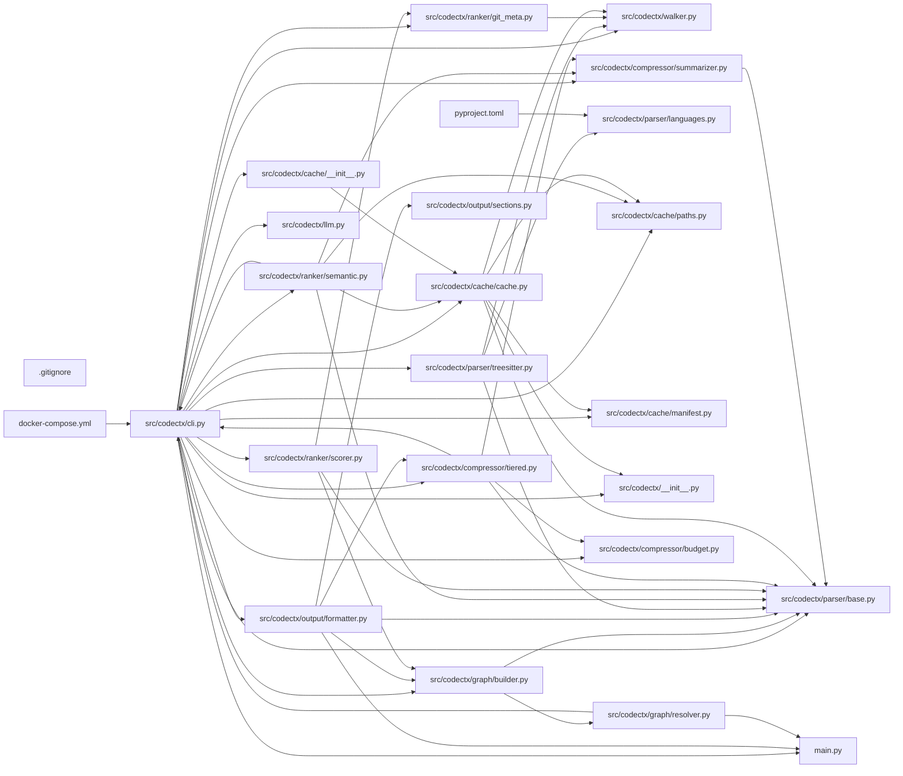

## ARCHITECTURE

codectx processes repositories through a structured analysis pipeline that ranks code by importance, compresses it intelligently, and emits a structured markdown document optimized for AI systems.

(Architecture truncated. See ARCHITECTURE.md for details.)

## ENTRY_POINTS

### `src/codectx/cli.py`

```python
"""codectx CLI — typer entrypoint wiring the full pipeline."""

from __future__ import annotations

import logging
import os
import sys
import threading
import time
from collections.abc import Callable
from dataclasses import dataclass
from fnmatch import fnmatch
from pathlib import Path
from typing import TYPE_CHECKING, Any

import typer
from rich.console import Console
from rich.panel import Panel
from rich.progress import Progress, SpinnerColumn, TextColumn

from codectx import __version__
from codectx.config.defaults import CACHE_DIR_NAME

if TYPE_CHECKING:
    from codectx.output.formatter import CompressionResult

try:
    from codectx.llm import llm_dependencies_available

    _LLM_AVAILABLE = llm_dependencies_available()
except Exception:
    _LLM_AVAILABLE = False


_WATCH_SOURCE_EXTENSIONS: frozenset[str] = frozenset(
    {
        ".py",
        ".ts",
        ".tsx",
        ".js",
        ".go",
        ".rs",
        ".java",
        ".cpp",
        ".c",
        ".h",
        ".rb",
        ".php",
    }
)
_WATCH_IGNORED_DIRS: frozenset[str] = frozenset(
    {"__pycache__", ".git", "node_modules", "dist", "build"}
)
_WATCH_IGNORED_NAMES: frozenset[str] = frozenset({"package-lock.json", "yarn.lock", "uv.lock"})
_WATCH_IGNORED_GLOBS: tuple[str, ...] = ("*.pyc", "*.pyo", "*.lock")


def _watch_path_is_relevant(path: Path) -> bool:
    parts = set(path.parts)
    if parts.intersection(_WATCH_IGNORED_DIRS):
        return False
    if path.name in _WATCH_IGNORED_NAMES:
        return False
    if any(fnmatch(path.name, pattern) for pattern in _WATCH_IGNORED_GLOBS):
        return False
    return path.suffix.lower() in _WATCH_SOURCE_EXTENSIONS


class DebouncedHandler:
    def __init__(self, delay: float, callback: Callable[[set[str]], None]) -> None:
        self._delay = delay
        self._callback = callback
        self._timer: threading.Timer | None = None
        self._pending: set[str] = set()
        self._lock = threading.Lock()

    def on_any_event(self, event: Any) -> None:
        if bool(getattr(event, "is_directory", False)):
            return
        src_path = str(getattr(event, "src_path", ""))
        if not src_path:
            return
        with self._lock:
            self._pending.add(src_path)
            if self._timer:
                self._timer.cancel()
            self._timer = threading.Timer(self._delay, self._fire)
            self._timer.start()

    def _fire(self) -> None:
        with self._lock:
            paths = self._pending.copy()
            self._pending.clear()
        callback = self._callback
        if callable(callback):
            callback(paths)


app = typer.Typer(
    name="codectx",
    help="Codebase context compiler for AI agents.",
    no_args_is_help=True,
    add_completion=False,
)
console = Console(stderr=True)


@app.command()
def analyze(
    root: Path = typer.Argument(  # noqa: B008
        ".",
        help="Repository root directory to analyze.",
        exists=True,
        file_okay=False,
        resolve_path=True,
    ),
    tokens: int = typer.Option(  # noqa: B008
        None,
        "--tokens",
        "-t",
        help="Token budget (default: 120000).",
    ),
    output: Path = typer.Option(  # noqa: B008
        None,
        "--output",
        "-o",
        help="Output file path (default: CONTEXT.md).",
    ),
    since: str | None = typer.Option(  # noqa: B008
        None,
        "--since",
        help="Include recent changes since this date (e.g. '7 days ago').",
    ),
    verbose: bool = typer.Option(  # noqa: B008
        False,
        "--verbose",
        "-v",
        help="Enable verbose logging.",
    ),
    no_git: bool = typer.Option(  # noqa: B008
        False,
        "--no-git",
        help="Skip git metadata collection.",
    ),
    query: str | None = typer.Option(  # noqa: B008
        None,
        "--query",
        "-q",
        help="Semantic query to rank files by relevance (requires codectx[semantic]).",
    ),
    task: str = typer.Option(  # noqa: B008
        "default",
        "--task",
        help="Task profile for context generation (debug, feature, architecture, default).",
    ),
    layers: bool = typer.Option(  # noqa: B008
        False,
        "--layers",
        help="Generate layered context output.",
    ),
    extra_roots: list[Path] | None = typer.Option(  # noqa: B008
        None,
        "--extra-root",
        help="Additional root directories for multi-root analysis.",
    ),
    output_format: str = typer.Option(
        "markdown", "--format", help="Output format: markdown or json."
    ),  # noqa: B008
    llm: bool = typer.Option(False, "--llm/--no-llm", help="Enable LLM-powered summaries."),  # noqa: B008
    llm_provider: str = typer.Option("openai", "--llm-provider", help="LLM provider."),  # noqa: B008
    llm_model: str = typer.Option("", "--llm-model", help="LLM model name."),  # noqa: B008
    llm_api_key: str | None = typer.Option(None, "--llm-api-key", help="LLM API key override."),  # noqa: B008
    llm_base_url: str | None = typer.Option(None, "--llm-base-url", help="LLM base URL override."),  # noqa: B008
    llm_max_tokens: int = typer.Option(256, "--llm-max-tokens", help="Max tokens per LLM summary."),  # noqa: B008
    force: bool = typer.Option(False, "--force", help="Bypass cache check and regenerate unconditionally."),  # noqa: B008
) -> None:
    """Analyze a codebase and generate CONTEXT.md."""
    _setup_logging(verbose)
    start_time = time.perf_counter()

    from codectx.config.loader import load_config

    # Build roots list: primary root + any extra roots
    roots_list: list[Path] | None = None
    if extra_roots:
        roots_list = [root] + list(extra_roots)

    if output_format not in {"markdown", "json"}:
        raise typer.BadParameter("--format must be one of: markdown, json")

    if llm and not _LLM_AVAILABLE:
        import click

        raise click.UsageError("LLM dependencies missing. Install with: pip install codectx[llm]")

    config = load_config(
        root,
        token_budget=tokens,
        output_file=str(output) if output else None,
        since=since,
        verbose=verbose,
        no_git=no_git,
        query=query or "",
        task=task,
        layers=layers,
        roots=roots_list,
        output_format=output_format,
        llm_enabled=llm,
        llm_provider=llm_provider,
        llm_model=llm_model,
        llm_api_key=llm_api_key,
        llm_base_url=llm_base_url,
        llm_max_tokens=llm_max_tokens,
    )

    # Check manifest for up-to-date status unless --force is used
    if not force:
        from codectx.cache import Cache

        cache = Cache(config.root)
        if cache.is_output_up_to_date(config):
            console.print("[green]Context is up to date. Use --force to regenerate.[/]")
            raise typer.Exit()

    metrics = _run_pipeline(config, quiet=output_format == "json")
    elapsed = time.perf_counter() - start_time

    ratio = metrics.original_tokens / metrics.context_tokens if metrics.context_tokens > 0 else 0

    if output_format == "json":
        from codectx.output.formatter import format_json

        if metrics.compression_result is None:
            raise typer.Exit(1)
        typer.echo(format_json(metrics.compression_result))
        return

    console.print(
        Panel(
            f"[bold green]✓[/] Context written to [bold]{metrics.output_path}[/]\n\n"
            f"[bold]Files scanned:[/] {metrics.files_scanned:,}\n"
            f"[bold]Source tokens (excl. tests/docs):[/] {metrics.original_tokens:,}\n"
            f"[bold]Context tokens:[/] {metrics.context_tokens:,}\n"
            f"[bold]Compression ratio:[/] {ratio:.1f}x\n"
            f"[bold]Analysis time:[/] {elapsed:.1f}s",
            title="codectx",
            border_style="green",
        )
    )


@app.command()
def benchmark(
    root: Path = typer.Argument(  # noqa: B008
        ".",
        help="Repository root directory.",
        exists=True,
        file_okay=False,
        resolve_path=True,
    ),
    tokens: int = typer.Option(None, "--tokens", "-t"),  # noqa: B008
    verbose: bool = typer.Option(False, "--verbose", "-v"),  # noqa: B008
    no_git: bool = typer.Option(False, "--no-git"),  # noqa: B008
) -> None:
    """Run analysis with detailed timing and stats."""
    _setup_logging(verbose)

    from codectx.config.loader import load_config

    config = load_config(
        root,
        token_budget=tokens,
        verbose=verbose,
        no_git=no_git,
    )

    console.print("[bold]Running benchmark...[/]\n")

    timings: dict[str, float] = {}

    # Walk
    t0 = time.perf_counter()
    from codectx.walker import walk

    files = walk(config.root, config.extra_ignore)
    timings["walk"] = time.perf_counter() - t0

    # Parse
    t0 = time.perf_counter()
    from codectx.parser.treesitter import parse_files

    parse_results = parse_files(files)
    timings["parse"] = time.perf_counter() - t0

    # Graph
    t0 = time.perf_counter()
    from codectx.graph.builder import build_dependency_graph

    dep_graph = build_dependency_graph(parse_results, config.root)
    timings["graph"] = time.perf_counter() - t0

... (truncated: entry point exceeds 300 lines)
```

### `main.py`

```python
def main():
    print("Hello from codectx!")


if __name__ == "__main__":
    main()

```

## SYMBOL_INDEX

**`src/codectx/cli.py`**
- `_watch_path_is_relevant()`
- class `DebouncedHandler`
  - `__init__()`
  - `on_any_event()`
  - `_fire()`
- `analyze()`
- `benchmark()`
- `watch()`
- `search()`
- `cache_export()`
- `cache_import()`
- `cache_clear()`
- `cache_info()`
- `main()`
- class `PipelineMetrics`
- `_run_pipeline()`
- `_setup_logging()`

**`src/codectx/graph/builder.py`**
- class `DepGraph`
  - `add_file()`
  - `add_edge()`
  - `fan_in()`
  - `fan_out()`
  - `entry_points()`
  - `graph_distance()`
  - `entry_distances()`
  - `detect_call_paths()`
  - `get_symbol_references()`
- class `SymbolReference`
- `_extract_used_symbol_names()`
- `build_dependency_graph()`

**`src/codectx/parser/base.py`**
- class `Symbol`
- class `ParseResult`
- `make_plaintext_result()`

**`main.py`**
- `main()`

**`src/codectx/output/formatter.py`**
- class `CompressionFileRecord`
- class `CompressionResult`
- `build_compression_result()`
- `format_json()`
- `_root_label()`
- `format_context()`
- `write_context_file()`
- `write_layer_files()`
- `_section_header()`
- `_auto_architecture()`
- `_render_mermaid_graph()`

**`src/codectx/parser/treesitter.py`**
- `_parse_scm_patterns()`
- class `QuerySpec`
- `_load_query_spec()`
- `_get_query_spec()`
- `parse_files()`
- `parse_file()`
- `_parse_single_worker()`
- `_log_parse_health()`
- `_extract()`
- `_fallback_parse()`
- `_extract_symbol_usages()`
- `_regex_imports()`
- `_regex_docstrings()`
- `_extract_imports()`
- `_extract_symbols()`
- `_extract_module_docstrings()`
- `_python_func_symbol()`
- `_python_class_symbol()`
- `_js_func_symbol()`
- `_js_class_symbol()`
- `_maybe_js_arrow()`
- `_go_func_symbol()`
- `_generic_symbol()`
- `_walk_tree()`
- `_node_text()`
- `_find_child()`
- `_extract_first_docstring()`
- `_read_source()`

**`src/codectx/ranker/semantic.py`**
- `_cache_root_dir()`
- `_as_float_list()`
- `_ensure_embedding_table()`
- `embed_with_cache()`
- `_evict_stale_embeddings()`
- `is_available()`
- `semantic_score()`

**`src/codectx/ranker/scorer.py`**
- `score_files()`
- `_min_max_normalize()`

**`src/codectx/compressor/tiered.py`**
- class `CompressedFile`
- `is_config_file()`
- `_is_non_source()`
- `assign_tiers()`
- `compress_files()`
- `_tier1_content()`
- `_extract_internal_imports()`
- `_structured_summary_content()`
- `_tier2_content()`
- `_tier3_content()`
- `_one_line_summary()`

**`src/codectx/config/loader.py`**
- class `Config`
- `load_config()`
- `_resolve()`
- `_resolve_bool()`
- `_resolve_str()`
- `_resolve_optional_str()`
- `_resolve_int()`
- `_resolve_float()`

**`src/codectx/walker.py`**
- `walk()`
- `_collect()`
- `_is_binary()`
- `walk_multi()`
- `find_root()`

**`src/codectx/graph/resolver.py`**
- `resolve_import()`
- `resolve_import_multi_root()`
- `_resolve_python()`
- `_resolve_js_ts()`
- `_find_go_mod_root()`
- `_parse_go_module()`
- `_resolve_go()`
- `_resolve_rust()`
- `_resolve_java()`
- `_resolve_c_cpp()`
- `_resolve_ruby()`

**`src/codectx/ranker/git_meta.py`**
- class `GitFileInfo`
- `collect_git_metadata()`
- `_collect_from_git()`
- `_filesystem_fallback()`
- `collect_recent_changes()`
- `_parse_since()`
- `_load_pygit2()`

**`src/codectx/cache/cache.py`**
- class `Cache`
  - `__init__()`
  - `_load()`
  - `save()`
  - `get_parse_result()`
  - `put_parse_result()`
  - `get_token_count()`
  - `put_token_count()`
  - `invalidate()`
  - `export_cache()`
  - `is_output_up_to_date()`
- `file_hash()`
- `_decode_children()`
- `_coerce_int()`

**`src/codectx/parser/languages.py`**
- class `LanguageEntry`
- class `TreeSitterLanguageLoadError`
- `get_language()`
- `get_language_for_path()`
- `get_ts_language_object()`
- `_coerce_language()`
- `load_typescript_language()`
- `supported_extensions()`

**`src/codectx/cache/paths.py`**
- `get_cache_root()`
- `get_manifest_path()`
- `get_embeddings_path()`

**`src/codectx/cache/manifest.py`**
- class `ManifestOptions`
- class `Manifest`
- `hash_file()`
- `collect_file_hashes()`
- `load_manifest()`
- `save_manifest()`
- `is_up_to_date()`

**`src/codectx/output/sections.py`**
- class `Section`

**`src/codectx/llm.py`**
- class `LLMProvider`
  - `summarize()`
- class `OpenAIProvider`
  - `summarize()`
- class `AnthropicProvider`
  - `summarize()`
- class `OllamaProvider`
  - `summarize()`
- `default_model_for()`
- `llm_dependencies_available()`
- `_fallback_summary()`
- `llm_summarize()`
- `llm_summarize_sync()`

**`src/codectx/compressor/summarizer.py`**
- `is_available()`
- `summarize_file()`
- `summarize_files_batch()`
- `_summarize_openai()`
- `_summarize_anthropic()`

## IMPORTANT_CALL_PATHS

main.main()
## CORE_MODULES

### `src/codectx/graph/builder.py`

**Purpose:** Dependency graph construction using rustworkx.
**Depends on:** `config.defaults`, `graph.resolver`, `parser.base`

**Types:**
- `DepGraph` - Dependency graph with file-level nodes and import edges. methods: `add_edge`, `add_file`, `detect_call_paths`, `entry_distances`, `entry_points`, `fan_in` (+3 more)
- `SymbolReference`

**Functions:**
- `def _extract_used_symbol_names(result: ParseResult) -> set[str]`
- `def build_dependency_graph(     parse_results: dict[Path, ParseResult],     root: Path, ) -> DepGraph`
  - Build a dependency graph from parse results.

**Notes:** large file (314 lines)

### `src/codectx/parser/base.py`

**Purpose:** Core data structures for the parser module.

**Types:**
- `ParseResult` - Result of parsing a single source file.
- `Symbol` - A top-level symbol extracted from a source file.

**Functions:**
- `def make_plaintext_result(path: Path, source: str) -> ParseResult`
  - Create a minimal ParseResult for unsupported language files.

### `src/codectx/output/formatter.py`

**Purpose:** Structured markdown formatter — emits CONTEXT.md.
**Depends on:** `compressor.tiered`, `config.defaults`, `graph.builder`, `output.sections`, +1 more

**Types:**
- `CompressionFileRecord`

**Functions:**
- `def _auto_architecture(compressed: list[CompressedFile], root: Path) -> str`
- `def _render_mermaid_graph(     dep_graph: DepGraph,     root: Path,     compressed: list[CompressedFile], ) -> str`
- `def _root_label(file_path: Path, roots: list[Path] | None) -> str`
- `def _section_header(title: str) -> str`

### `src/codectx/parser/treesitter.py`

**Purpose:** Tree-sitter AST extraction — parallel parsing of source files.
**Depends on:** `config.defaults`, `parser.base`, `parser.languages`

**Types:**
- `QuerySpec` - Parsed query specification from a .scm file.

**Functions:**
- `def _extract(path: Path, source: str, entry: LanguageEntry) -> ParseResult`
- `def _extract_first_docstring(body_node: Any, source: str) -> str`
- `def _extract_imports(node: Any, language: str, source: str) -> list[str]`
- `def _extract_module_docstrings(node: Any, language: str, source: str) -> list[str]`

## Constants
QUERIES_DIR = Path(__file__).parent / "queries"

### `src/codectx/ranker/semantic.py`

**Purpose:** Semantic search ranking using lancedb and sentence-transformers.
**Depends on:** `cache.paths`, `parser.base`

**Functions:**
- `def _as_float_list(value: Any) -> list[float]`
- `def _cache_root_dir() -> Path`
- `def _ensure_embedding_table(db: Any, dim: int) -> Any`
- `def _evict_stale_embeddings(table: Any, current_paths: set[str]) -> None`
- `def embed_with_cache(file_contents: dict[str, str], repo_root: str, ...) -> dict[str, list[float]]`
- `def is_available() -> bool`
- `def semantic_score(query: str, files: list[Path], parse_results: dict[Path, ParseResult], ...) -> dict[Path, float]`

### `src/codectx/config/defaults.py`

**Purpose:** Default configuration values and constants for codectx.

### `src/codectx/ranker/scorer.py`

**Purpose:** Composite file scoring — ranks files by importance.
**Depends on:** `config.defaults`, `graph.builder`, `parser.base`, `ranker.git_meta`

**Functions:**
- `def _min_max_normalize(values: dict[Path, float]) -> dict[Path, float]`
  - Min-max normalize values to [0, 1]. Returns 0 for all if constant.
- `def score_files(files: list[Path], dep_graph: DepGraph, git_meta: dict[Path, GitFileInfo], ...) -> dict[Path, float]`
  - Score each file 0.0–1.0 using a weighted composite.

### `src/codectx/compressor/tiered.py`

**Purpose:** Tiered compression — assigns tiers and enforces token budget.
**Depends on:** `compressor.budget`, `compressor.summarizer`, `config.defaults`, `parser.base`

**Types:**
- `CompressedFile` - A file compressed to its assigned tier.

**Functions:**
- `def _extract_internal_imports(imports: tuple[str, ...], root: Path, source_path: Path) -> list[str]`
- `def _is_non_source(path: Path, root: Path) -> bool`
- `def _one_line_summary(pr: ParseResult) -> str`
- `def _structured_summary_content(pr: ParseResult, path: Path, root: Path) -> str`

### `src/codectx/config/loader.py`

**Purpose:** Configuration loader — reads .codectx.toml or pyproject.toml [tool.codectx].
**Depends on:** `config.defaults`

**Types:**
- `Config` - Resolved configuration for a codectx run.

**Functions:**
- `def _resolve(key: str, cli: dict[str, object], file_cfg: dict[str, object], default: object) -> object`
- `def _resolve_bool(key: str, cli: dict[str, object], file_cfg: dict[str, object], default: bool) -> bool`
- `def _resolve_float(key: str, cli: dict[str, object], file_cfg: dict[str, object], default: float) -> float`
- `def _resolve_int(     key: str,     cli: dict[str, object],     file_cfg: dict[str, object],     default: int, ) -> int`

### `src/codectx/walker.py`

**Purpose:** File-system walker — discovers files, applies ignore specs, filters binaries.
**Depends on:** `config.defaults`, `ignore`

**Functions:**
- `def _collect(     current: Path,     root: Path,     spec: pathspec.PathSpec,     out: list[Path], ) -> None`
- `def _is_binary(path: Path) -> bool`
- `def find_root(file_path: Path, roots: list[Path]) -> Path | None`
- `def walk(     root: Path,     extra_ignore: tuple[str, ...] = (),     output_file: Path | None = None, ) -> list[Path]`
- `def walk_multi(roots: list[Path], ...),     output_file: Path | None = None, ) -> dict[Path, list[Path]]`

### `src/codectx/graph/resolver.py`

**Purpose:** Per-language import string → file path resolution.

**Functions:**
- `def _find_go_mod_root(source_file: Path, repo_root: Path) -> Path | None`
- `def _parse_go_module(repo_root: str) -> str | None`
- `def _resolve_c_cpp(import_text: str, source_file: Path, root: Path, all_files: frozenset[str]) -> list[Path]`
- `def _resolve_go(import_text: str, source_file: Path, root: Path, all_files: frozenset[str]) -> list[Path]`

### `src/codectx/ranker/git_meta.py`

**Purpose:** Git metadata extraction via pygit2.

**Types:**
- `GitFileInfo` - Git metadata for a single file.

**Functions:**
- `def _collect_from_git(repo: Any, pygit2_mod: Any, files: list[Path], root: Path, ...) -> dict[Path, GitFileInfo]`
- `def _filesystem_fallback(files: list[Path]) -> dict[Path, GitFileInfo]`
- `def _load_pygit2() -> Any | None`
- `def _parse_since(since: str) -> float | None`
- `def collect_git_metadata(files: list[Path], root: Path, no_git: bool = False, ...) -> dict[Path, GitFileInfo]`
- `def collect_recent_changes(root: Path, since: str | None, no_git: bool = False) -> str`

## SUPPORTING_MODULES

### `README.md`

*215 lines, 0 imports*

### `src/codectx/cache/cache.py`

> File-level caching for parse results, token counts, and git metadata.

```python
class Cache
    """JSON-based file cache in .codectx_cache/."""

def file_hash(path: Path) -> str
    """Compute a fast hash of file contents."""

def _decode_children(children: list[Any] | tuple[Any, ...]) -> tuple[Symbol, ...]

def _coerce_int(value: object) -> int | None

```

### `src/codectx/parser/languages.py`

> Extension → language mapping for tree-sitter parsers.

```python
class LanguageEntry
    """A supported language with its tree-sitter module reference."""

class TreeSitterLanguageLoadError(RuntimeError)
    """Raised when a tree-sitter language cannot be resolved safely."""

def get_language(ext: str) -> LanguageEntry | None
    """Return the LanguageEntry for a file extension, or None if unsupported."""

def get_language_for_path(path: Any) -> LanguageEntry | None
    """Return the LanguageEntry for a file path (uses suffix)."""

def get_ts_language_object(entry: LanguageEntry) -> Any
    """Dynamically import and return the tree-sitter Language object.

    Uses the modern per-package tree-sitter bindings (tree-sitter-python, etc.)."""

def _coerce_language(value: Any) -> tree_sitter.Language
    """Normalize any supported language payload into a Language object."""

def load_typescript_language(language_fn: str = "language_typescript") -> tree_sitter.Language
    """Load TypeScript grammar across tree_sitter_typescript API variants.

    Supported exports across known package versions include:
    - callable factories: language(), get_language(), language_typescript(), language_tsx()
    - constants: LANGUAGE, LANGUAGE_TYPESCRIPT, LANGUAGE_TSX
    - manual binding fallback via tree_sitter.Language(<shared-library>, <name>)"""

def supported_extensions() -> frozenset[str]
    """Return all file extensions supported for tree-sitter parsing."""

```

### `src/codectx/cache/paths.py`

```python
def get_cache_root(repo_root: str) -> Path
    """Returns ~/.cache/codectx/<repo_hash>/ (or $XDG_CACHE_HOME variant).
    Creates the directory if it does not exist."""

def get_manifest_path(repo_root: str) -> Path

def get_embeddings_path(repo_root: str) -> Path

```

### `CHANGELOG.md`

*24 lines, 0 imports*

### `src/codectx/cache/manifest.py`

```python
class ManifestOptions

class Manifest

def hash_file(path: str | Path) -> str
    """sha256 hex digest of file content."""

def collect_file_hashes(
    file_paths: list[str],
    repo_root: str,
) -> dict[str, str]
    """Returns {relative_path: sha256} for all paths.
    Skips unreadable files silently."""

def load_manifest(manifest_path: Path) -> Manifest | None
    """Returns None if file does not exist, is unreadable, or fails JSON parse.
    Never raises."""

def save_manifest(manifest_path: Path, manifest: Manifest) -> None
    """Atomic write: manifest_path.with_suffix('.json.tmp') then os.replace().
    Never raises — logs warning to stderr on failure."""

def is_up_to_date(
    manifest: Manifest,
    current_hashes: dict[str, str],
    current_options: ManifestOptions,
    current_version: str,
) -> bool
    """Returns True if and only if ALL of the following hold:
    - manifest.codectx_version == current_version
    - manifest.options == current_options
    - manifest.files == current_hashes  (same keys AND same values)
    Returns False if manifest is None."""

```

### `src/codectx/output/sections.py`

> Section constants for CONTEXT.md output.

```python
class Section
    """A named section in the output file."""

```

### `src/codectx/cache/__init__.py`

*4 lines, 1 imports*

### `src/codectx/llm.py`

> LLM provider abstraction for async file summarization.

```python
class LLMProvider(Protocol)

class OpenAIProvider

class AnthropicProvider

class OllamaProvider

def default_model_for(provider: str) -> str

def llm_dependencies_available() -> bool

def _fallback_summary(file_path: str, file_content: str) -> str

def llm_summarize(
    file_path: str,
    file_content: str,
    provider: str,
    model: str,
    api_key: str | None,
    base_url: str | None,
    max_tokens: int,
) -> str

def llm_summarize_sync(
    file_path: str,
    file_content: str,
    provider: str,
    model: str,
    api_key: str | None,
    base_url: str | None,
    max_tokens: int,
) -> str

```

### `src/codectx/__init__.py`

> codectx — Codebase context compiler for AI agents.

*9 lines, 1 imports*

### `src/codectx/compressor/summarizer.py`

> LLM-based file summarization for Tier 3 compression.

This module is an optional dependency — all LLM imports are guarded.
Install with: pip install codectx[llm]


```python
def is_available() -> bool
    """Check if any LLM provider is available."""

def summarize_file(result: ParseResult, provider: str = "openai", model: str = "") -> str
    """Return one-sentence summary of the file's purpose.

    Args:
        result: ParseResult for the file.
        provider: LLM provider ('openai' or 'anthropic').
        model: Model name (defaults to provider-specific default).

    Returns:
        One-sentence summary string.

    Raises:
        ImportError: If the required provider is not installed.
        RuntimeError: If the summarization call fails."""

def summarize_files_batch(
    results: list[ParseResult],
    provider: str = "openai",
    model: str = "",
    max_workers: int = 4,
) -> dict[Path, str]
    """Summarize multiple files concurrently.

    Args:
        results: List of ParseResult objects to summarize.
        provider: LLM provider name.
        model: Model name.
        max_workers: Max concurrent summarization threads.

    Returns:
        Dict mapping file path to summary string."""

def _summarize_openai(prompt: str, model: str) -> str
    """Call OpenAI API for summarization."""

def _summarize_anthropic(prompt: str, model: str) -> str
    """Call Anthropic API for summarization."""

```

### `PLAN.md`

*145 lines, 0 imports*

## DEPENDENCY_GRAPH



### Cyclic Dependencies

> [!WARNING]
> The following circular import chains were detected:

1. `src/codectx/cli.py` -> `src/codectx/output/formatter.py` -> `src/codectx/compressor/tiered.py`

## RANKED_FILES

| File | Score | Tier | Tokens |
|------|-------|------|--------|
| `src/codectx/cli.py` | 0.835 | full source | 2350 |
| `src/codectx/graph/builder.py` | 0.534 | structured summary | 166 |
| `src/codectx/parser/base.py` | 0.532 | structured summary | 91 |
| `main.py` | 0.524 | full source | 34 |
| `src/codectx/output/formatter.py` | 0.488 | structured summary | 160 |
| `src/codectx/parser/treesitter.py` | 0.471 | structured summary | 178 |
| `pyproject.toml` | 0.453 | one-liner | 12 |
| `src/codectx/ranker/semantic.py` | 0.447 | structured summary | 183 |
| `src/codectx/config/defaults.py` | 0.417 | structured summary | 25 |
| `src/codectx/ranker/scorer.py` | 0.390 | structured summary | 150 |
| `src/codectx/compressor/tiered.py` | 0.387 | structured summary | 164 |
| `src/codectx/config/loader.py` | 0.374 | structured summary | 200 |
| `src/codectx/walker.py` | 0.362 | structured summary | 186 |
| `src/codectx/graph/resolver.py` | 0.345 | structured summary | 137 |
| `src/codectx/ranker/git_meta.py` | 0.306 | structured summary | 194 |
| `tests/test_scorer.py` | 0.265 | one-liner | 17 |
| `README.md` | 0.245 | signatures | 13 |
| `src/codectx/cache/cache.py` | 0.245 | signatures | 104 |
| `src/codectx/parser/languages.py` | 0.245 | signatures | 320 |
| `tests/test_integration.py` | 0.226 | one-liner | 20 |
| `src/codectx/cache/paths.py` | 0.225 | signatures | 85 |
| `CHANGELOG.md` | 0.219 | signatures | 14 |
| `tests/unit/test_cli.py` | 0.219 | one-liner | 14 |
| `tests/unit/test_semantic_mock.py` | 0.219 | one-liner | 17 |
| `src/codectx/cache/manifest.py` | 0.214 | signatures | 267 |
| `src/codectx/output/sections.py` | 0.204 | signatures | 38 |
| `src/codectx/cache/__init__.py` | 0.204 | signatures | 21 |
| `src/codectx/llm.py` | 0.204 | signatures | 199 |
| `tests/unit/test_semantic.py` | 0.196 | one-liner | 17 |
| `src/codectx/__init__.py` | 0.191 | signatures | 33 |
| `tests/unit/test_config_filter.py` | 0.183 | one-liner | 20 |
| `tests/unit/test_treesitter.py` | 0.174 | one-liner | 18 |
| `tests/integration/test_analyze_json.py` | 0.172 | one-liner | 20 |
| `tests/integration/test_analyze_llm.py` | 0.172 | one-liner | 22 |
| `tests/integration/test_watch_integration.py` | 0.172 | one-liner | 18 |
| `tests/unit/test_embedding_cache.py` | 0.172 | one-liner | 17 |
| `tests/unit/test_go_resolver.py` | 0.172 | one-liner | 20 |
| `tests/unit/test_json_output.py` | 0.172 | one-liner | 16 |
| `tests/unit/test_llm_summarize.py` | 0.172 | one-liner | 23 |
| `tests/unit/test_watch_debounce.py` | 0.172 | one-liner | 18 |

## PERIPHERY

- `pyproject.toml` — 116 lines
- `tests/test_scorer.py` — Tests for the composite file scorer.
- `tests/test_integration.py` — Integration test — runs codectx pipeline end-to-end.
- `tests/unit/test_cli.py` — Tests for CLI commands.
- `tests/unit/test_semantic_mock.py` — Mock tests for semantic logic.
- `tests/unit/test_semantic.py` — Tests for semantic search ranking module.
- `tests/unit/test_config_filter.py` — Tests for config-file demotion to peripheral tier.
- `tests/unit/test_treesitter.py` — Tests for multi-language treesitter parsing.
- `tests/integration/test_analyze_json.py` — Integration test for analyze --format json.
- `tests/integration/test_analyze_llm.py` — Integration tests for analyze with --llm.
- `tests/integration/test_watch_integration.py` — Integration tests for watch command behavior.
- `tests/unit/test_embedding_cache.py` — Tests for persistent semantic embedding cache.
- `tests/unit/test_go_resolver.py` — Tests for Go resolver go.mod module parsing behavior.
- `tests/unit/test_json_output.py` — Tests for JSON output formatter.
- `tests/unit/test_llm_summarize.py` — Tests for async LLM summarization strategy layer.
- `tests/unit/test_watch_debounce.py` — Tests for debounced watch behavior.
- `tests/unit/test_cache_export.py` — Tests for CI cache export/import.
- `tests/unit/test_formatter_sections.py` — Tests for deterministic formatter section ordering and presence.
- `tests/unit/test_constants_summary.py` — Tests for structured summary constants section.
- `tests/unit/test_symbol_xref.py` — Tests for symbol cross-reference graph edges.
- `tests/unit/test_formatter_coverage.py` — Tests for output formatting.
- `tests/test_walker.py` — Tests for the file walker.
- `tests/unit/test_git_meta.py` — Tests for git metadata collection.
- `tests/test_compressor.py` — Tests for tiered compression and token budget.
- `tests/unit/test_resolver.py` — Tests for import resolution.
- `tests/unit/test_summarizer.py` — Tests for LLM summarizer module.
- `.gitignore` — 44 lines
- `src/codectx/compressor/budget.py` — Token counting and budget tracking via tiktoken.
- `tests/integration/test_cache_integration.py` — Integration tests for cache functionality.
- `tests/unit/test_cache.py` — Unit tests for cache functionality.
- `ARCHITECTURE.md` — 252 lines
- `tests/unit/test_multi_root.py` — Tests for multi-root support.
- `tests/test_parser.py` — Tests for tree-sitter parsing.
- `tests/test_ignore.py` — Tests for ignore-spec handling.
- `docker-compose.yml` — 14 lines
- `tests/unit/test_cycles.py` — Tests for cyclic dependency detection.
- `docs/src/content/docs/advanced/token-compression.md` — 27 lines
- `docs/src/content/docs/comparison.md` — 31 lines
- `docs/src/content/docs/getting-started/basic-usage.md` — 63 lines
- `docs/src/content/docs/getting-started/quick-start.mdx` — 44 lines
- `docs/src/content/docs/guides/configuration.md` — 53 lines
- `docs/src/content/docs/reference/cli-reference.md` — 116 lines
- `tests/unit/test_call_paths.py` — Tests for call path detection and formatting.
- `tests/unit/test_safety.py` — Tests for safety checks in pipeline flow.
- `tests/unit/test_cache_wiring.py` — Tests for cache wiring into the analyze pipeline.
- `tests/unit/test_version.py` — Tests for package version exposure.
- `src/codectx/safety.py` — Sensitive-file detection and user confirmation.
- `tests/unit/test_queries.py` — Tests for .scm query file loading and data-driven extraction.
- `Dockerfile` — 48 lines
- `docs/src/content/docs/guides/docker.md` — 74 lines
- `src/codectx/ignore.py` — Ignore-spec handling — layers ALWAYS_IGNORE, .gitignore, .ctxignore.
- `src/codectx/ranker/__init__.py` — 0 lines
- `docs/astro.config.mjs` — 2 imports, 75 lines
- `DECISIONS.md` — 262 lines
- `docs/build_output.txt` — 382 lines
- `docs/src/content/docs/community/contributing.md` — 52 lines
- `docs/src/content/docs/guides/best-practices.md` — 34 lines
- `docs/src/content/docs/guides/using-context-effectively.md` — 34 lines
- `docs/src/content/docs/advanced/dependency-graph.md` — 23 lines
- `docs/src/content/docs/advanced/ranking-system.md` — 41 lines
- `docs/src/content/docs/getting-started/installation.md` — 62 lines
- `docs/src/content/docs/introduction/what-is-codectx.md` — 22 lines
- `docs/src/content/docs/reference/architecture-overview.md` — 33 lines
- `docs/package.json` — 26 lines
- `.dockerignore` — 27 lines
- `docs/src/content.config.ts` — 3 imports, 7 lines
- `docs/src/content/docs/community/faq.md` — 23 lines
- `docs/src/content/docs/index.mdx` — 32 lines
- `docs/src/content/docs/introduction/why-it-exists.md` — 20 lines
- `docs/src/env.d.ts` — 3 lines
- `docs/src/styles/custom.css` — 19 lines
- `docs/tsconfig.json` — 10 lines
- `src/codectx/parser/queries/go.scm` — 7 lines
- `src/codectx/parser/queries/java.scm` — 5 lines
- `src/codectx/parser/queries/javascript.scm` — 8 lines
- `src/codectx/parser/queries/python.scm` — 7 lines
- `src/codectx/parser/queries/rust.scm` — 8 lines
- `src/codectx/parser/queries/typescript.scm` — 8 lines
- `tests/unit/__init__.py` — 0 lines
- `src/codectx/compressor/__init__.py` — 0 lines
- `src/codectx/config/__init__.py` — 0 lines
- `src/codectx/graph/__init__.py` — 0 lines
- `src/codectx/output/__init__.py` — 0 lines
- `src/codectx/parser/__init__.py` — 0 lines
- `tests/__init__.py` — 0 lines
- `.python-version` — 2 lines

