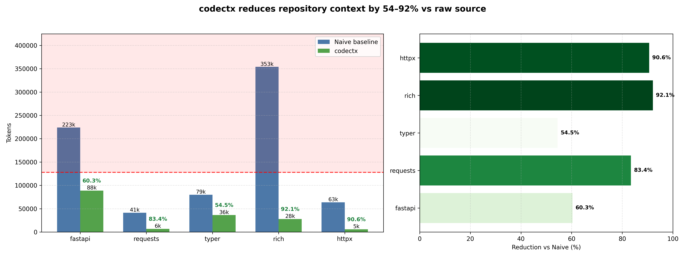

# codectx

[](https://pypi.org/project/codectx/)
[](https://pepy.tech/projects/codectx)[](https://github.com/hey-granth/codectx)
[](https://github.com/hey-granth/codectx/blob/main/LICENSE)

A CLI tool that compiles repository context for AI agents — ranking files by importance, compressing them into structured summaries, and emitting a single markdown document optimized for LLM reasoning.

## The problem

Feeding a raw repository to an AI agent wastes context. Most files are noise — tests, docs, boilerplate, lockfiles. The signal (core architecture, key abstractions, dependency structure) is buried.

Naive approaches either blow past context limits or arbitrarily truncate. Neither helps an agent reason about a codebase.

## How codectx works

codectx treats context generation as a compilation step:

1. Scans the repository and builds a dependency graph
2. Scores every file by fan-in centrality, git commit frequency, and entry-point proximity
3. Assigns tiers — top 15% get structured summaries, next 30% get signatures, rest get one-liners
4. Enforces a token budget, highest-signal files first
5. Emits a structured `CONTEXT.md` an agent can reason from immediately

The output is not a source dump. Core files get AST-derived structured summaries: purpose, internal dependencies, public types, and function signatures — at roughly 10% of the token cost of the raw source.

## Benchmark

Tested against five well-known Python repos. Naive baseline counts all source files excluding tests, docs, and examples — the same file set codectx analyzes.

| Repo | Naive tokens | codectx tokens | Reduction |
|------|-------------|----------------|-----------|
| fastapi | 224k | 89k | 60% |
| requests | 41k | 7k | 83% |
| typer | 80k | 36k | 54% |
| rich | 354k | 28k | 92% |
| httpx | 64k | 6k | 91% |

**Average reduction: 76%.** Every repo fits within a 128k context window. Naive baseline exceeds it for fastapi and rich.



Repos with lower reduction (fastapi, typer) contain large entry point files that codectx includes as full source by design — the CLI surface is exactly what an agent needs to see in full.

## Installation

Requires Python 3.10+.

```bash
pip install codectx
```

```bash
uv add codectx
```

```bash
pipx install codectx
```

## Quick start

```bash
# analyze the current repository
codectx analyze .

# adjust token budget
codectx analyze . --tokens 60000

# custom output path
codectx analyze . --output my-context.md

# watch mode — regenerate on file changes
codectx watch .

# semantic search ranking
codectx analyze . --query "authentication flows"

# task-specific ranking profiles
codectx analyze . --task architecture
codectx analyze . --task refactor
codectx analyze . --task debug
codectx analyze . --task feature
```

## Output

`CONTEXT.md` is structured with fixed sections in a consistent order:

| Section | Content |
|---------|---------|
| `ARCHITECTURE` | Auto-generated project description and subsystem map |
| `ENTRY_POINTS` | Full source for entry point files (cli.py, main.py, etc.) |
| `SYMBOL_INDEX` | All public symbols across Tier 1 and Tier 2 files |
| `IMPORTANT_CALL_PATHS` | Execution paths traced from entry points |
| `CORE_MODULES` | AST-driven structured summaries for highest-ranked files |
| `SUPPORTING_MODULES` | Function signatures and docstrings for mid-ranked files |
| `DEPENDENCY_GRAPH` | Mermaid diagram of module relationships, cyclic deps flagged |
| `RANKED_FILES` | Every file's score, tier, and token cost — fully auditable |
| `PERIPHERY` | One-line summaries for remaining files |

A structured summary for a core module looks like this:

```
### `src/myapp/core/engine.py`

**Purpose:** Main execution engine for request processing.

**Depends on:** `core.models`, `core.cache`, `utils.retry`

**Types:**
- `Engine` — methods: process, shutdown, health_check

**Functions:**
- `def process(request: Request, timeout: float = 30.0) -> Response`
  Handle a single request through the full processing pipeline.
- `def shutdown(graceful: bool = True) -> None`
  Stop accepting new requests and drain the queue.
```

## Configuration

Create `.codectx.toml` in your project root:

```toml
[codectx]
token_budget = 120000
output_file = "CONTEXT.md"
extra_ignore = ["**/generated/**", "*.draft.py"]
```

CLI flags override config file values. Supported task profiles for `--task`: `default`, `debug`, `feature`, `architecture`, `refactor`.

## Supported languages

Python, TypeScript, JavaScript, Go, Rust, Java, C, C++, Ruby. Language detection is automatic from file extension via tree-sitter.

## How it works

```
Repository
    ↓
[Walker]      → scan files, apply .gitignore + .ctxignore
    ↓
[Parser]      → extract imports and symbols via tree-sitter
    ↓
[Graph]       → build dependency graph with rustworkx
    ↓
[Ranker]      → score files by fan-in, git frequency, entry proximity
    ↓
[Compressor]  → assign tiers, enforce token budget
    ↓
[Summarizer]  → generate AST-driven structured summaries
    ↓
[Formatter]   → emit structured markdown
    ↓
CONTEXT.md
```

See [ARCHITECTURE.md](ARCHITECTURE.md) for detail on each stage. See [DECISIONS.md](DECISIONS.md) for reasoning behind key design choices.

## Development setup

```bash
git clone https://github.com/hey-granth/codectx.git
cd codectx
uv sync
```

Or with pip:

```bash
pip install -e ".[dev]"
```

### Tests

```bash
pytest
pytest --cov=src/codectx   # with coverage
```

### Type checking and linting

```bash
mypy src
ruff check src tests
ruff format src tests
```

## Contributing

Issues and pull requests are welcome. The project prioritizes correctness, performance, and maintainability. File an issue before starting significant work.

## License

MIT. See [LICENSE](LICENSE).